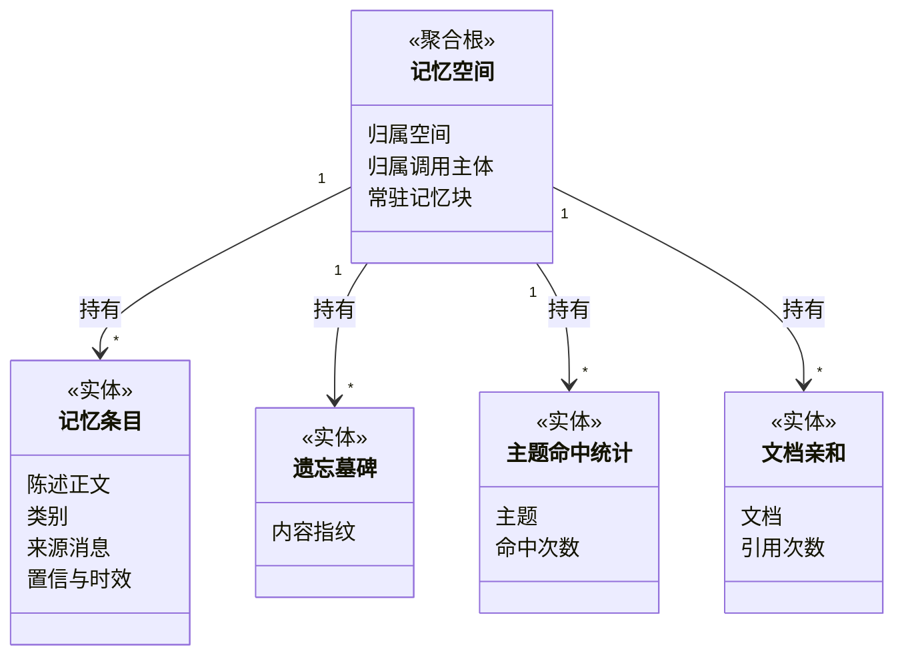

# 限界上下文详解 · 支撑域与通用域

## 一句话概括

四个支撑上下文各自解决一个核心域自己不该操心的问题——记住这个人是谁、决定谁能看什么、把外部世界接进来、把模型供应商的差异挡在外面；三个通用上下文则提供任何多租户系统都绕不开的底座：身份、文件、留痕。

---

## 1. 长期记忆上下文（支撑域）

### 1.1 实体与关系

### 1.2 记忆的五个类别与两种取用方式

| 类别 | 记的是什么 | 取用方式 |
|---|---|---|
| 画像 | 这个人是谁：岗位、团队、常用语言 | **常驻**——每轮都注入 |
| 偏好 | 这个人希望怎么被回答：篇幅、语气、格式 | **常驻** |
| 长期关注点 | 这个人反复在问的方向 | **常驻**（并在理解提问阶段影响改写） |
| 事实 | 与这个人相关的具体信息：项目名、负责的系统 | **情境**——只有与本轮提问相关时才注入 |
| 任务 | 这个人正在推进的事 | **情境** |

**常驻与情境的分界不是「重要程度」，而是「相关性是否依赖当前提问」**：画像和偏好在任何话题下都适用，所以每轮都带；事实和任务只有对上号才有价值，全带会稀释提示、挤占预算。

### 1.3 不变量

1. **记忆空间的唯一标识是「空间 + 调用主体」两者的组合。** 同一个人在不同空间的记忆互不相通——这是隔离要求，不是功能缺失。
2. **召回不得调用生成模型。** 召回发生在每轮开头，一旦引入模型调用，首字延迟直接被拖垮。
3. **长期关注点不能由单次提问产生。** 必须由同一主题在**多次独立会话**中被反复触及、累计达到阈值（默认 3 次，上限 20 次）后才升级。这是为了避免「随口问一次就被当成长期兴趣」。
4. **用户要求忘记时，必须留下内容指纹的墓碑，且墓碑不保存原文。** 不留墓碑，后台抽取会从同一条历史消息里把同样的记忆重新生成出来；保存原文则违背了「忘记」的承诺。
5. **记忆是增强而非依赖。** 记忆服务整体不可用时，问答必须照常完成。

---

## 2. 协作共享上下文（支撑域）

### 2.1 核心概念

| 概念 | 业务含义 |
|---|---|
| 共享空间 | 跨工作空间的协作容器。**它自己不存放任何资产**，只登记「哪些空间在里面、各自什么档位」 |
| 共享记录 | 一条「某份资产被放进某个共享空间、以某档位开放」的授权 |
| 共享空间内的三档角色 | 管理员 / 编辑者 / 浏览者，与工作空间内的四档角色是**两套独立体系** |
| 隐藏共享资产 | 接收方主动把某个共享进来的智能体从自己的列表里藏起来，是个人化设置，不影响他人 |
| 收藏与置顶 | 纯粹的个人排序偏好，不改变任何权限 |

### 2.2 不变量

1. **共享空间不持有数据。** 取消共享后资产仍完整留在原空间，接收方只是失去访问。
2. **发起共享要同时满足两侧条件**：在资产所在空间是创建者或管理员及以上，且在目标共享空间持有编辑者及以上。缺一不可。
3. **经共享智能体间接看到的知识库一律只读**，且该只读是写死的，不随共享者自身权限放宽。
4. **收藏与置顶绝不参与权限判断。** 资产被取消共享后，收藏记录可以留着，但访问必须被拒。

> 完整的判定链路见 `2026-09-19-知识资产访问与共享规则.md`。

---

## 3. 外部集成上下文（支撑域）

### 3.1 四类方向完全不同的集成

这是最容易混淆的一个上下文——它包含四类方向相反的集成，误把其中两类当成一回事是常见错误：

| 类别 | 方向 | 业务含义 | 产出物 |
|---|---|---|---|
| **数据源同步** | 外部内容 → 系统 | 把外部知识库、代码仓库、订阅源里的文档定期搬进来 | 标准知识条目，走与手工上传同一条加工链路 |
| **外部工具接入** | 系统 → 外部工具 | 让智能体能调用别人提供的工具 | 智能体可用的工具目录 |
| **对外工具发布** | 外部客户端 → 系统 | 把本系统的能力包装成工具，供外部 AI 客户端调用 | 一个受限的对外端点 |
| **对外对话渠道** | 外部用户 → 系统 | 把某个智能体投放到网页挂件、通讯软件、浏览器扩展上 | 一个面向匿名或第三方身份的对话入口 |

已接入的数据源共 8 类（Confluence、钉钉文档、飞书、GitLab、ima、Notion、RSS、语雀）；已接入的通讯渠道共 9 类（钉钉、飞书、Mattermost、QQ 机器人、Slack、Telegram、微信、企业微信、云之家）。

### 3.2 不变量

1. **每一类集成的调用主体都是独立的。** 网页访客、通讯软件用户、外部客户端各自是一类主体，其可用范围被强制收窄，**不继承配置者的权限**。
2. **外部协议的差异必须在本上下文内消化干净。** 智能体侧只认「工具」这一个统一概念，不该出现针对某家协议的特判。
3. **同步是幂等的**：同一份外部文档重复同步不得产生第二份知识条目；外部已删除的文档需要在本地留下可识别的失效标记，而非静默残留。
4. **对外发布的端点必须显式声明可调用的工具子集**，默认不开放全部能力。

---

## 4. 模型接入上下文（支撑域）

### 4.1 五类模型能力

| 能力 | 业务用途 | 被谁调用 |
|---|---|---|
| 文本向量化 | 把文字转成可比较的数值表示 | 知识加工（建索引）、检索（查询向量化）、长期记忆（语义召回） |
| 重排 | 对候选片段做精排 | 检索 |
| 对话生成 | 产出自然语言回答，以及所有需要「让模型读一段文字给出结论」的场景 | 对话问答、知识加工（摘要/推荐问题/自动打标/图谱抽取）、智能体、长期记忆抽取 |
| 图片理解 | 看图识字与看图描述 | 知识加工（图片片段）、对话问答（用户发图） |
| 语音转写 | 把语音转成文字 | 对话问答（语音输入）、知识加工（音频资料） |

### 4.2 不变量

1. **供应商差异必须在本上下文内收口。** 对外只暴露上述五类能力的统一契约，核心域里出现「如果是某某供应商就怎样」即为边界被击穿。
2. **向量维度是模型的固有属性，不是可配项。** 知识库一旦建了索引就不能换向量化模型——换了以后旧向量与新查询向量无法比较，检索会静默失准而非报错，这是最危险的一类故障。
3. **模型凭证只写不读。** 配置后可替换、不可回显。
4. **用量必须按调用主体归集**，否则无法回答「这次问答花了多少」。
5. **并发受控。** 模型侧的限速必须在本上下文内消化成排队，不得让核心域直接面对限速错误。

---

## 5. 身份与租户上下文（通用域）

### 5.1 核心概念

| 概念 | 业务含义 |
|---|---|
| 用户 | 一个能登录的人 |
| 工作空间 | 一切数据的归属根，也是配置默认值的承载者 |
| 成员关系 | 某人在某空间内的角色档位与状态 |
| 调用主体 | 发起本次操作的身份，可能是用户、接口密钥、网页访客、通讯软件用户 |
| 接口密钥 | 面向程序化调用的机器凭证，可按能力与知识库范围限权 |
| 平台管理员 | 独立于空间角色阶梯之外的运维身份 |

### 5.2 不变量

1. **每条业务数据必属于且只属于一个空间**，跨空间访问只能经共享链路。
2. **机器凭证的可用范围直接刻在凭证上，与任何人的角色无关。**
3. **平台管理员不是「比所有者更高一档」**，而是一条独立判定路径。
4. **一个人可以同时属于多个空间**，切换空间会切换其全部可见数据与角色档位。

---

## 6. 资源与存储上下文（通用域）

### 6.1 核心概念

| 概念 | 业务含义 |
|---|---|
| 资源 | 一个物理文件在应用层的稳定身份。同一份文件被多处引用时只存一份 |
| 引用绑定 | 「谁在引用这份资源」的登记。任一处删除不影响其他引用方 |
| 存储后端 | 空间可挂载的文件存放位置，一个空间可挂多个，按知识库绑定 |
| 限时访问凭证 | 为某次下载/预览签发的短时凭证，到期或被撤销即失效 |

### 6.2 不变量

1. **资源的物理删除必须等到最后一个引用解除。** 否则会出现「删了自己的一份，别人的引用也断了」。
2. **限时凭证的有效期与可撤销性是硬要求**，不得以永久直链替代。
3. **存储后端可以更换，使用方不感知。** 使用方只认资源引用，不认物理路径。

---

## 7. 运维与审计上下文（通用域）

### 7.1 核心概念

| 概念 | 业务含义 |
|---|---|
| 审计日志 | 权限变更、资产增删改、系统管理等关键操作的只追加留痕 |
| 平台参数 | 平台级运行时可调参数，改完即时生效 |
| 死信台账 | 重试耗尽的后台任务快照，供人工排查与补救 |
| 待处理操作队列 | 需要按批次消费、且必须持久化的操作队列 |
| 处理追踪 | 一份资料的加工链路时间线，用于定位「卡在哪一步」 |

### 7.2 不变量

1. **审计日志只追加，不修改、不删除。** 可按保留期整批过期，但不可选择性抹除。
2. **本上下文只观察、不决策。** 审计写入失败不得阻断业务动作。
3. **任务进入死信不等于业务结束。** 必须有人工可见的入口，否则等于静默丢数据。

---

## 完整示例：一次跨空间协作

以「研发空间把 API 文档库共享给客服空间，客服同事通过网页挂件向外部客户提供问答」为例：

| 步骤 | 所在上下文 | 发生了什么 |
|---|---|---|
| 1 | 身份与租户 | 研发空间所有者创建共享空间，邀请客服空间加入 |
| 2 | 协作共享 | 客服空间在该共享空间中被授予「浏览者」档位 |
| 3 | 协作共享 | 研发空间管理员把 API 文档库共享进来，档位设为只读 |
| 4 | 身份与租户 | 客服同事切到客服空间，其可见范围中出现这个只读知识库 |
| 5 | 智能体 | 客服同事新建智能体，知识范围绑定该共享知识库 |
| 6 | 外部集成 | 该智能体被发布为网页挂件渠道，供外部客户使用 |
| 7 | 身份与租户 | 外部客户以「网页访客」主体接入，其可用范围被强制收窄到该渠道声明的范围，不继承客服同事的权限 |
| 8 | 长期记忆 | 网页访客也有独立记忆空间，与客服同事的记忆互不相通 |
| 9 | 运维与审计 | 第 2、3 步的授权动作各留一条审计记录 |
| 10 | 协作共享 | 研发方取消共享后，客服侧智能体立即失去该知识库访问；收藏记录仍在但访问被拒 |

---

## 技术实现参考

- 角色档位与判定链路的完整规则 —— `../product/权限矩阵.md`
- 各上下文对外暴露的接口分组 —— `../product/api-设计.md`
- 聚合根与数据表的落地映射 —— `../product/数据字典/README.md`
- 战略层的上下文划分依据与映射关系 —— `2026-09-19-领域驱动设计总览.md`
- 核心域的聚合与不变量 —— `2026-09-19-限界上下文详解-核心域.md`
- 访问与共享的判定规则 —— `2026-09-19-知识资产访问与共享规则.md`
