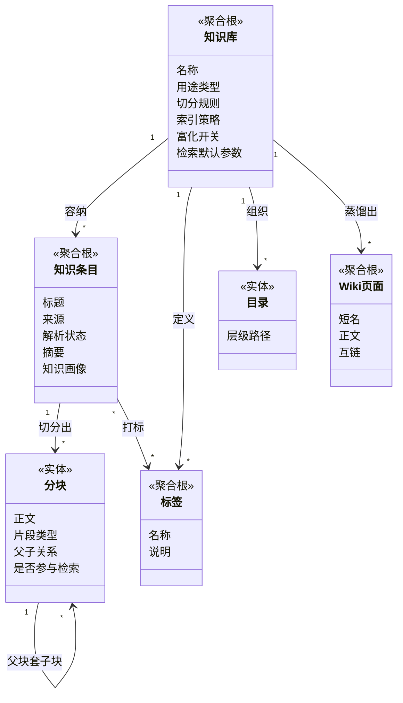
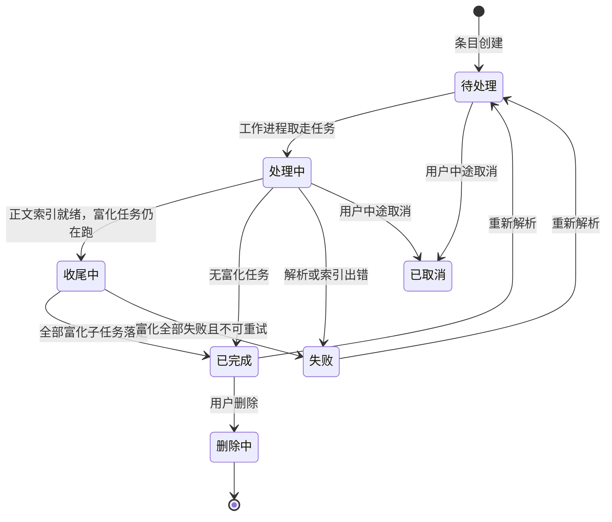
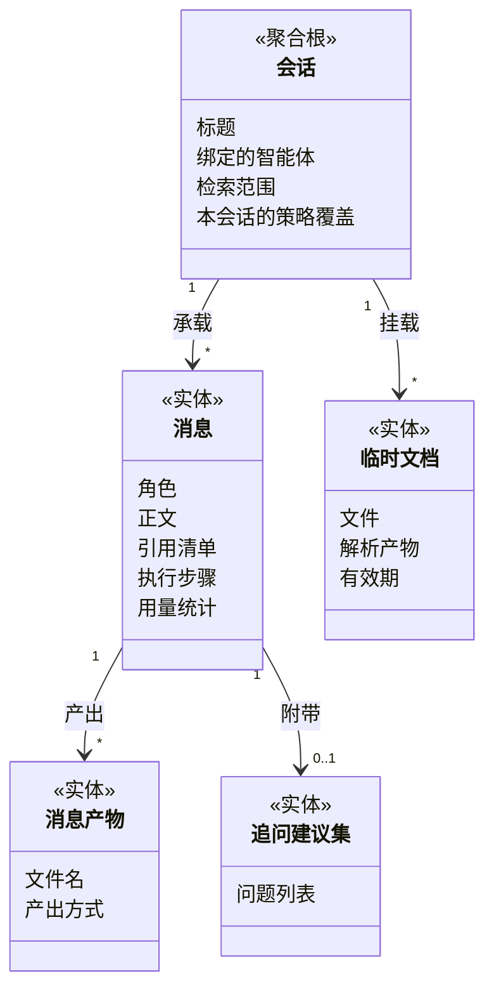
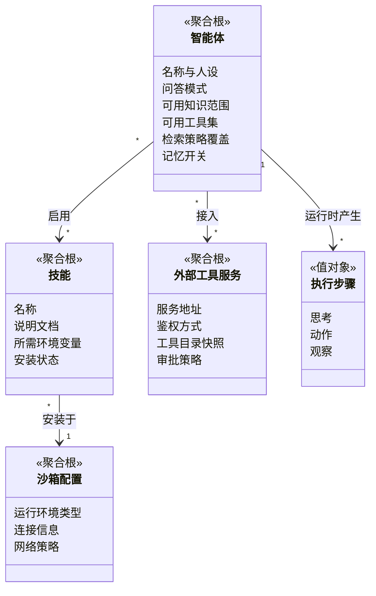

# 限界上下文详解 · 核心域

## 一句话概括

五个核心上下文各自守着一组「必须一起改、一起校验」的业务对象：知识资产守知识的组织形态，知识加工守从原始文件到可检索索引的转换，检索守「给一句话捞出最相关片段」的策略，对话问答守一轮问答的完整交付，智能体守一个能自主行动的助手怎么定义与运行。

---

## 1. 知识资产上下文

### 1.1 实体与关系



### 1.2 聚合边界与不变量

| 聚合根 | 边界内包含 | 必须成立的规则（不变量） |
|---|---|---|
| 知识库 | 切分规则、索引策略、富化开关、检索默认参数、FAQ 配置、Wiki 配置 | 1. 知识库一旦有已建索引的内容，**向量化模型不可更换**——换了会使已有向量与新查询向量不可比<br/>2. 用途类型（文档/问答对/Wiki）在创建时确定，后续不可改<br/>3. 知识库必属于且只属于一个空间 |
| 知识条目 | 基本信息、解析状态、摘要、知识画像、其下全部分块 | 1. 条目与其分块的归属知识库必须一致，跨库移动必须整体搬迁<br/>2. 同一知识库内不允许两份内容完全相同的条目（按内容指纹判重）<br/>3. 解析状态只能沿既定状态机推进，不得跳跃<br/>4. 条目被删除时，其全部分块与索引必须一并消失，不留孤儿 |
| 标签 | 名称、说明、与条目的关联 | 标签只在定义它的知识库内有效，不跨库复用 |
| Wiki 页面 | 正文、短名、修订历史、质量问题 | 1. 短名在所属知识库内唯一<br/>2. 正文覆盖前必须留存上一版，支持回滚<br/>3. 页面引用的原始条目被删除时，引用须被标记为失效而非静默留空 |

**关于分块的一处务实偏离**：按严格 DDD，分块应只经由知识条目访问。实际系统允许直接按分块查询与编辑（分块编辑、启用停用、重排），因为一次检索要跨成千上万条分块取数，走聚合根会让性能完全不可用。代价是：**任何直接改分块的操作，都必须自行保证不破坏「分块归属与条目一致」这条不变量**——这是该上下文最容易被破坏的地方。

### 1.3 知识条目的解析状态机



**最容易被误解的是「收尾中」**：它不是「快完成了」的进度条，而是一个有确切业务含义的状态——**正文已经能被检索到了，但摘要、自动标签、图片识别这类增强内容还在生成**。这时提问已经能命中这份资料的正文，只是还引用不到它的摘要。把「收尾中」当成「不可用」会让用户白等。

### 1.4 领域事件

| 事件 | 何时发出 | 谁关心 |
|---|---|---|
| 知识条目已创建 | 条目落库、尚未解析 | 知识加工上下文（启动加工作业） |
| 正文索引已就绪 | 分块与向量写入完成 | 检索上下文（内容开始可被召回）、对话问答（用户可见） |
| 知识条目已删除 | 条目及其派生物清理完成 | 检索上下文（索引清除）、资源与存储（引用释放）、Wiki（失效链接标记） |
| 知识条目已跨库移动 | 归属知识库变更完成 | 检索上下文（索引归属改写） |
| Wiki 页面已更新 | 正文覆盖并留存旧版 | 检索上下文（页面索引重建） |

---

## 2. 知识加工上下文

### 2.1 加工作业的阶段划分

这是全系统唯一一个「一次业务动作横跨多个异步阶段」的上下文。它的聚合根是**加工作业**，边界内包含该作业的全部阶段与阶段间的状态传递。

| 阶段 | 业务动作 | 是否必经 | 失败后果 |
|---|---|---|---|
| 1 解析 | 把任意格式的原始文件转成统一的结构化正文 + 图片清单 | 必经 | 整份条目判失败 |
| 2 切分 | 按知识库的切分规则把正文切成可检索的片段，必要时建立父子两层 | 必经 | 整份条目判失败 |
| 3 向量化与建索引 | 为每个片段生成向量，连同原文写入检索存储 | 必经 | 整份条目判失败，并回滚已写入的片段 |
| 4 图片理解 | 对正文中的图片做识字与内容描述，各自产出独立片段 | 可选 | 单张图片失败不影响整体 |
| 5 摘要与画像 | 为整份条目生成摘要与结构化画像，并作为一个独立片段入索引 | 可选 | 摘要标记为失败，正文仍可检索 |
| 6 推荐问题 | 基于内容预生成一组「这份资料能回答什么」的问题 | 可选 | 静默跳过 |
| 7 自动打标 | 从知识库已有标签里挑出适合这份条目的标签 | 可选 | 静默跳过 |
| 8 图谱抽取 | 抽取实体与实体间关系，供实体检索使用 | 可选 | 静默跳过 |

### 2.2 不变量

1. **先写片段、后写索引；索引写失败必须回滚片段。** 片段表与检索索引是两份必须一致的存储，系统不用分布式事务，而是用「后一步失败就撤销前一步」来保证一致。
2. **重新解析必须先清空旧片段与旧索引。** 否则同一份资料会出现新旧两套片段同时被检索到。
3. **可选阶段的失败不得改写必经阶段的结论。** 摘要生成失败只影响摘要状态，不得把条目整体判为失败。
4. **作业执行期间原条目的归属若发生变化（被移动、被删除、知识库易主），作业必须自行放弃。** 这是防止「任务跑完把结果写回一个已经不属于原主的地方」。
5. **同一份原始文件在同一知识库内只允许存在一份条目**，重复上传应识别为「已存在」而非失败。

### 2.3 领域事件

| 事件 | 触发下游 |
|---|---|
| 解析已完成 | 切分阶段启动 |
| 片段已建立 | 向量化阶段启动 |
| 正文索引已就绪 | 富化阶段批量启动；同时对外宣告内容可检索 |
| 富化子任务已落定 | 收尾判定：全部落定则条目转为已完成 |
| 加工已失败 | 记录失败原因；超过重试上限进死信台账 |

---

## 3. 检索上下文

### 3.1 领域概念

检索上下文没有长生命周期的实体，它的核心是**一次检索请求**这个聚合，以及一组领域服务。

| 概念 | 业务含义 |
|---|---|
| 检索范围 | 本次允许被搜到的知识库与条目集合。**由外部传入，检索侧不自行推断** |
| 检索策略 | 召回条数、命中阈值、融合权重、重排条数、是否扩展查询等一组参数 |
| 召回 | 从海量片段里先捞出一批候选。分「按词面捞」和「按语义捞」两路 |
| 融合 | 把两路召回的结果合成一张榜。按各自名次取倒数加权，而不是直接比分数——两路的分数量纲不同，直接比会让其中一路被系统性淹没 |
| 重排 | 用一个更强但更慢的模型对候选做精排，只保留最相关的若干条 |
| 片段展开 | 命中子块后，把它的父块取出来一并交付，避免答案断在半句话上 |
| 裁剪 | 按上下文预算砍掉排在后面的候选 |

### 3.2 检索策略的四层优先级

这是本上下文最重要、也最容易出错的规则：

```
单次请求显式指定  >  智能体上的设置  >  知识库上的设置  >  空间默认值
```

**任何一层缺省时向上一层取值，而不是就地兜底一个内置常量。** 就地兜底会让上层配置静默失效——这是历史上反复出现的缺陷形态。

### 3.3 不变量

1. **可见性不是检索的职责。** 检索只接受一个已经算好的范围，范围之外的内容绝不出现在结果里，但范围本身由协作共享与身份租户两个上下文算好。
2. **同一次检索内，所有片段必须用同一套向量化口径生成。** 跨向量化口径比较相似度没有意义。
3. **融合只在两路召回都有结果时进行**；只有一路时直接按该路名次去重输出。
4. **重排是可选增强，不可成为必经环节。** 重排不可用时必须退回融合结果，而不是整体失败。

---

## 4. 对话问答上下文

### 4.1 实体与关系



### 4.2 不变量

1. **一条助手消息与它引用的片段必须同时落库。** 只落答案不落引用，等于事后无法解释这句话从哪来。
2. **会话的检索范围在每轮开始时冻结。** 一轮问答进行中知识库被删除或被取消共享，本轮按冻结时的范围完成，不半路改写。
3. **临时文档只在其所属会话内可见**，且过期后必须连同解析产物一并清理——它不是知识库内容，不进入常规检索。
4. **分支会话（从某条消息派生新会话）复制的是上下文快照，不是引用。** 原会话后续的改动不影响分支。

### 4.3 一轮问答的阶段（业务视角）

| 阶段 | 业务动作 | 可跳过的条件 |
|---|---|---|
| 载入历史 | 取回本会话最近若干轮对话 | 本会话设定为不带历史 |
| 召回记忆 | 取回关于这个人的已知信息 | 记忆功能关闭 |
| 理解提问 | 把口语化、带指代的提问改写成可检索的表述；判断这一问到底要不要查资料 | 未开启改写且无图片 |
| 检索 | 在冻结的范围内召回候选片段 | 理解阶段判定「不需要查资料」 |
| 重排与合并 | 精排、展开父块、合并相邻片段、按预算裁剪 | 无候选 |
| 组装提示 | 把资料、历史、记忆、附件拼成给模型的输入 | — |
| 生成回答 | 流式产出答案 | — |
| 事后沉淀 | 抽取本轮值得长期记住的信息、生成追问建议 | 对应功能关闭 |

---

## 5. 智能体上下文

### 5.1 实体与关系



### 5.2 两种问答模式

| 模式 | 业务含义 | 适用场景 |
|---|---|---|
| **快速问答** | 一次检索、一次生成，不使用工具 | 问答准确性要求高、响应要快、答案完全来自知识库 |
| **智能推理** | 「思考—行动—观察」反复循环，期间可多次检索、调用工具、执行脚本 | 需要跨多份资料汇总、需要算数或画图、需要操作外部系统 |

**这两种模式不是「简单版与高级版」**，而是两种收益取向不同的选择：快速问答可解释、可预期、成本稳定；智能推理能力更强但耗时与成本不可预期，且每多一步就多一分偏离原问题的风险。

### 5.3 不变量

1. **智能体的可用知识范围不得超出其所属空间的可见范围。** 智能体不是提权工具。
2. **技能必须先安装到某个沙箱环境才可被启用**；同一份技能定义可安装到多个环境，但压缩包只存一份。
3. **高风险工具在调用前必须经过审批策略判定**，审批未通过时该次调用必须失败，而不是降级为跳过。
4. **执行步骤必须完整留存并可回放。** 只留最终答案、不留中间步骤，等于智能体的行为不可审计。
5. **被共享出去的智能体，其绑定的知识库对接收方一律只读**，且不因共享者自身有编辑权而放宽。

### 5.4 领域事件

| 事件 | 谁关心 |
|---|---|
| 执行步骤已产生 | 对话问答（实时推送给用户）、运维审计 |
| 工具调用待审批 | 对话问答（阻塞等待用户确认） |
| 技能安装状态变更 | 智能体（可用工具集刷新） |
| 沙箱快照已生成 | 运维审计（防止快照资源泄漏） |

---

## 完整示例：一份合同从入库到被引用

以「法务把一份 80 页采购合同放进知识库，同事提问并得到带出处的答案」为例，串起五个核心上下文：

| 步骤 | 所在上下文 | 发生了什么 |
|---|---|---|
| 1 | 身份与租户 | 判定法务在该空间为贡献者，对该知识库可写 |
| 2 | 资源与存储 | 原始文件落到存储后端，拿到一个稳定的引用 |
| 3 | 知识资产 | 创建知识条目，状态置为「待处理」；按内容指纹确认非重复上传 |
| 4 | 知识加工 | 解析出正文与 12 张图片 → 按知识库的切分规则切成 210 个正文片段（父块 35 个、子块 175 个） |
| 5 | 知识加工 | 210 个片段全部向量化并写入检索存储 → 发出「正文索引已就绪」，条目转为「收尾中」 |
| 6 | 知识加工 | 12 张图片逐张识字与描述，产出 19 个图片片段；整份条目生成摘要并另成一个片段；从知识库已有标签中挑中「采购」「合同」 |
| 7 | 知识资产 | 全部富化子任务落定，条目转为「已完成」 |
| 8 | 对话问答 | 同事在会话中提问「这份合同的违约金怎么算」 |
| 9 | 对话问答 | 载入最近 3 轮历史；召回该同事的记忆（无相关项）；理解阶段把提问改写为「采购合同 违约金 计算方式 赔偿比例」 |
| 10 | 检索 | 在冻结的范围内按词面与语义两路各召回 30 条 → 融合成一张榜 → 重排取前 8 条 |
| 11 | 检索 | 命中的是子块，展开取出其父块，避免条款断句 |
| 12 | 对话问答 | 组装提示并流式生成答案；答案与 8 条引用一并落库 |
| 13 | 对话问答 | 事后从本轮抽取「这位同事负责采购合同审核」，交给长期记忆上下文 |

---

## 技术实现参考

- 五个上下文对外暴露的接口分组 —— `../product/api-设计.md`
- 聚合根与数据表的落地映射 —— `../product/数据字典/README.md`
- 入库与检索两条链路的外部模型与存储明细 —— `../product/知识库入库与检索流程.md`
- 战略层的上下文划分依据与映射关系 —— `2026-09-19-领域驱动设计总览.md`
- 跨上下文的事件与长流程编排 —— `2026-09-19-领域事件与业务流程编排.md`
- 知识资产的四层组织与解析状态语义 —— `2026-09-19-知识资产组织模型.md`
