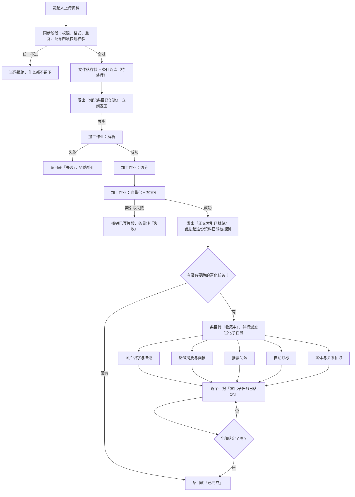
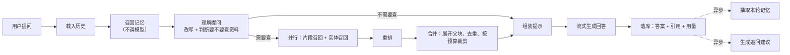

# 领域事件与业务流程编排

## 一句话概括

系统里凡是「一次用户动作要横跨多个上下文、且不可能在一次操作内全部完成」的地方，都用**领域事件 + 后台作业**串起来；这意味着一致性是最终一致而非即时一致，每条链路都必须显式回答「中途失败了怎么办」。

## 参与角色

| 角色 | 在流程中的职责 |
|---|---|
| 发起人 | 上传资料、提问、配置共享的人或机器主体 |
| 事件发出方 | 完成了某个业务事实的上下文，负责如实宣告 |
| 事件消费方 | 关心该事实的下游上下文，各自决定要不要动作 |
| 后台作业 | 承载耗时动作的执行单元，可重试、可取消、失败可进死信 |
| 收尾判定方 | 判断一组并行子作业是否全部落定，从而推进主状态 |

---

## 1. 领域事件总表

### 1.1 知识生命周期相关

| 事件 | 发出方 | 业务事实 | 消费方与动作 |
|---|---|---|---|
| 知识条目已创建 | 知识资产 | 一份资料被纳管，尚未可检索 | 知识加工：启动加工作业 |
| 解析已完成 | 知识加工 | 原始文件已转为统一正文 | 知识加工：进入切分 |
| 正文索引已就绪 | 知识加工 | 这份资料的正文**已经能被搜到** | 知识资产：状态转「收尾中」或「已完成」；知识加工：批量启动富化 |
| 富化子任务已落定 | 知识加工 | 某项增强内容产出或放弃 | 收尾判定：全部落定则主状态转「已完成」 |
| 加工已失败 | 知识加工 | 必经阶段出错 | 知识资产：状态转「失败」；运维审计：记录原因 |
| 知识条目已删除 | 知识资产 | 条目及派生物应消失 | 检索：清索引；资源与存储：解引用；Wiki：标记失效链接 |
| 知识条目已跨库移动 | 知识资产 | 归属知识库变更 | 检索：索引归属改写 |

### 1.2 对话与智能体相关

| 事件 | 发出方 | 业务事实 | 消费方与动作 |
|---|---|---|---|
| 记忆已召回 | 长期记忆 | 本轮用到了哪几条记忆 | 对话问答：告知用户本轮参考了什么 |
| 执行步骤已产生 | 智能体 | 一次「思考—行动—观察」完成 | 对话问答：实时推送；运维审计：留痕 |
| 工具调用待审批 | 智能体 | 高风险动作需人工确认 | 对话问答：阻塞并向用户征询 |
| 回答已完成 | 对话问答 | 一轮问答交付 | 长期记忆：启动记忆抽取；对话问答：生成追问建议 |
| 记忆已抽取 | 长期记忆 | 本轮沉淀出新的记忆条目 | 长期记忆：刷新常驻块 |

### 1.3 协作与集成相关

| 事件 | 发出方 | 业务事实 | 消费方与动作 |
|---|---|---|---|
| 资产已共享 / 已取消共享 | 协作共享 | 可见范围变化 | 智能体：可用知识范围刷新；运维审计：留痕 |
| 空间成员角色已变更 | 身份与租户 | 某人档位变化 | 运维审计：留痕 |
| 外部数据源同步完成 | 外部集成 | 一批外部文档进入或更新 | 知识资产：新增/更新条目并触发加工 |
| 技能安装状态已变更 | 智能体 | 某技能可用或不可用 | 智能体：可用工具集刷新 |

---

## 2. 长流程一：一份资料从上传到完全可用

这是全系统最长的一条链路，也是最能说明「最终一致」代价的一条。

### 2.1 这条链路的三条关键业务规则

1. **同步阶段只做能立刻失败的检查。** 权限、格式、重复、配额四项全在返回前做完；做不完的一律推到后台。这不是性能优化，而是业务承诺——**用户点完上传就该拿到明确结论：要么被拒，要么已受理**。

2. **「正文索引已就绪」是对外可用性的分水岭。** 在它之前这份资料完全搜不到；在它之后即使富化全挂，正文也照样能被检索和引用。把这条线画在别处会让用户白等。

3. **必经阶段与可选阶段的失败后果必须不同。** 解析、切分、建索引三步任一失败，整份资料判失败；图片识别、摘要、推荐问题、打标、图谱抽取任一失败，只影响对应的增强内容。混淆两者会导致「因为一张图没认出来，整份合同用不了」这类荒谬结果。

### 2.2 补偿与回滚

| 失败点 | 补偿动作 | 为什么不用更强的一致性保证 |
|---|---|---|
| 写索引失败 | 撤销刚写入的片段 | 片段与索引在两套存储里，跨存储事务代价过高，且失败是小概率；用「后一步失败撤销前一步」足够 |
| 富化子任务失败 | 只标记该子项失败，主状态照常推进 | 增强内容的缺失不构成业务不可用 |
| 作业跑完发现条目已被删/被移走 | 直接丢弃结果，不写回 | 防止把结果写到一个已经不属于原主的地方 |
| 重试耗尽 | 进死信台账，等待人工处理 | 无限重试会拖垮队列；静默丢弃会导致数据不一致且无人知晓 |

### 2.3 异常路径

| 异常 | 业务处理 |
|---|---|
| 用户中途取消 | 作业在每个阶段边界检查取消标记，命中即放弃并清理已产出的中间物 |
| 同一份资料被重复上传 | 识别为「已存在」，刷新旧记录时间并返回提示，**不是错误** |
| 加工过程中知识库被删除 | 作业自行放弃，不报错 |
| 配额超限 | 在写索引前判定并终止，已写片段一并撤销 |

---

## 3. 长流程二：一轮问答的编排

### 3.1 关键业务规则

1. **召回记忆不得调用模型。** 它在每轮最前面，引入模型调用会直接拖垮首字延迟。
2. **理解阶段有权判定「这一问不需要查资料」**，此时整条检索链路被跳过。这不是优化开关，而是业务判断——闲聊、纯计算、纯格式转换本就不该去翻知识库。
3. **检索范围在本轮开始时冻结。** 进行中共享被取消，本轮按冻结范围完成。
4. **答案与引用必须同时落库。** 只落答案不落引用，等于这句话事后无法解释来源。
5. **事后沉淀是异步的、可失败的。** 记忆抽取或追问建议失败，都不影响这轮回答已经交付的事实。

### 3.2 异常路径

| 异常 | 业务处理 |
|---|---|
| 检索一条结果都没有 | 明确告知「没找到相关内容」，而不是让模型凭空作答 |
| 重排不可用 | 退回融合后的结果继续，不整体失败 |
| 生成中途断流 | 已产出的部分保留并标记未完成，用户可重试 |
| 用户中途停止 | 立刻停止生成，已产出部分照常落库 |
| 工具调用被拒绝审批 | 该次调用判失败并回到推理循环，**不是静默跳过** |

---

## 4. 一致性边界总结

| 场景 | 一致性要求 | 理由 |
|---|---|---|
| 权限判定与数据访问 | **强一致**，同一次操作内完成 | 权限滞后就是越权 |
| 片段与检索索引 | **强一致**，靠失败撤销保证 | 两者不一致会让检索返回已删除内容 |
| 条目主状态与富化内容 | **最终一致** | 富化耗时不可控，强一致会让用户长时间无法使用 |
| 共享变更与智能体可用范围 | **最终一致**，但取消共享的生效必须即时 | 放开可以慢，收紧不能慢 |
| 用量统计与计费视图 | **最终一致** | 统计滞后可接受 |
| 审计留痕与业务动作 | **最终一致**，且审计失败不阻断业务 | 保持单向依赖 |

**其中唯一一条不对称的规则值得单独记住**：共享的「放开」可以最终一致，「收紧」必须即时生效。任何把取消共享做成延迟生效的设计都是权限缺口。

---

## 完整示例：一次带取消的入库

以「运营上传一份 200 页产品手册，30 秒后发现传错了，点了取消」为例：

| 时刻 | 发生了什么 | 条目状态 |
|---|---|---|
| 0 秒 | 上传成功，四项快速校验通过，文件落存储，条目落库 | 待处理 |
| 1 秒 | 后台工作进程取走任务，开始解析 | 处理中 |
| 30 秒 | 运营点击取消，系统打上取消标记 | 处理中（已标记取消） |
| 45 秒 | 解析完成，作业在进入切分前检查取消标记，命中 | — |
| 45 秒 | 作业放弃：丢弃解析产物，不写任何片段，不建索引 | 已取消 |
| 46 秒 | 释放原始文件的引用；若无其他引用则物理删除 | 已取消 |

**这里最关键的是「检查点在阶段边界」**：取消不会打断正在进行的解析（强行中断外部调用不可靠），而是在下一个阶段边界生效。所以用户点取消到真正停止之间会有一段延迟，这是设计使然，不是缺陷——但产品上必须让用户看到「正在取消」而不是「已取消」。

---

## 技术实现参考

- 入库与检索两条链路的外部模型与存储明细 —— `../product/知识库入库与检索流程.md`
- 各流程的调用链路与分支条件 —— `../product/流程图/`
- 上下文划分与映射关系 —— `2026-09-19-领域驱动设计总览.md`
- 核心域的聚合与不变量 —— `2026-09-19-限界上下文详解-核心域.md`
- 支撑域与通用域的聚合与不变量 —— `2026-09-19-限界上下文详解-支撑域与通用域.md`
