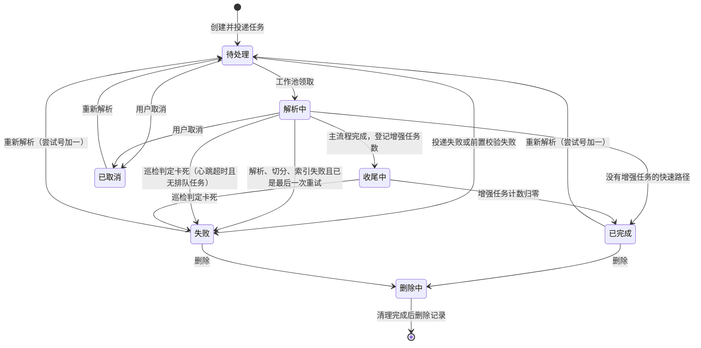

# 领域驱动设计 · 聚合与业务不变量

## 一句话概括

本文把《限界上下文总览》里的 30 个上下文逐个拆到**聚合根 → 内部实体 → 值对象**这一层，并列出每个聚合必须始终成立的业务不变量（不变量：不管怎么操作都不能被打破的规则，比如「每个空间至少一位所有者」）和状态机；它回答的问题是「一次操作到底改动了哪几张纸、哪些规则在暗中拦着你」。

> 阅读约定：聚合根用**粗体**；「内部实体」是随聚合根一起增删、有自己身份的对象；「值对象」是没有独立身份、整体替换的配置或快照。带「（推断）」的条目是从实现反推、尚未经业务方确认的规则。

## 实体与关系

### 一、知识主干

#### 1. 知识库（聚合根：**知识库**）

| 成分 | 内容 |
|---|---|
| 内部实体 | 无（知识条目、标签、Wiki 页面各自是独立聚合，只通过知识库标识引用） |
| 值对象 | 切分配置、图片处理配置、视觉模型配置、语音模型配置、图谱抽取配置、问答对配置、问题生成配置、自动打标配置、知识库画像配置、Wiki 配置、存储供应商配置、索引策略（向量 / 关键词 / Wiki / 图谱四个开关） |
| 不变量 | 1）绑定的向量库实例建库后不可更换；2）绑定的存储后端建库后不可更换；3）类型只能是文档型 / 问答对型 / Wiki 型之一，建库后不改；4）图谱开关生效需要「索引策略开图谱」与「抽取配置启用」同时成立；5）标记为临时的知识库对界面隐藏（推断：供评测与对话附件使用） |
| 生命周期 | 创建 → 使用中 → 删除中（删除是异步任务，先清索引与文件再删记录） |

#### 2. 知识条目（聚合根：**知识条目**）

| 成分 | 内容 |
|---|---|
| 内部实体 | 处理阶段记录（每一次解析尝试下的逐阶段进度树：解析、切分、向量化、多模态、后处理五个规范阶段） |
| 值对象 | 单次处理覆盖配置（上传时对知识库默认配置的覆盖，重解析时沿用）、知识画像（摘要、主题词、典型问题）、手工知识元数据（草稿 / 已发布）、来源渠道、内容指纹、目录路径 |
| 不变量 | 1）同一知识库内「内容指纹 + 文件名 + 大小 + 文件类型」相同的资料视为重复，不重复入库；2）「待处理增强任务数」只在收尾中有意义，进入终态时归零；3）解析状态的迁移必须沿状态机走（见下）；4）启用状态与解析状态独立：索引一成功就置为启用，不等增强任务；5）每次重解析的尝试号递增，新尝试会取代旧尝试的收尾动作；6）删除必须先标记「删除中」阻止并发写入，再清资源，最后删记录 |

**解析状态机**

辅助状态机：**摘要状态**「无 → 待生成 → 生成中 → 已完成 / 失败」，与解析状态独立；分块被编辑、启停或元数据变更都会让摘要过期并触发刷新，刷新完成前若输入又变了，本次结果直接丢弃、让更新的那次收尾（防止旧摘要覆盖新摘要）。

#### 3. 分块（聚合根：**分块**）

| 成分 | 内容 |
|---|---|
| 内部实体 | 分块修订记录（每次覆盖前的历史版本） |
| 值对象 | 分块类型（正文、父块、图片描述、图片文字识别、摘要、生成问题、问答对、实体、关系、Wiki 页面、表格摘要、表格列）、图片信息、问答对元数据（标准问、相似问、反例问、答案、答题策略）、前后邻居指针、父块指针、内容指纹 |
| 不变量 | 1）原始内容（解析器产物）不可变，人工只改当前内容；2）每次人工编辑或回滚修订号加一，同一分块同一修订号只有一条历史；3）分块顺序号全局唯一递增；4）索引状态只有就绪 / 索引中 / 失败三种，编辑后必须重新索引才回到就绪；5）父块只入库不进检索索引，检索命中子块后回填父块内容；6）停用的分块在主库与检索索引中必须同时不可见——索引侧更新失败要报错，不能静默 |

#### 4. 检索请求与检索结果（无聚合根，值对象）

| 值对象 | 语义 |
|---|---|
| 检索范围 | 知识库列表、可选的知识条目与标签约束；显式圈定范围的目标可关闭召回阈值 |
| 检索参数 | 向量阈值、关键词阈值、召回条数、查询向量（每个向量模型身份只算一次） |
| 检索结果 | 分块标识、内容、分数、来源类型（知识库 / 联网 / 历史引用 / 数据分析 / 图谱）、命中方式 |
| 不变量 | 1）一次多库检索的所有库必须共用同一向量模型身份；2）过召回条数有上限（避免大范围检索拖垮引擎）；3）双路召回时用排名融合而不是分数融合，因为关键词分数无上界 |

#### 5. 问答对（复用分块聚合）

不变量：1）一个问答对型知识库只有一个知识条目，所有问答对都挂在它下面；2）问答对去重基于归一化后的内容指纹（去网址、转小写、繁转简、全角转半角）；3）追加模式下标准问冲突整条失败，相似问或反例问冲突只剔除冲突项；4）反例问不参与索引，只在检索后做精确剔除；5）同一知识库同一时刻只允许一个导入任务。

#### 6. 标签（聚合根：**标签**）

内部实体：标签与知识条目的关联。不变量：标签顺序号唯一递增；删除标签时异步清理关联与索引中的标签字段；自动打标只从已有标签中挑、上限十个、默认跳过已有标签的资料。

### 二、对话与智能

#### 7. 会话（聚合根：**会话**）

| 成分 | 内容 |
|---|---|
| 内部实体 | 消息（用户消息与助手消息以同一个请求号配对成一轮）、生成产物（智能体产出的可下载文件及其版本）、建议问题集、临时附件（有有效期）、分支快照租约 |
| 值对象 | 上次请求状态（界面记住的智能体 / 模型 / 知识库 / 联网选择）、上下文配置、消息图片、消息附件、提及项（@文档 / @标签 / @技能 / @工具）、推理步骤（智能体的思考、工具调用与结果）、知识引用 |
| 不变量 | 1）会话拥有者是「调用主体」，九类身份统一落到同一个字段；2）同一会话同一时刻只允许一轮回答在生成；3）用户消息随请求即完成，助手消息在流结束或被停止后补全；4）分支会话记录来源会话与分叉点，但**不建立强绑定**，父会话删除后分支仍在；5）会话对沙箱的绑定是临时的，随沙箱回收而消失；6）分支前先落快照租约，防止创建过程崩溃留下孤儿快照 |

#### 8. 智能体执行（无聚合根）

不变量：1）引擎跨轮**无状态**，历史每轮从会话消息重建；2）上下文溢出时每轮只允许一次「压缩并重试」；3）高风险外部工具调用先经审批闸门，默认等待十分钟，拒绝、超时、取消都作为工具结果返回给模型继续推理；4）外部工具需要授权时可在当前对话内完成，成功后自动重试该次调用；5）非终局轮次的「开场白」在后续出现工具调用时被标记为已取代，不进入最终答案。

#### 9. 自定义智能体（聚合根：**自定义智能体**）

| 成分 | 内容 |
|---|---|
| 值对象 | 智能体配置（工作模式、类型预设、系统提示词、模型与重排模型、工具白名单、外部工具选择模式、技能选择模式与沙箱、记忆开关、知识库选择模式、多模态与附件策略、问答对策略、联网策略、多轮策略、检索参数、兜底策略、建议问题配置） |
| 内部实体 | 收藏记录（用户对智能体或知识库的星标） |
| 不变量 | 1）标识在空间内唯一（主键是「标识 + 空间」的组合，内置智能体对所有空间可见）；2）内置智能体由声明式配置文件维护，运行时不可编辑；3）智能推理模式强制开启多轮；4）若工具集包含知识检索且知识库范围未禁用，必须配置重排模型，否则不允许共享；5）共享出去的智能体权限强制为只读；6）接收方可以在本空间隐藏某个共享智能体，但不能改它 |

#### 10. 长期记忆（聚合根：**记忆主体**）

| 成分 | 内容 |
|---|---|
| 内部实体 | 记忆条目（五类：资料、偏好、事实、事项、兴趣）、条目向量、主题统计、文档亲和（反复引用的文档）、墓碑（被拒绝的推断，用于抑制重复抽取）、抽取会话记录 |
| 值对象 | 记忆配置（挂在空间上：开关、写入模式、抽取模型、延迟与最短间隔、抽取指令、条目上限、兴趣阈值、召回向量模型、检索个性化开关）、预渲染记忆块 |
| 不变量 | 1）一个空间内一个调用主体只有一个记忆主体；2）同一归一化主题的新条目**取代**旧条目，读路径不需要模型参与；3）推断出的条目处于待确认状态时不注入提示词；4）人工编辑过的条目不再被后台抽取覆盖；5）多轮连续提问只入队一次抽取（防抖）；6）空间开关关闭或写入模式不是自动时不跑后台蒸馏；7）活跃条目数有上限（默认二百） |

**记忆条目状态机**：待确认 → 活跃（确认）；活跃 → 已取代（同主题新条目出现）；活跃 → 已归档（事项到期或整理归档）；任一状态 → 删除（留墓碑）。

#### 11. Wiki 页面（聚合根：**Wiki 页面**）

| 成分 | 内容 |
|---|---|
| 内部实体 | 页面修订记录、页面问题（智能体或人标记的待修问题） |
| 关联聚合 | Wiki 目录（独立聚合：邻接树，允许空目录先搭骨架） |
| 值对象 | 页面类型（摘要页、实体页、概念页、索引页、综合页、对比页）、页面状态（草稿 / 已发布 / 已归档）、编辑来源（管道 / 智能体 / 人工 / 回滚）、别名、来源引用 |
| 不变量 | 1）同一知识库内别名唯一；2）页面所属目录只有一个事实源，路径与深度是每次写入重算的缓存；3）覆盖前先整份快照旧版本，同一页面同一版本号只有一条历史，重试下幂等；4）回滚会以目标版本内容创建**新**版本，版本号继续递增，因此回滚本身也可回滚；回滚到当前版本被拒绝；5）历史清理两级上限：五十版时只清自动生成的，二百版时不分来源；6）综合页与对比页只能由智能体创建 |

### 三、能力供应与外部接入

#### 12. 空间沙箱配置（聚合根：**沙箱配置**）

值对象：后端类型（三选一）与各自连接参数、资源限制、网络策略（默认放行 / 默认拒绝加白名单、按域名与路径的细粒度规则、请求头注入）、卷挂载、技能镜像配置、环境变量。不变量：1）修改后端身份或删除配置前，必须确认没有运行中或暂停的实例和关联智能体；2）已有实例不因策略修改自动更新，需重建后生效；3）注入的凭据加密保存、响应脱敏；4）会话与沙箱的绑定按会话持续，空闲超时与孤儿实例被回收。

#### 13. 技能（聚合根：**技能安装记录**）

| 成分 | 内容 |
|---|---|
| 关联聚合 | 技能目录条目（空间级，只存一份包）、镜像快照（记录每次安装 / 卸载 / 重建产生的快照及父子链）、个人环境变量 |
| 值对象 | 服役版本、环境变量声明、安装进度与日志 |
| 不变量 | 1）目录条目要求已无沙箱安装引用才可删，且不隐式卸载；2）**服役镜像与最新安装解耦**：只有安装成功才前移指针，失败时旧版本继续服役；3）安装卡死按「安装中起始时间」回收；4）快照状态机：构建中 → 活跃 → 已取代 / 已删除；5）环境变量的唯一性由「空间 + 主体类型 + 主体 + 沙箱配置 + 技能 + 变量名」六元组保证；6）停用只影响智能体可选范围，不动安装 |

**技能状态机**：安装中 → 就绪；安装中 → 失败（含人工停止）；失败 → 安装中（重试）；就绪 / 失败 → 卸载中 → 消失。

#### 14. 外部工具服务（聚合根：**外部工具服务**）

内部实体：工具元数据、工具审批策略、授权客户端、授权令牌。值对象：传输方式（三种）、认证配置、高级配置。不变量：1）同一空间内服务名唯一；2）审批策略按「空间 + 服务 + 工具」唯一；3）授权令牌按「空间 + 主体类型 + 主体 + 服务」唯一，授权不跨主体复用。

#### 15. 对外端点（聚合根：**对外端点**）

不变量：1）令牌指纹全局唯一，令牌有固定前缀；2）能力按检索 / 问答 / Wiki / 写入四组授权；3）写入类工具必须显式授权到具体知识库。

#### 16. 数据源（聚合根：**数据源**）

内部实体：同步记录。值对象：连接器类型、凭据、同步范围与周期、同步模式（增量 / 全量）、游标。不变量：1）状态只有活跃 / 暂停 / 出错 / 已删除；2）同步记录状态：运行中 → 成功 / 部分成功 / 失败 / 已取消；3）抓取失败的条目不推进游标，下次必然重试；4）暂停后停止计划同步，恢复后重新注册调度。

#### 17. 浏览器已配对设备 / 18. 搜索供应商 / 19. IM 渠道 / 20. 嵌入渠道 / 21. 评测任务

| 聚合根 | 不变量 |
|---|---|
| 已配对设备 | 每个用户当前只保留一个；配对令牌一次性，兑换后即删；连接中断的任务标记为需显式恢复 |
| 搜索供应商 | 凭据字段可单独删除；是否生效由智能体配置与本轮请求开关共同决定 |
| IM 渠道（内部实体：渠道会话） | 接入模式二选一（回调 / 长连接），部分平台强制某一种；渠道会话按「用户」或「线程」隔离；绑定的附件入库知识库必须是渠道所在空间的库 |
| 嵌入渠道 | 访客范围完全由绑定的智能体决定；发布令牌可换取短效令牌；来源域名白名单与每 IP / 每渠道 / 每日三级限流 |
| 评测任务（内存态） | 进程重启即丢失；评测使用独立建立的评测知识库 |

### 四、治理与基础设施

#### 22. 空间（聚合根：**空间**）

| 成分 | 内容 |
|---|---|
| 内部实体 | 成员（角色、状态：活跃 / 已邀请 / 已停用）、邀请（定向邀请或邀请链接）、接口密钥（能力清单、知识库范围、密钥指纹） |
| 值对象 | 检索引擎配置、存储引擎配置、解析引擎配置、凭据配置（加密）、接口主体配置（三种主体解析模式）、对话历史配置、检索融合配置、记忆配置、上下文配置、联网搜索配置、存储配额（默认十 GB） |
| 不变量 | 1）角色偏序：访客 < 贡献者 < 管理员 < 所有者，高档自动涵盖低档；2）每个空间至少一位所有者，降级最后一位被拒；3）无活跃成员的空间由下一位访问的真实用户自动接管为所有者；4）接口密钥在所属空间固定视为管理员，但删除空间仍需所有者；5）密钥指纹唯一；6）成员在空间内唯一（同一用户不重复加入） |

#### 23. 用户（聚合根：**用户**）

内部实体：登录令牌（可吊销）。值对象：个人偏好。不变量：1）用户名与邮箱各自全局唯一；2）注册模式分自助与仅邀请；3）新用户的空间供给模式分「建个人空间」与「无空间」；4）跨空间平台管理需「用户标记」与「系统开关」双重放行；5）已签发令牌在成员停用后仍可用到过期或被吊销（推断，待业务确认是否应立即失效）。

#### 24. 共享空间（聚合根：**共享空间**）

| 成分 | 内容 |
|---|---|
| 内部实体 | 成员空间（角色：查看者 / 编辑者 / 管理员）、加入申请（类型：加入 / 升级；状态：待审 / 通过 / 拒绝）、知识库共享记录、智能体共享记录、接收方隐藏记录 |
| 值对象 | 邀请码（全局唯一）、成员上限（默认五十，零为不限） |
| 不变量 | 1）成员单位是空间不是用户；2）创建方空间的成员记录不可删不可改；3）共享只记录关系不改变归属；4）发起共享须同时满足「在源空间是创建者或管理员以上」与「所在空间在共享空间内是编辑者以上」；5）智能体共享强制只读；6）跨空间写操作必须同时通过共享闸口与源空间角色闸口 |

#### 25. 模型（聚合根：**模型**）

值对象：类型（对话 / 向量 / 重排 / 视觉 / 语音）、来源（本地 / 远程）、参数（地址、密钥加密、维度、上下文窗口、并发上限、是否支持视觉）、状态（可用 / 下载中 / 下载失败）。不变量：1）每个空间每种类型只有一个默认模型；2）内置模型由声明式配置维护，从配置里移除即下线，管理员运行时接管的行不被配置覆盖；3）删除前检查十二种引用关系（知识库的向量 / 摘要 / 视觉 / 语音模型、智能体的对话 / 重排 / 视觉 / 语音 / 查询理解模型、记忆抽取与召回模型、空间默认等），有引用即拒绝；4）更换向量模型必须重建索引。

#### 26. 存储后端 / 向量库实例 / 资源

| 聚合根 | 不变量 |
|---|---|
| 存储后端 | 来源分「用户配置」与「环境驱动」；一个空间可挂多个实例并按知识库绑定 |
| 向量库实例 | 环境驱动的伪实例有固定前缀标记；启动时不可用的实例可在首次使用时按需重建，构建失败进入冷却期 |
| 资源（内部实体：引用绑定、访问凭证） | 句柄全局唯一；一份物理文件多处引用，任一处删除不影响其他；生命周期分持久 / 临时；访问凭证限时、指纹唯一、可撤销 |

#### 27. 审计记录 / 28. 任务运行时 / 29. 系统设置项

| 聚合根 | 不变量 |
|---|---|
| 审计记录 | 只追加；动作按命名空间分组（角色、向量库、检索索引、系统）；按保留期清理；空间级与平台级分开（平台级空间标识为零） |
| 死信记录 / 待处理操作 | 重试预算耗尽才进死信，并联动业务状态（如把知识条目标为失败）；待处理操作用于按批次消费的操作（Wiki 摄取），重启后据此恢复 |
| 系统设置项 | 键全局唯一；变更即时广播；无缓存时降级为进程内 |

## 字段语义

跨聚合复用、含义容易混淆的字段：

| 字段 | 业务含义 | 必填 | 备注 |
|---|---|---|---|
| 创建者 | 资产归属判定的依据：贡献者只能改自己创建的 | 是 | 共享不改变创建者；子资源（分块、Wiki 页、问答对、标签）沿所属知识库回溯创建者 |
| 尝试号 | 一次解析尝试的序号 | 是 | 新尝试取代旧尝试的收尾动作；阶段进度树按尝试号隔离 |
| 修订号 | 分块或 Wiki 页面被覆盖的次数 | 是 | 每次编辑或回滚加一；用于版本对比与幂等 |
| 编辑来源 | 这一版是谁写的：管道 / 智能体 / 人工 / 回滚 | 是 | 决定历史清理时的优先级：先清管道生成的 |
| 请求号 | 把一轮的用户消息与助手消息配对 | 是 | 历史加载与记忆抽取都以它为单位 |

## 映射/转换规则

1. **从「知识库配置」到「单次处理配置」**：知识库默认配置 + 上传时携带的覆盖项 → 生效配置；约束「图谱开关 = 索引策略开图谱 且 抽取配置启用」；图片上传必须配视觉模型、音频上传必须配语音模型、多模态要求对象存储完整。生效配置持久化在知识条目上，重解析沿用。
2. **从「智能体定义」到「运行时配置」**：定义里的开关与本轮请求叠加：联网搜索需两者同时开启；搜索供应商回退空间默认；检索范围由知识库、@文档、@标签统一构建；共享智能体的 @工具只能落在定义预设集合内；只有知识检索工具实际可用时才要求重排模型。
3. **从「外部身份」到「调用主体」**：IM 用户、网页访客、接口密钥各自按固定前缀编码成调用主体标识，写入会话拥有者与记忆主体；该标识不携带任何角色。
4. **从「解析状态」到「用户可见状态」**：待处理 → 等待中；解析中 → 显示进度；收尾中 → **已可检索但摘要可能未齐**；已完成 → 正常；失败 → 显示原因；已取消 / 删除中 → 从列表移除。

## 完整示例

**场景：运营同事编辑一条问答对，随后又回滚了这次编辑。**

1. 问答对型知识库里，一条问答对就是一个分块。运营同事把答案里的旧电话号码改掉并保存。**分块聚合**先把改动前的整条内容快照成一条修订记录（修订号 3），再把当前内容更新为新答案、修订号变为 4、索引状态置为「索引中」。
2. 后台重新计算这条问答对的向量并写入向量库，索引状态回到「就绪」。这期间检索命中的仍是旧向量对应的分块标识，但返回的内容已是新答案（内容以主库为准）。
3. 由于分块内容变了，所属**知识条目**的摘要被标记过期，触发一次摘要刷新；刷新期间没人再改，刷新结果落库。
4. 同事发现改错了，选择回滚到修订号 3。聚合再次先快照当前内容（修订号 4）为历史，再把修订号 3 的内容写回当前、修订号变为 5。回滚也是一次修订，因此还能再回滚。
5. 又一次重新索引、又一次摘要刷新；第二次刷新的输入快照与第一次不同，所以两次刷新互不覆盖。

这个例子说明了三条不变量在实际中如何联动：原始内容不可变、修订号只增不减、摘要刷新以输入快照防覆盖。

## 技术实现参考

聚合根类型与主表对照已列于《限界上下文总览》的技术实现参考段，此处只补充状态值与关键字段的英文对照。

| 状态机 | 中文状态 → 代码取值 | 定义位置 |
|---|---|---|
| 知识条目解析状态 | 待处理 `pending`、解析中 `processing`、收尾中 `finalizing`、已完成 `completed`、失败 `failed`、已取消 `cancelled`、删除中 `deleting` | `internal/types/knowledge.go`（`ParseStatus`） |
| 知识条目启用状态 | 启用 `enabled`、停用 `disabled` | 同上（`EnableStatus`） |
| 摘要状态 | 无 `none`、待生成 `pending`、生成中 `processing`、已完成 `completed`、失败 `failed` | 同上（`SummaryStatus`） |
| 处理阶段状态 | 待处理 `pending`、运行中 `running`、完成 `done`、失败 `failed`、跳过 `skipped`、取消 `cancelled`；阶段 `docreader / chunking / embedding / multimodal / postprocess` | `internal/types/knowledge_span.go` |
| 分块索引状态 | 就绪 `ready`、索引中 `processing`、失败 `failed` | `internal/types/chunk.go`（`IndexStatus`） |
| 分块类型 | `text / parent_text / image_caption / image_ocr / summary / question / faq / entity / relation / wiki_page / table_summary / table_column` | `internal/types/chunk.go`（`ChunkType`） |
| 记忆条目状态 | 待确认 `pending`、活跃 `active`、已取代 `superseded`、已归档 `archived` | `internal/types/memory.go` |
| Wiki 页面状态 / 编辑来源 | `draft / published / archived`；`pipeline / agent / user / revert` | `internal/types/wiki_page.go` |
| 技能状态 / 快照状态 | `installing / ready / failed / removing`；`building / active / superseded / deleted` | `internal/types/tenant_skill.go` |
| 数据源状态 / 同步记录状态 | `active / paused / error / deleted`；`running / success / partial / failed / canceled` | `internal/types/datasource.go` |
| 共享空间加入申请 | `pending / approved / rejected`；类型 `join / upgrade` | `internal/types/organization.go` |
| 模型状态 / 类型 | `active / downloading / download_failed`；`KnowledgeQA / Embedding / Rerank / VLLM / ASR` | `internal/types/model.go` |
| 空间角色 / 共享空间角色 | `viewer(10) < contributor(20) < admin(30) < owner(40)`；`viewer / editor / admin` | `internal/middleware/rbac.go`、`internal/types/organization.go` |
| 调用主体类型 | `web_user / api_tenant_key / api_platform_key / api_external_user / im_user / embed_channel / embed_session / embed_visitor / mcp_endpoint` | `internal/types/principal.go` |

关键字段：创建者 `creator_id`；尝试号 `attempt`；分块修订号 `content_revision`；Wiki 版本号 `version`；编辑来源 `last_edit_source`；请求号 `request_id`；待处理增强任务数 `pending_subtasks_count`；内容指纹 `file_hash` / `content_hash`。

- 限界上下文清单与上下文映射 —— `2026-09-19-领域驱动设计-限界上下文总览.md`
- 领域事件与跨上下文协作 —— `2026-09-19-领域驱动设计-领域事件与上下文协作.md`
- 各表完整字段与索引 —— `../product/数据字典/README.md`
- 角色与能力条目 —— `../product/权限矩阵.md`
- 入库链路的状态与阶段推进 —— `../product/流程图/知识库插入与检索/知识入库-模型与数据访问-工程视图.md`
