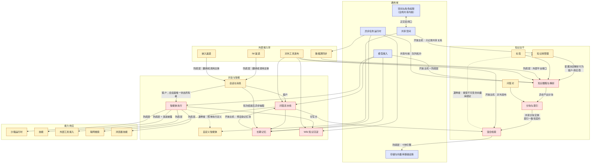

# 领域驱动设计 · 限界上下文总览

## 一句话概括

本系统可以拆成 **30 个限界上下文**，它们围绕一条主干「知识资料进来 → 被拆成可检索的分块 → 被检索出来回答问题」展开，主干之外由智能体、长期记忆、Wiki 三块能力放大价值，再由空间（多租户）作为全局共享内核把所有上下文串在一起；理解「哪些上下文是核心、它们之间谁依赖谁」是读懂这套系统的最短路径。

> 这是一份从现有实现**逆向归纳**出来的领域模型：系统本身是分层单体，并没有显式的领域层。下文的上下文边界是按三条独立线索交叉验证得到的：实体簇的聚集方式、对外接口的分组方式、异步任务的队列拓扑。三条线索在绝大多数地方一致，少数不一致处在文末「边界争议」中说明。

## 实体与关系

### 一、子域分类

先回答「哪些部分是这个产品的命根子，哪些只是必须有的配套」。

| 子域类型 | 包含的上下文 | 判定理由 |
|---|---|---|
| **核心域**（产品差异化所在） | 知识摄取与解析、分块与索引、混合检索、问答流水线、智能体执行、长期记忆、Wiki 知识沉淀 | 这七块决定回答质量：解析能不能把资料拆干净、检索能不能召回对的分块、智能体能不能自主编排工具、记忆能不能跨会话生效。实现上也最精细：解析有逐阶段进度追踪与多次尝试语义，检索支持十种引擎，流水线有三十余个可插拔阶段，记忆自带质量回归用的评测集。**有评测集的地方，就是核心域。** |
| **支撑域**（业务必需、带本产品特有语义，但可替换） | 知识库管理、会话与消息、自定义智能体、问答对（FAQ）、沙箱运行时、技能、外部工具接入（MCP 客户端）、对外工具发布（MCP 端点）、数据源同步、浏览器技能、IM 渠道、嵌入渠道、标签、评测 | 少接几个 IM 平台、换一种沙箱后端，产品依然成立。沙箱与技能虽然实现复杂，但它们是智能体的「能力供应商」，不是价值本身。 |
| **通用域**（任何多租户 SaaS 都要解决的问题） | 空间与角色权限、用户与认证、共享空间、模型接入、存储与向量库基础设施、审计日志、异步任务运行时、系统设置 | 语义与知识问答无关。两个边界案例：共享空间「成员单位是空间而不是用户」属于本产品的特有取舍，可视为支撑域偏通用；任务运行时的六池硬隔离拓扑是为文档处理定制的，属于通用域中的定制实现。 |

### 二、限界上下文清单

按四组列出。每个上下文给出职责、聚合根（以业务名称表述）与最关键的业务规则；聚合内部结构与不变量的完整清单见姊妹文档《领域驱动设计 · 聚合与业务不变量》。

#### 第一组：知识主干（核心业务）

| 上下文 | 一句话职责 | 聚合根 | 最关键的业务规则 |
|---|---|---|---|
| 知识库管理 | 管理知识库这个容器，以及挂在它上面的解析、切分、索引、检索、共享、画像等配置 | 知识库 | 知识库绑定的向量库实例**建库后不可更换**（换了索引就对不上）；知识库类型只有文档型、问答对型、Wiki 型三种；创建者身份决定「谁能改它」 |
| 知识摄取与解析 | 把文件、网址、手写文本、外部同步进来的内容变成知识条目，并推进到「可检索」 | 知识条目 | 解析状态机固定为：待处理 → 解析中 → 收尾中 → 已完成，另有失败、已取消、删除中三个旁路；「收尾中」即已可检索，只是增强产物（摘要、问题、图谱、Wiki）还没跑完 |
| 分块与索引 | 维护分块及其人工修订、启停状态，并保证分块内容与检索索引同步 | 分块 | 分块的原始内容不可变，人工编辑只改当前内容并递增修订号；分块顺序号全局唯一；同一分块同一修订号只有一条历史 |
| 混合检索 | 在多种检索引擎上做「语义相似 + 关键词」双路召回、跨库扇出、结果融合 | 无持久化聚合（检索请求与检索结果是值对象） | 一次多库检索中的所有知识库必须共用同一个向量模型，否则分数不可比、直接拒绝；查询向量只算一次并复用到所有库 |
| 问答流水线 | 用可插拔的阶段编排一次「快速问答」：加载历史 → 记忆召回 → 查询理解 → 并行检索 → 重排 → 合并 → 截断 → 组装上下文 → 流式生成 | 无持久化聚合 | 流水线按请求特征动态组装：没选知识库也没开联网搜索时退化为「历史 + 记忆 + 直接生成」；用户主动停止的优先级高于「检索无结果」的兜底判断 |
| 问答对（FAQ） | 管理问答对型知识库中的条目：导入、去重、相似问、反例问 | 复用「分块」（一条问答对就是一个特殊类型的分块） | 批量导入支持只校验不落库的试运行；反例问命中即剔除该条，不参与索引；同一知识库同一时刻只允许一个导入任务 |
| 标签 | 知识库内的分类维度，可挂在知识条目上 | 标签 | 自动打标只从知识库**已有**标签中挑选，不新建、不覆盖人工标签、失败不阻断入库 |

#### 第二组：对话与智能（核心业务）

| 上下文 | 一句话职责 | 聚合根 | 最关键的业务规则 |
|---|---|---|---|
| 会话与消息 | 管理会话、消息、临时附件、生成产物、会话分支 | 会话 | 会话拥有者可以是登录用户，也可以是接口密钥、外部用户、IM 用户、网页访客——统一抽象为「调用主体」；会话分支刻意不与父会话建立强绑定，父删子存 |
| 智能体执行 | 以「思考 → 行动 → 观察」循环自主调用工具，直到给出答案 | 无持久化聚合（**引擎跨轮无状态**） | 每一轮的历史都从会话消息重建，引擎不持有任何跨轮缓存；上下文溢出时每轮只允许压缩重试一次；高风险工具调用先过审批闸门 |
| 自定义智能体 | 智能体的定义、内置预设、共享与收藏 | 自定义智能体 | 智能体有两种工作模式（快速问答 / 智能推理）与若干类型预设；共享出去的智能体对接收方**强制只读**；若智能体启用了知识检索，必须配置重排模型才允许共享 |
| 长期记忆 | 跨会话记住关于某个调用主体的稳定信息：资料、偏好、事实、事项、兴趣 | 记忆主体 | 一个调用主体在一个空间里只有一个记忆主体；同主题的新事实**取代**旧事实，无需模型参与读路径；多轮连续提问只触发一次后台抽取（防抖）；空间开关优先于个人开关 |
| Wiki 知识沉淀 | 由智能体把原始资料重新组织成互相链接的条目式知识网 | Wiki 页面 | 同一知识库内页面别名唯一；页面归属目录只有一个事实源；每次覆盖前先把旧版本快照进历史；历史版本按「软上限 50 / 硬上限 200」两级清理，优先清自动生成的版本 |

#### 第三组：能力供应与外部接入（支撑业务）

| 上下文 | 一句话职责 | 聚合根 | 最关键的业务规则 |
|---|---|---|---|
| 沙箱运行时 | 为智能体提供隔离执行环境（三种后端可选） | 空间沙箱配置 | 沙箱按会话持续存在，前一步产生的文件后一步还能用；空闲与孤儿实例会被回收；终端和桌面访问走一次性凭证 |
| 技能 | 空间级技能包的目录、安装、镜像快照、环境变量 | 技能安装记录 | 技能目录里只存一份包，可安装到多个沙箱配置；**正在服役的镜像与最新一次安装解耦**——只有安装成功才前移镜像指针，失败时旧版本继续服役；技能状态机：安装中 → 就绪 / 失败 → 卸载中 |
| 外部工具接入 | 把第三方工具服务接进来供智能体调用，含授权与高风险工具审批 | 外部工具服务 | 同一空间内服务名唯一；授权令牌按调用主体隔离，A 用户的授权不能被 B 用户复用；审批拦的是执行，不拦模型的提议 |
| 对外工具发布 | 把本系统的检索、问答、Wiki、写入能力打包成标准工具，供外部客户端调用 | 对外端点 | 令牌全局唯一；能力按检索 / 问答 / Wiki / 写入四组授权；写入类工具必须显式授权到具体知识库 |
| 数据源同步 | 从飞书、语雀、Notion、GitLab 等外部平台按计划把内容同步进知识库 | 数据源 | 首次全量、之后增量；删除检测由连接器能力决定（订阅类源天然不支持）；单篇失败生成占位条目、不中断整批 |
| 浏览器技能 | 让智能体驱动用户本地浏览器完成网页操作 | 已配对设备 | 每个用户当前只保留一个已配对设备；配对令牌一次性、兑换后即删除 |
| 联网搜索 | 管理搜索供应商配置并在问答中调用 | 搜索供应商 | 搜索是否生效由智能体配置与本轮请求开关**同时**决定 |
| IM 渠道 | 把智能体接到企业微信、飞书、钉钉、Slack 等即时通讯工具 | IM 渠道 | 群聊与私聊按渠道模式隔离成不同会话；内置命令（帮助 / 信息 / 搜索 / 停止 / 清空）只声明意图，副作用由服务层执行 |
| 嵌入渠道 | 把智能体包装成可嵌入第三方网页的匿名问答窗口 | 嵌入渠道 | 访客的检索范围与模型完全由渠道绑定的智能体决定，请求里的任何范围覆盖都被丢弃；受来源域名白名单与三级限流约束 |
| 评测 | 用带标准答案的数据集评估检索与生成效果 | 评测任务（**内存态，不落库**） | 一次评测使用独立建立的评测知识库，不污染参考知识库 |

#### 第四组：治理与基础设施（通用业务）

| 上下文 | 一句话职责 | 聚合根 | 最关键的业务规则 |
|---|---|---|---|
| 空间与角色权限 | 多租户隔离、四档角色、接口密钥、配额与全局默认配置 | 空间 | 角色偏序：访客 < 贡献者 < 管理员 < 所有者；每个空间至少一位所有者；无活跃成员的空间由下一个访问者自动接管；接口密钥的能力刻在凭证上、不走角色体系 |
| 用户与认证 | 注册、登录、单点登录、令牌、个人偏好 | 用户 | 用户名与邮箱各自全局唯一；注册模式分自助与仅邀请；跨空间的平台管理需要「用户标记 + 系统开关」双重放行 |
| 共享空间 | 若干空间之间共享知识库与智能体的协作通道 | 共享空间 | **成员单位是空间不是用户**；创建方空间的成员记录不可删不可改；共享只记录关系不改变归属；跨空间写操作必须同时通过「共享闸口」与「源空间角色闸口」 |
| 模型接入 | 对话、向量、重排、视觉、语音五类模型的统一接入与并发治理 | 模型 | 每个空间每种类型只有一个默认模型；被知识库或智能体引用中的模型不允许删除（十二种引用关系逐一检查）；后台任务的模型调用受并发闸门约束，交互式请求永不排队 |
| 存储与向量库基础设施 | 对象存储后端与向量库实例的注册，以及文件资源的统一引用 | 存储后端 / 向量库实例 / 资源 | 一份物理文件可被多处引用，任一处删除不影响其他；资源访问凭证限时可撤销 |
| 审计日志 | 记录角色变更、基础设施变更、系统管理等关键操作 | 审计记录 | 只追加不修改；按保留期定期清理；空间内变更与共享空间变更分开记录 |
| 异步任务运行时 | 队列拓扑、六个工作池、重试、死信、取消 | 死信记录 / 待处理操作 | 六个工作池并发度硬隔离，外加一个弹性池只借用核心与增强两类队列的闲置容量；每个任务负载都必须自带空间标识与追踪上下文 |
| 系统设置 | 部署级可热更新参数、平台管理员引导 | 系统设置项 | 设置键全局唯一；变更即时广播到所有实例；平台管理员引导幂等且不恢复已撤销的权限 |

### 三、上下文映射图

图例：红色为核心域，黄色为支撑域，蓝色为通用域。实线箭头由上游指向下游（上游变化会影响下游），虚线表示「遵奉者」关系（下游无条件接受上游约定）。

### 四、上下文关系明细

| 上游 | 下游 | 关系类型 | 业务含义 |
|---|---|---|---|
| 知识库管理 | 知识摄取与解析 | 客户-供应商 | 知识库上的切分策略、多模态、图谱、问题生成等配置直接决定每份资料怎么被处理；单次上传可以覆盖其中一部分 |
| 知识摄取与解析 | 分块与索引 | 客户-供应商（异步） | 解析完成后异步产出分块；分块归属知识条目 |
| 分块与索引 | 混合检索 | 发布-订阅 + 共享内核 | 两者共享「分块」实体；分块的索引状态是两者之间的一致性契约；删索引以异步任务方式通知 |
| 混合检索 | 知识库管理 | 遵奉者 | 用哪个向量库实例由知识库的绑定决定，且建库后不可改；检索侧只能接受，不能协商 |
| 混合检索 | 存储与向量库基础设施 | 防腐层 | 十种检索引擎各自的差异被隔离在仓储实现里，上层只看到「向量召回」与「关键词召回」两种统一动作 |
| 问答流水线 | 混合检索 / 长期记忆 / 联网搜索 / 模型接入 | 客户-供应商（插件式） | 每个上游都有一个对应的流水线阶段作消费适配 |
| 会话与消息 | 智能体执行 | 客户-供应商 | **会话是唯一状态所有者**：智能体引擎跨轮无状态，每轮历史都从会话消息重建再喂给引擎；智能体的推理步骤作为消息的一部分保存 |
| 智能体执行 | 自定义智能体 | 遵奉者 | 运行时配置完全由智能体定义派生，引擎照单执行、不反向影响定义 |
| 智能体执行 | 沙箱 / 技能 / 外部工具 / 浏览器 | 防腐层 | 四类异构能力都被翻译成统一的「工具」语义再交给引擎；技能额外有三级渐进披露协议（先看名称、再看说明、最后看文件树） |
| 智能体执行 | Wiki 知识沉淀 | 客户-供应商（可写） | 智能体是 Wiki 的**写入方**，不只是读者；它写出的版本会被标记来源为「智能体」 |
| 空间与角色权限 | 所有上下文 | 共享内核 | 几乎每个实体都带空间标识；空间上的十来组全局默认配置是各上下文取默认值的单一事实源。**这是全系统最强的耦合点** |
| 空间与角色权限 | 共享空间 | 正交双闸口（合作关系） | 空间角色是纵向的纵深防御，共享空间是横向的协作通道；跨空间写操作必须同时穿过两道闸口，任一不放行即拒绝 |
| 共享空间 | 知识库管理 / 自定义智能体 | 开放主机服务 | 共享空间不持有任何资产，只记录「谁共享了什么、给了什么档位」；归属与创建者不因共享改变 |
| 会话与消息 | 长期记忆 | 发布-订阅（异步、防抖） | 一轮问答结束后延迟触发记忆抽取；短时间内多轮只触发一次 |
| 长期记忆 | 问答流水线 | 开放主机服务 | 记忆以预先渲染好的文本块对外供给，读路径不做任何计算 |
| IM 渠道 / 嵌入渠道 | 会话与消息 | 防腐层 | 两者都把外部身份翻译成「调用主体」再落到会话上；会话上下文不认识飞书用户或网页访客，只认识调用主体。**调用主体不隐含任何角色权限** |
| 对外工具发布 | 混合检索 / 问答流水线 / Wiki / 知识摄取 | 开放主机服务 | 以标准工具协议把内部能力对外发布，按四组能力授权 |
| 数据源同步 | 知识摄取与解析 | 客户-供应商（异步） | 同步进来的内容与手工上传走同一条入库链路；连接器是对外部平台接口的防腐层 |
| 异步任务运行时 | 所有异步上下文 | 共享内核 + 发布-订阅 | 队列拓扑是单一事实源；所有任务负载强制携带空间标识与追踪上下文，因为后台执行时没有请求期的上下文可用 |
| 模型接入 | 摄取 / 流水线 / 智能体 / 记忆 / Wiki | 开放主机 + 防腐层 | 五类模型统一接口；反向用「十二种引用关系」保护在用模型不被误删 |

## 字段语义

跨上下文出现、最容易被误解的三个概念：

| 概念 | 业务含义 | 必填 | 备注 |
|---|---|---|---|
| 空间标识 | 资产归属与隔离的根；几乎每条记录都带 | 是 | 平台级记录用「零」表示不属于任何空间；共享进来的资产在执行检索时会临时切换到资产所在空间 |
| 调用主体 | 发起请求的身份，共九类：网页用户、接口密钥（空间级 / 平台级）、接口外部用户、IM 用户、嵌入渠道、嵌入会话、嵌入访客、对外端点 | 是 | 会话拥有者、记忆主体、外部工具授权令牌都以它为单位；**它不等于用户账号，也不隐含角色权限** |
| 调用方 | 通过认证的身份及其在空间内的角色，用于资源授权判定 | 是 | 与调用主体的分工：调用方回答「你是谁、什么档位」，调用主体回答「数据按谁隔离」。查询切换到资产所在空间执行时，调用方的空间与角色**不变** |

## 映射/转换规则

**边界争议与判定结论**（三条线索不一致的地方）：

1. **问答对是不是独立上下文？** 实体线索说不是（它复用分块），接口线索说是（有独立的接口分组与导入任务）。结论：作为支撑上下文单列，但明确它的聚合根就是分块，避免读者去找不存在的「问答对实体」。
2. **删除索引任务的归属。** 该任务的处理器挂在标签服务上，而语义属于分块与索引。判定为历史遗留，建模时归入「分块与索引」。
3. **评测任务不落库。** 评测结果只在内存中保存，进程重启即丢失；因此评测上下文没有真正的聚合根，建模时标为内存态。
4. **流水线阶段名与总线事件名同名不同物。** 流水线里的「阶段」是编排标识，总线里的「事件」是发布订阅消息，两者名字相似但互不转换。写文档时务必区分，否则读者会误以为流水线阶段会被广播出去。

## 完整示例

**场景：法务同事在空间 A 上传一份合同模板，供加入了同一共享空间的空间 B 同事通过飞书机器人提问。**

1. 空间 A 的法务同事（角色：贡献者）在自己创建的知识库里上传文件。**知识库管理**上下文校验他对这个库有写权限，并把库上的切分与增强配置交给**知识摄取与解析**。
2. 摄取上下文先算内容指纹去重，再把文件交给**存储基础设施**保存、写一条「待处理」的知识条目，然后向**异步任务运行时**投递一个「文档待解析」任务，立刻返回。
3. 后台工作池取到任务：调用解析服务把文件变成结构化文本，按配置切成分块交给**分块与索引**落库，再调用**模型接入**的向量模型生成向量、写入知识库绑定的向量库实例。此刻知识条目进入「收尾中」，已可被检索到。
4. 摘要、自动打标签等增强任务继续在后台跑；每个任务结束时把待处理计数减一，归零后知识条目变为「已完成」。
5. 空间 A 的管理员把这个知识库共享到共享空间，档位为查看者。**共享空间**只记录这条共享关系，知识库归属不变。
6. 空间 B 的同事在飞书里向机器人提问。**IM 渠道**把飞书用户翻译成一个「调用主体」，找到或新建对应的**会话**，把问题交给**问答流水线**。
7. 流水线先召回这位调用主体的**长期记忆**，再把问题交给**混合检索**：检索先做两道判定——空间 B 的这个调用主体能否访问空间 A 的这个库（共享闸口放行）、库对空间 B 允许的档位是什么（查看者，只读）——然后临时切换到空间 A 执行检索、返回分块。
8. 重排、合并后交给对话模型流式生成答案，答案带着分块出处一路推回飞书。
9. 这一轮结束后，**会话**延迟触发一次记忆抽取；如果同事连续追问了三次，只抽取一次。

这个例子里穿过了 12 个上下文，但空间 B 的同事自始至终只做了一件事：在飞书里打字。

## 技术实现参考

以下是各上下文到代码模块、数据表与英文标识的对照，供工程读者定位。

| 上下文 | 主要代码位置 | 聚合根类型 → 主表 | 对外路由前缀 |
|---|---|---|---|
| 知识库管理 | `internal/application/service/knowledgebase*.go` | `KnowledgeBase` → `knowledge_bases` | `/api/v1/knowledge-bases` |
| 知识摄取与解析 | `knowledge_create.go` `knowledge_process.go` `knowledge_post_process.go` `knowledge_delete.go` `knowledge_clone_move.go` | `Knowledge` → `knowledges`；`KnowledgeProcessingSpan` → `knowledge_processing_spans` | `/api/v1/knowledge` |
| 分块与索引 | `chunk.go` `chunk_write.go` `knowledge_index_content.go` | `Chunk` → `chunks`；`ChunkRevision` → `chunk_revisions` | `/api/v1/chunks` |
| 混合检索 | `knowledgebase_search*.go`、`service/retriever/`、`repository/retriever/{postgres,elasticsearch,opensearch,qdrant,milvus,weaviate,doris,tencentvectordb,sqlite,neo4j}` | `SearchParams` / `SearchResult`（值对象）；默认引擎数据表 `embeddings` | `/api/v1/knowledge-bases/:id/hybrid-search` |
| 问答流水线 | `service/chat_pipeline/*.go`、`session_knowledge_qa.go` | `ChatManage`（流水线状态） | `/api/v1/knowledge-chat/:session_id` |
| 问答对 | `knowledge_faq*.go` | `Chunk`（`ChunkTypeFAQ`） | `/api/v1/knowledge-bases/:id/faq` |
| 标签 | `tag.go` `knowledge_auto_tag.go` | `KnowledgeTag` → `knowledge_tags`、`knowledge_tag_relations` | `/api/v1/knowledge-bases/:id/tags` |
| 会话与消息 | `session.go` `message.go` `session_fork.go` | `Session` → `sessions`；`Message` → `messages`；`message_artifacts`、`temporary_documents`、`fork_snapshot_leases` | `/api/v1/sessions`、`/api/v1/messages` |
| 智能体执行 | `internal/agent/{engine,think,act,observe,finalize,steer}.go`、`agent/tools/` | `AgentConfig` / `AgentStep`（值对象） | `/api/v1/agent-chat/:session_id` |
| 自定义智能体 | `custom_agent.go` `agent_service.go` `agent_share.go` | `CustomAgent` → `custom_agents`（复合主键 id + tenant_id） | `/api/v1/agents` |
| 长期记忆 | `service/memory/` | `MemorySubject` → `memory_subjects`；`memory_items`、`memory_item_embeddings`、`memory_topic_stats`、`memory_doc_affinity`、`memory_tombstones`、`memory_extraction_sessions` | `/api/v1/memory` |
| Wiki 知识沉淀 | `wiki_page.go` `wiki_ingest*.go` | `WikiPage` → `wiki_pages`；`wiki_page_revisions`、`wiki_folders`、`wiki_page_issues` | `/api/v1/knowledgebase/:kb_id/wiki` |
| 沙箱运行时 | `tenant_sandbox_config.go`、`internal/sandbox/` | `TenantSandboxConfigEntity` → `tenant_sandbox_configs` | `/api/v1/sandbox-configs` |
| 技能 | `tenant_skill_*.go`、`internal/agent/skills/` | `TenantSkillEntity` → `tenant_skills`；`tenant_skill_catalog`、`tenant_skill_snapshots`、`tenant_user_env_vars` | `/api/v1/skills` |
| 外部工具接入 | `mcp_service.go` `mcp_tool_approval_service.go`、`internal/mcp/` | `MCPService` → `mcp_services`；`mcp_metadata`、`mcp_tool_approvals`、`mcp_oauth_clients`、`mcp_oauth_tokens` | `/api/v1/mcp-services` |
| 对外工具发布 | `mcp_endpoint.go`、`internal/mcpserver/` | `MCPEndpoint` → `mcp_endpoints` | `/api/v1/mcp-endpoints` |
| 数据源同步 | `datasource_service.go`、`internal/datasource/{scheduler,connector}` | `DataSource` → `data_sources`；`sync_logs` | `/api/v1/datasource` |
| 浏览器技能 | `internal/browserskill/` | `browser_devices`、`browser_pairings`、`browser_task_interruptions` | `/api/v1/me/browser` |
| 联网搜索 | `web_search.go` `web_search_provider.go` | `WebSearchProviderEntity` → `web_search_providers` | `/api/v1/web-search-providers` |
| IM 渠道 | `internal/im/` | `IMChannel` → `im_channels`；`im_channel_sessions` | `/api/v1/im-channels` |
| 嵌入渠道 | `embed_channel.go` `embed_session.go` | `EmbedChannel` → `embed_channels` | `/api/v1/embed-channels` |
| 评测 | `evaluation.go` `dataset.go`、`service/metric/` | `EvaluationTask`（内存态，无表） | `/api/v1/evaluation` |
| 空间与角色权限 | `tenant.go` `tenant_member.go` `tenant_api_key.go`、`internal/router/rbac.go`、`internal/middleware/` | `Tenant` → `tenants`；`tenant_members`、`tenant_invitations`、`tenant_api_keys` | `/api/v1/tenants` |
| 用户与认证 | `user.go`、`internal/handler/auth.go` | `User` → `users`；`auth_tokens` | `/api/v1/auth` |
| 共享空间 | `organization.go` `kbshare.go` `agent_share.go` | `Organization` → `organizations`；`organization_tenant_members`、`organization_join_requests`、`kb_shares`、`agent_shares`、`tenant_disabled_shared_agents` | `/api/v1/organizations` |
| 模型接入 | `model.go`、`internal/models/{chat,embedding,rerank,vlm,asr,provider,limiter}` | `Model` → `models` | `/api/v1/models` |
| 存储与向量库基础设施 | `storagebackend.go` `vectorstore.go` `resource.go`、`service/file/` | `storage_backends`、`vector_stores`、`resources`、`resource_bindings`、`resource_access_grants` | `/api/v1/storage-backends`、`/api/v1/vector-stores` |
| 审计日志 | `audit_log.go` `audit_log_retention.go` | `AuditLog` → `audit_logs` | `/api/v1/tenants/:id/audit-log` |
| 异步任务运行时 | `internal/router/{task,sync_task,task_inspector}.go`、`internal/types/task.go` | `task_dead_letters`、`task_pending_ops` | `/api/v1/system/admin` |
| 系统设置 | `system_setting.go` | `SystemSetting` → `system_settings` | `/api/v1/system` |

统一语言对照（代码英文标识 ↔ 本文中文名）：`tenant` = 空间；`organization` = 共享空间；`knowledge` = 知识条目；`chunk` = 分块；`custom agent` = 自定义智能体；`session` = 会话；`memory subject` = 记忆主体；`principal` = 调用主体；`caller` = 调用方；`skill` = 技能；`sandbox` = 沙箱；`MCP service` = 外部工具接入；`MCP endpoint` = 对外工具发布；`embed channel` = 嵌入渠道；`IM channel` = IM 渠道；`datasource` = 数据源；`wiki page` = Wiki 页面；`resource` = 资源；`artifact` = 产物；`vector store` = 向量库实例；`storage backend` = 存储后端；空间角色 `viewer / contributor / admin / owner` = 访客 / 贡献者 / 管理员 / 所有者；共享空间角色 `viewer / editor / admin` = 查看者 / 编辑者 / 管理员。

- 聚合内部结构、不变量与状态机 —— `2026-09-19-领域驱动设计-聚合与业务不变量.md`
- 领域事件清单与跨上下文协作流程 —— `2026-09-19-领域驱动设计-领域事件与上下文协作.md`
- 易混术语的精确定义 —— `2026-09-19-核心业务术语.md`
- 知识资产四级组织模型 —— `2026-09-19-知识资产组织模型.md`
- 访问与共享的双链规则 —— `2026-09-19-知识资产访问与共享规则.md`
- 各表字段与约束 —— `../product/数据字典/README.md`
- 角色、能力条目与访问判定 —— `../product/权限矩阵.md`
- 对外接口契约 —— `../product/api-设计.md`
- 入库与检索链路（含调用的模型与访问的表） —— `../product/流程图/知识库插入与检索/知识入库-模型与数据访问-工程视图.md`、`../product/流程图/知识库插入与检索/问答检索-模型与数据访问-工程视图.md`
