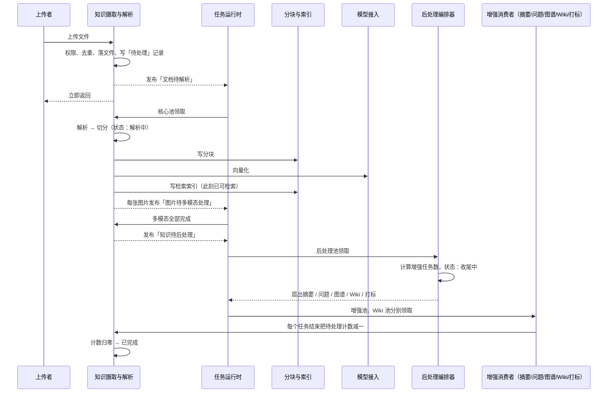
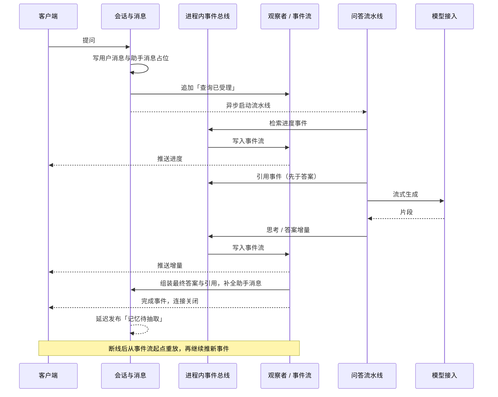
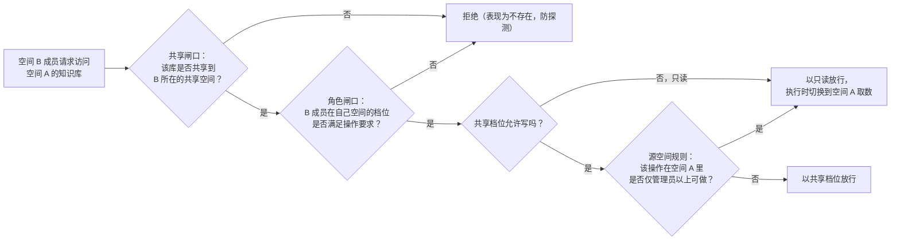

# 领域驱动设计 · 领域事件与上下文协作

## 一句话概括

本系统的上下文之间**几乎不靠同步调用协作，而靠三类事件**：跨进程的异步任务（22 种，承载「某件事需要后台去做」）、进程内的发布订阅事件（40 余种，承载「一次问答进行到了哪一步」）、以及流水线阶段标识（14 种，只用于编排、不对外广播）；读懂这三类事件各自的用途与边界，就能看懂一次上传或一次提问在系统里如何流转。

## 参与角色

| 角色 | 在事件协作中的职责 |
|---|---|
| 发起方（上传资料的人、提问的人、配置数据源的管理员、平台调度器） | 触发一个业务动作，动作立即返回，后续靠事件推进 |
| 生产上下文 | 完成同步部分（落文件、写记录、校验权限）后发布事件 |
| 任务运行时 | 把事件投递到对应队列，由六个隔离的工作池按并发上限消费；重试预算耗尽转死信并联动业务状态 |
| 消费上下文 | 领取事件、执行耗时工作、把结果写回并（按需）发布下一个事件 |
| 会话侧的观察者 | 订阅进程内事件，把思考、工具调用、引用、答案增量转成可续传的流推给前端 |

## 流程步骤

### 一、跨进程异步任务（= 跨上下文领域事件）

共 22 种，按业务含义命名如下。每种事件都自带**空间标识与追踪上下文**，因为后台执行时没有请求期的上下文可用——这是一条显式的防腐规则。

| 领域事件（业务含义） | 生产上下文 | 消费上下文 | 队列 / 工作池 | 触发条件与说明 |
|---|---|---|---|---|
| 文档待解析 | 知识摄取与解析 | 知识摄取与解析（解析、切分、向量化） | 默认队列 / 核心池 | 文件、网址、数据源同步进来的每一份资料；最多重试 3 次，单次超时默认 30 分钟；重解析时尝试号加一 |
| 手工知识待更新 | 知识摄取与解析 | 同上（先清理旧产物再重新索引） | 默认队列 / 核心池 | 手写内容发布或修改；不经过文档解析服务 |
| 会话附件待解析 | 会话与消息 | 会话与消息 | 聊天附件队列 / 核心池 | 对话中上传的临时文件；在核心池里权重高于批量导入，保证聊天不被拖慢 |
| 知识待后处理 | 知识摄取与解析 | 知识摄取与解析（后处理编排器） | 后处理队列 / 后处理池 | 主流程与多模态全部完成后；编排器计算增强任务数并把状态提升为「收尾中」 |
| 摘要待生成 | 后处理编排器 / 分块编辑 | 知识摄取与解析 | 摘要队列 / 增强池 | 每份资料一个；编辑分块、启停分块、改元数据都会触发「刷新」型摘要，刷新以输入快照防覆盖 |
| 表格摘要待生成 | 知识摄取与解析 | 知识摄取与解析 | 摘要队列 / 增强池 | 表格类文件（CSV、Excel）在文档解析之外额外挂一个 |
| 问题待生成 | 后处理编排器 | 知识摄取与解析 | 问题队列 / 增强池 | 每 20 个分块一批；生成的问题作为独立索引条目参与检索 |
| 图片待多模态处理 | 知识摄取与解析 | 知识摄取与解析（多模态） | 多模态队列 / 增强池 | 每张图片一个；全部完成后才触发「知识待后处理」；孤儿任务（父块已删）直接丢弃 |
| 分块待抽取图谱 | 后处理编排器 | 分块与索引（图谱抽取） | 图谱队列 / 增强池 | 每个文本分块一个，是最昂贵的扇出；仅图数据库启用时才投递 |
| 知识待自动打标 | 后处理编排器 | 标签 | 摘要队列 / 增强池 | 知识库开启自动打标时；**不占增强任务名额**，失败不阻断入库 |
| 知识库画像待刷新 | 摘要终态 / 删除 / 移动 | 知识库管理 | 摘要队列 / 增强池 | 按知识库与 30 秒窗口去抖；内容哈希未变则不调用模型 |
| 记忆待抽取 | 会话与消息 | 长期记忆 | 记忆队列 / 增强池 | 一轮回答完成后延迟触发；同一调用主体多轮只入队一个；空间关闭记忆或写入模式非自动时不投递 |
| 数据源待同步 | 数据源同步（调度器） | 数据源同步 | 同步队列 / 维护池 | 按计划周期或手动触发；产出「文档待解析」事件 |
| 问答对待导入 | 问答对 | 问答对 | 维护队列 / 维护池 | 支持试运行；同一知识库同一时刻只允许一个；超时 2 小时 |
| 知识库待复制 | 知识库管理 | 知识库管理 | 维护队列 / 维护池 | 复制配置与资料，向量索引直接复制不重算 |
| 知识库待删除 | 知识库管理 | 知识库管理 | 维护队列 / 维护池 | 先清索引与文件，再删记录 |
| 索引待删除 | 标签 / 分块与索引 | 分块与索引 | 维护队列 / 维护池 | 删标签等场景下清理索引中的标签字段（处理器挂在标签服务上，属历史遗留） |
| 知识待批量删除 / 批量重解析 / 移动 | 知识摄取与解析 | 知识摄取与解析 | 维护队列 / 维护池 | 批量操作；移动分「复用向量」与「重新解析」两种模式，后者产出「文档待解析」 |
| Wiki 待摄取 | 后处理编排器 | Wiki 知识沉淀 | Wiki 队列 / Wiki 池（硬隔离） | 防抖批量；同一知识库的并发受槽位限制；重启后按持久化的待处理操作恢复 |
| Wiki 待收尾 | Wiki 摄取 | Wiki 知识沉淀 | Wiki 队列 / Wiki 池 | 知识库级防抖：重建索引页、清死链、交叉链接；同一知识库只保留一个 |

**工作池拓扑**（并发度硬隔离，默认值）：核心 8、后处理 2、增强 12、维护 4、Wiki 8，另有弹性池 6 只借用核心与增强两类队列的闲置容量。后处理与维护不参与弹性借用：前者要保障延迟，后者任务时间长会挤占交互任务。

**运行形态分支**：没有缓存服务时（轻量模式）所有事件改为进程内同步执行，注册的处理器集合与异步模式**完全一致**，任务语义不因部署形态漂移。

### 二、进程内发布订阅事件（一次问答的实时进度）

这些事件只在一次请求内存在，由「会话侧观察者」订阅后写入可续传的事件流，前端以固定频率拉取。分组如下：

| 分组 | 事件（业务含义） | 说明 |
|---|---|---|
| 查询阶段 | 查询已接收、已校验、预处理、改写中、已改写 | 快速问答流水线入口 |
| 检索阶段 | 检索开始、向量召回、关键词召回、实体召回、检索完成 | 前端合并显示为一个「正在检索知识库」进度窗口 |
| 重排与合并 | 重排开始 / 完成、合并开始 / 完成 | 同上 |
| 生成阶段 | 生成开始、生成完成、流式片段 | 答案增量 |
| 智能体粗粒度 | 收到问题、规划、单步、工具、完成 | 智能推理模式 |
| 智能体细粒度（推给前端） | 思考、命令输出、工具调用、工具结果、反思、引用、最终答案 | 引用事件**先于**答案发出，保证连接关闭前前端已拿到出处 |
| 人工介入 | 工具审批请求 / 已处理、外部工具授权请求 / 已处理 | 需要人在界面上点确认；拒绝、超时、取消都作为工具结果回给模型 |
| 记忆与上下文 | 记忆已召回、上下文已压缩 | 时间线上显示记忆相关步骤 |
| 会话控制 | 用户插话已注入、会话标题、错误、停止 | 「停止」由独立的监视器处理，客户端断开后依然生效 |

### 三、流水线阶段标识（只编排、不广播）

快速问答流水线的 14 个阶段：加载历史、记忆召回、查询理解、分块检索、并行检索、实体检索、重排、网页抓取、合并、数据分析、组装上下文、生成、流式生成、截断。运行时按请求特征动态拼装：

- **检索路径**（选了知识库或开了联网搜索）：加载历史（有历史时）→ 记忆召回 → 查询理解 → 并行检索 → 重排 → 网页抓取（开联网时）→ 合并 → 截断 → 数据分析（开启时）→ 组装上下文 → 流式生成
- **纯聊天路径**：加载历史（有历史时）→ 记忆召回 → 流式生成
- **只检索不生成**（供接口与工具使用）：分块检索 → 重排 → 合并 → 截断

同一阶段上可以串多个插件，先注册的在外层：查询理解阶段先改写再抽实体；重排阶段先模型重排、再 Wiki 加权、再记忆亲和加权。

## 状态流转

三条最重要的跨上下文协作链，用事件串起来：

### 链路 A：资料从上传到可用

### 链路 B：一次提问的实时流

### 链路 C：共享空间下的跨空间访问（双闸口）

要点：共享不会绕过源空间的规则；接口密钥在自己空间是管理员，也不会因此获得跨空间共享库的写权限；两条闸口的审计分开记录。

## 异常路径

| 异常 | 业务处理 |
|---|---|
| 事件投递失败（队列不可用） | 知识条目直接置为失败，文件已保存，用户可重新解析 |
| 消费者失败、未到最后一次重试 | 返回错误让运行时按指数退避重试；Wiki 的锁冲突改为固定 15 秒重试 |
| 消费者失败、已是最后一次重试 | 知识条目置为失败并记录原因；任务快照进死信，供运维排查与手动补救 |
| 增强任务实际入队数少于计划数 | 编排器立即补偿递减差额，防止永远卡在「收尾中」 |
| 工作进程优雅退出时正在递减计数 | 递减动作脱离请求上下文执行（10 秒超时），避免计数丢失 |
| 工作进程崩溃、任务凭空消失 | 巡检每 5 分钟一轮：更新时间过旧 且 阶段心跳超时 且 队列里没有该任务 → 置为失败；摘要生成中超过 1 小时同样置失败 |
| 用户中途取消解析 | 置为已取消并清零计数（单条更新，防止晚到的递减抢跑），级联取消阶段进度，从各队列清掉待执行任务；已写的分块与索引保留 |
| 新一次重解析开始，旧尝试的任务仍在跑 | 旧尝试被「取代」，其收尾动作跳过并释放计数 |
| 父块已删除，多模态或图谱任务才到 | 孤儿任务直接丢弃并释放计数 |
| 提问时用户点停止 | 事件流写入停止事件；独立监视器（不依赖客户端连接、2 小时兜底）取消生成；已流出的部分内容保留并标记完成；停止优先于「检索无结果」判定 |
| 检索无结果 | 按兜底策略：固定文案，或让模型自由回答 |
| 记忆抽取时空间已关闭记忆 | 任务跳过，不报错 |

## 完整示例

**场景：技术支持同事把一份 120 页、带 30 张截图的产品手册上传到一个开启了多模态、问题生成、图谱与自动打标的知识库，随后在处理途中又点了一次「重新解析」。**

1. 上传立即返回。摄取上下文写下「待处理」记录，发布「文档待解析」事件（尝试号 1）。
2. 核心池领取：文档解析服务把手册变成结构化文本与 30 张图片字节；图片上传到对象存储；切成 300 个分块落库；向量化写入索引。此刻状态仍是「解析中」，但资料**已可检索**。
3. 发布 30 个「图片待多模态处理」事件到多模态队列；缓存里记下「还有 30 张待处理」。
4. 处理到第 12 张时，同事点了「重新解析」。摄取上下文开启尝试号 2，重置记录为「待处理」，重新发布「文档待解析」。
5. 剩余 18 个尝试号 1 的多模态事件陆续被领取，但它们发现自己已被尝试号 2 取代，直接跳过并释放计数——不会把旧图片描述写进新一轮的分块。
6. 尝试号 2 从头跑一遍：清掉旧分块、旧索引、旧图谱，再解析、切分、索引，再发 30 个多模态事件。全部完成后发布「知识待后处理」。
7. 后处理编排器算出增强任务数：摘要 1 + 问题 15 批（300 ÷ 20）+ 图谱 300 = 316，状态提升为「收尾中」；自动打标另行投递但不计入 316。
8. 增强池并行消费：摘要与问题走摘要 / 问题队列，300 个图谱抽取走图谱队列且受模型并发闸门约束；每个结束时把计数减一。
9. 图谱抽取跑到一半时工作进程被重启。5 分钟后巡检发现该记录更新时间过旧，但阶段心跳仍在刷新、队列里也还有排队任务，于是**不**判为卡死；进程恢复后继续消费。
10. 计数归零，状态变为「已完成」。同事在知识库设置的「活动」里能看到这次上传、重解析与自动打标的记录。

## 技术实现参考

| 事件类别 | 定义位置 | 消费者注册位置 |
|---|---|---|
| 异步任务类型常量（22 种） | `internal/types/task.go`（`TypeDocumentProcess` = `document:process`、`TypeManualProcess` = `manual:process`、`TypeTemporaryDocumentProcess` = `temporary_document:process`、`TypeKnowledgePostProcess` = `knowledge:post_process`、`TypeSummaryGeneration` = `summary:generation`、`TypeDataTableSummary` = `datatable:summary`、`TypeQuestionGeneration` = `question:generation`、`TypeImageMultimodal` = `image:multimodal`、`TypeChunkExtract` = `chunk:extract`、`TypeKnowledgeAutoTag` = `knowledge:auto_tag`、`TypeKnowledgeBaseProfile` = `kb:profile`、`TypeMemoryExtract` = `memory:extract`、`TypeDataSourceSync` = `datasource:sync`、`TypeFAQImport` = `faq:import`、`TypeKBClone` = `kb:clone`、`TypeKBDelete` = `kb:delete`、`TypeIndexDelete` = `index:delete`、`TypeKnowledgeListDelete` = `knowledge:list_delete`、`TypeKnowledgeListReparse` = `knowledge:list_reparse`、`TypeKnowledgeMove` = `knowledge:move`、`TypeWikiIngest` = `wiki:ingest`、`TypeWikiFinalize` = `wiki:finalize`） | `internal/router/task.go`（`RunAsynqServer`，asynq 模式）与 `internal/router/sync_task.go`（`RegisterSyncHandlers`，轻量模式），两处处理器集合一致 |
| 队列拓扑与工作池 | `internal/types/task.go`（`queueDefinitions`：`default` / `chat_attachment` / `postprocess` / `summary` / `multimodal` / `graph` / `question` / `memory` / `sync` / `low`（维护队列物理名） / `wiki`） | `internal/container/container.go`（六个 `asynq.Server`） |
| 死信中间件 | `internal/middleware/asynqdl/` | `internal/router/task.go` |
| 进程内事件类型 | `internal/event/event.go`；总线接口 `internal/types/event_bus.go` | `internal/handler/session/agent_stream_handler.go`（订阅并写入流管理器） |
| 流水线阶段标识 | `internal/types/chat_manage.go`（`types.EventType`，与 `event.EventType` 同名不同物） | `internal/application/service/session_knowledge_qa.go`（`PipelineBuilder`）；插件注册顺序 `internal/container/container.go` |
| 事件流（可续传） | `internal/stream/{memory_manager,redis_manager}.go` | `internal/handler/session/stream.go` |
| 收尾计数 | `internal/application/repository/knowledge.go`（`SetFinalizing` / `FinalizeSubtask` / `CompleteProcessingWithoutSubtasks`） | `internal/application/service/knowledge_post_process.go` |
| 巡检自愈 | `internal/application/service/knowledge_housekeeping.go` | — |
| 共享空间双闸口 | `internal/middleware/kb_access.go`、`internal/router/rbac.go` | — |

- 限界上下文清单与上下文映射 —— `2026-09-19-领域驱动设计-限界上下文总览.md`
- 聚合、不变量与状态机 —— `2026-09-19-领域驱动设计-聚合与业务不变量.md`
- 入库链路逐步骤的模型调用与数据访问 —— `../product/流程图/知识库插入与检索/知识入库-模型与数据访问-工程视图.md`
- 问答检索链路逐步骤的模型调用与数据访问 —— `../product/流程图/知识库插入与检索/问答检索-模型与数据访问-工程视图.md`
- 访问与共享的双链规则 —— `2026-09-19-知识资产访问与共享规则.md`
