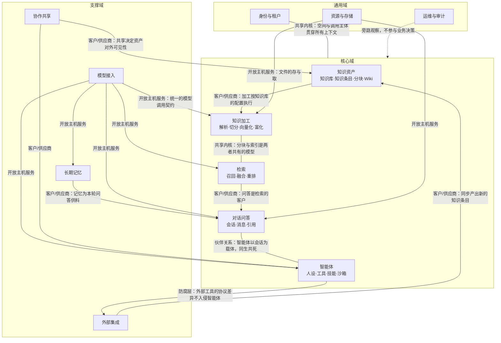

# 领域驱动设计总览（战略设计）

## 一句话概括

整个系统由 **12 个限界上下文**构成，其中 5 个是决定产品竞争力的核心域（知识资产、知识加工、检索、对话问答、智能体），4 个是有业务特异性的支撑域（长期记忆、协作共享、外部集成、模型接入），3 个是任何多租户系统都需要的通用域（身份与租户、资源与存储、运维与审计）。

## 阅读前须知：三个 DDD 词的白话解释

| 术语 | 白话解释 |
|---|---|
| 限界上下文 | 一块「同一个词只有一种意思」的业务地盘。出了这块地盘，同一个词可能换了含义，必须显式翻译 |
| 聚合 / 聚合根 | 一组必须一起改、一起校验的业务对象。聚合根是这组对象唯一的对外出入口，外部只认根，不直接碰内部 |
| 上下文映射 | 两块地盘之间的协作方式与话语权关系。谁定规矩、谁迁就谁、中间要不要翻译层 |

---

## 1. 域分层：哪些地方值得投入最多精力

| 分层 | 含义 | 本系统包含的上下文 | 投入判断 |
|---|---|---|---|
| **核心域** | 别人抄不走、抄走也做不好的部分，产品价值来源 | 知识资产、知识加工、检索、对话问答、智能体 | 自研，持续深耕；业务规则最复杂、变化最频繁 |
| **支撑域** | 核心域跑起来必需，但本身不构成竞争力，有较强业务特异性 | 长期记忆、协作共享、外部集成、模型接入 | 自研但求稳，边界要清晰，避免把核心域的复杂度传染进来 |
| **通用域** | 任何同类系统都得有的部分，业务上没有差异化空间 | 身份与租户、资源与存储、运维与审计 | 求标准、求省事，优先复用成熟方案 |

---

## 2. 限界上下文全景

### 2.1 核心域

| 上下文 | 一句话职责 | 核心聚合根 | 这块地盘特有的语言 |
|---|---|---|---|
| **知识资产** | 管「有哪些知识、怎么组织」：知识库容器、知识条目、分块、标签、目录、Wiki 页面 | 知识库 / 知识条目 / 标签 / Wiki 页面 | 知识库、知识条目、分块、父块与子块、标签、解析状态 |
| **知识加工** | 管「原始文件怎么变成可检索的东西」：解析、分块、向量化、富化 | 加工作业 | 解析、切分、向量化、摘要、自动打标、多模态识图、图谱抽取、收尾中 |
| **检索** | 管「给一句话，从知识里捞出最相关的若干段」：召回、融合、重排、裁剪 | 检索请求（含检索策略） | 召回、关键词召回、向量召回、混合检索、融合、重排、命中阈值、TopK |
| **对话问答** | 管「一轮问答怎么完成」：会话、消息、引用、追问建议 | 会话 | 会话、消息、轮次、引用、追问建议、消息产物 |
| **智能体** | 管「一个可自主行动的助手怎么定义与运行」：人设、工具、技能、沙箱、审批 | 智能体 / 技能 / 沙箱配置 / 外部工具服务 | 智能体、问答模式、工具、技能、沙箱、审批、执行步骤 |

### 2.2 支撑域

| 上下文 | 一句话职责 | 核心聚合根 | 这块地盘特有的语言 |
|---|---|---|---|
| **长期记忆** | 管「系统记住了这个人的什么」：跨会话的个人事实与偏好 | 记忆空间 | 记忆空间、记忆条目、常驻块、情境召回、遗忘墓碑、长期关注点 |
| **协作共享** | 管「一份资产怎么给别的空间用」：共享空间、共享授权、个人收藏与置顶 | 共享空间 / 共享记录 | 共享空间、共享、编辑者、被共享方、收藏、置顶 |
| **外部集成** | 管「系统怎么和外面的世界连上」：数据源同步、外部工具接入、对外渠道发布、联网搜索 | 数据源 / 渠道 / 对外工具端点 / 搜索服务商 | 数据源、同步、外部工具接入、对外工具发布、嵌入渠道、通讯渠道、联网搜索 |
| **模型接入** | 管「用哪个模型、怎么调、调了多少」：模型清单、供应商适配、用量与并发 | 模型 | 模型、模型类型、供应商、向量维度、用量、并发上限 |

### 2.3 通用域

| 上下文 | 一句话职责 | 核心聚合根 | 这块地盘特有的语言 |
|---|---|---|---|
| **身份与租户** | 管「你是谁、你在哪个空间、你能干什么」 | 用户 / 工作空间 / 接口密钥 | 用户、空间、成员、角色档位、邀请、接口密钥、调用主体 |
| **资源与存储** | 管「文件存哪、谁在引用、怎么安全地取」 | 资源 / 存储后端 / 临时文档 | 资源、引用绑定、存储后端、临时文档、限时访问凭证 |
| **运维与审计** | 管「发生过什么、参数怎么调、任务卡在哪」 | 审计日志 / 平台设置 / 任务台账 | 审计日志、平台参数、死信、待处理操作、处理追踪 |

---

## 3. 上下文映射图

### 3.1 映射关系逐条解释

| 上游 → 下游 | 关系模式 | 业务含义 | 为什么是这个模式 |
|---|---|---|---|
| 知识资产 → 知识加工 | 客户/供应商 | 加工作业必须按知识库上已设定的切分规则、索引策略、富化开关执行 | 配置的话语权在知识库一侧；加工侧只能遵从，不能自行改规则 |
| 知识加工 ↔ 检索 | 共享内核 | 「分块」和「索引条目」这两个概念在两边含义完全一致 | 写索引的人和读索引的人必须对同一个模型达成一致，否则写进去的东西检索不出来 |
| 检索 → 对话问答 | 客户/供应商 | 问答向检索要「最相关的若干段」，检索按问答给的范围与预算作答 | 问答是需求提出方，检索按需供给 |
| 对话问答 ↔ 智能体 | 伙伴关系 | 智能体的每一步执行都挂在会话的某条消息下；两者必须同步演进 | 双向依赖、同生共死，任何一方单方面改模型都会立刻拖垮另一方 |
| 长期记忆 → 对话问答 | 客户/供应商 | 记忆在每轮问答开始时提供「关于这个人的已知信息」 | 记忆是供给方，问答是消费方；记忆缺席不影响问答可用 |
| 智能体 → 外部集成 | 防腐层 | 各家外部工具的协议、鉴权、错误语义差异巨大 | 必须在边界上翻译成统一的「工具」概念，否则外部协议的怪癖会渗进智能体的核心逻辑 |
| 外部集成 → 知识资产 | 客户/供应商 | 数据源同步的产物是标准的知识条目，走与手工上传同一条加工链路 | 外部来源的差异在集成侧消化干净，知识资产侧不需要知道内容从哪来 |
| 模型接入 → 各核心域 | 开放主机服务 | 对外只暴露五类稳定能力：文本向量化、重排、对话生成、图片理解、语音转写 | 供应商数量多、更替频繁，必须用一套公开契约把变化挡在外面 |
| 协作共享 → 知识资产 / 智能体 | 客户/供应商 | 共享关系决定一份资产在自有空间之外是否可见、以什么档位可见 | 可见性规则的话语权在共享侧 |
| 身份与租户 ↔ 全部 | 共享内核 | 「空间」「调用主体」两个概念出现在每一个上下文里，含义必须完全一致 | 一旦含义分叉，就会出现跨空间越权 |
| 资源与存储 → 知识加工 / 对话问答 | 开放主机服务 | 对外只暴露「按引用取文件、按引用存文件」 | 底层存放位置可换，使用方不该感知 |
| 运维与审计 → 全部 | 旁路观察 | 只记录、只调参，不参与任何业务决策 | 保持单向依赖，避免审计失败拖垮业务 |

---

## 4. 跨上下文的通用语言

下列词在**所有**上下文中含义一致，是全局共享的语言。任何一处出现分叉都是缺陷：

| 词 | 全局唯一含义 | 常见误用 |
|---|---|---|
| 空间 | 一切数据的归属根。任何一条业务数据必属于且只属于一个空间 | 与「共享空间」混淆——后者是跨空间协作的容器，不存放数据 |
| 调用主体 | 发起本次操作的身份，可能是登录用户、接口密钥、网页访客、通讯工具用户 | 只想到「用户」，漏掉机器身份与匿名访客，导致权限判断出现缺口 |
| 知识库 | 一套加工与检索配置的容器，也是共享与权限的最小授予单位 | 当成「文件夹」——文件夹只管组织，知识库还管加工规则 |
| 知识条目 | 一份被纳管的原始资料 | 与「分块」混淆——用户看到的是条目，检索命中的是分块 |
| 分块 | 检索能命中的最小片段 | 以为一段文字只会产出一个分块；实际一段文字可同时产出正文块、图片识字块、图片描述块、摘要块 |
| 智能体 | 一套可复用的助手配置 | 与「会话」混淆——智能体是模板，会话是一次具体使用 |
| 会话 | 一次多轮对话的上下文 | 与「消息」混淆 |

---

## 5. 边界最容易被侵蚀的三处

这三处是实践中反复出问题的地方，任何新设计经过这里都要显式说明如何守住边界：

1. **检索配置的归属**。检索策略（召回数量、阈值、融合权重、重排开关）同时出现在空间默认值、知识库、智能体、单次请求四个层级。**唯一正确的读法是：越靠近本次请求的层级优先级越高**；任何在检索上下文内部「就地兜底一个默认值」的做法都会让四层配置失效。

2. **可见性判断的位置**。判断「这份资产此人能不能看」属于协作共享上下文与身份租户上下文，**不属于**检索上下文。检索只接受一个已经算好的可见范围，不自行推断。一旦检索侧自己查共享关系，跨空间越权就只是时间问题。

3. **模型差异的收口位置**。不同供应商的向量维度、上下文窗口、是否支持图片、是否支持流式差异巨大。这些差异**必须**在模型接入上下文内消化完，向外只暴露能力声明。核心域里出现「如果是某某供应商就怎样」的判断，即为边界被击穿。

---

## 技术实现参考

- 限界上下文与接口分组的对应关系 —— `../product/api-设计.md`
- 聚合根与数据表的落地映射 —— `../product/数据字典/README.md`
- 各上下文内部的聚合、实体、不变量 —— `2026-09-19-限界上下文详解-核心域.md` 与 `2026-09-19-限界上下文详解-支撑域与通用域.md`
- 跨上下文的事件与长流程编排 —— `2026-09-19-领域事件与业务流程编排.md`
- 权限判断链路的完整规则 —— `2026-09-19-知识资产访问与共享规则.md`
- 核心词的精确定义 —— `2026-09-19-核心业务术语.md`
