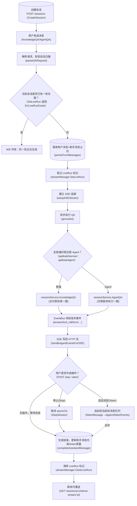

# 会话对话 · 流程图（逆向推断稿）

> ⚠ **逆向推断·需人工校正**
> 本文档由 reverse-product-docs 从代码调用链反推生成，**未经业务确认**。
> 标 **（待确认：…）** 处（尤其分支条件）需业务方核对，文末有汇总清单。
> 全部核对完成后请删除本提示与清单。

## 流程：会话对话（创建会话 → 消息往返 → 流式输出 → 消息落库）

> 本文聚焦「会话 / 流式生命周期编排」这一层，不重复展开 RAG 内部阶段——那部分见 [问答检索](问答检索.md)。

入口：`POST /api/v1/sessions`（创建）+ `POST /api/v1/knowledge-chat/:session_id` 或 `/agent-chat/:session_id`（发消息）

**（待确认：N 节点两种中途操作的产品语义差异、D 节点 409 对用户的呈现方式）**

### 1. 怎么读这张图

`[(...)]` 表示对数据库或状态存储（LiveRun 标记落在 Redis / 内存）的写入；`-.异步.->` 表示跨 goroutine / 跨请求的异步边界（例如 Steer 追加消息发生在**另一次 HTTP 请求**里，作用于正在跑的那一轮）。

### 2. 这张图说明什么

一次「发消息」请求本质上是「先落库占位 + 登记互斥锁 + 建流 + 后台异步生成」，与 HTTP 响应本身是分离的两条线：HTTP 层只管把 SSE 流打开、把事件转发给浏览器；真正的生成逻辑在独立 goroutine 里跑，靠 `EventBus` 把两者粘起来。

`LiveRun` 这个互斥标记的存在说明**同一个会话同一时刻只允许一轮回答在生成**，第二个请求会直接被拒绝（409）而不是排队等待。断线重连接口（`continue-stream`）说明前端刷新页面或网络抖动后，可以接回正在进行的生成而不丢内容。**（待确认：业务含义——重连后是否补发已丢失的历史事件，还是只能接上之后的增量）**

### 3. 为什么这么设计

- LiveRun 用 Redis（`RedisStreamManager`）或内存（`MemoryStreamManager`，Lite 单机模式）双实现，说明这套机制被设计成要跨多实例生效——多副本部署下，第二个请求打到另一个实例也要能感知到「这个会话正在跑」。**（待确认：设计意图需业务确认——Lite 模式内存版是否只保证单机语义，多机场景是否要求必须用 Redis）**
- Steer（追加消息）没有像 Stop 那样立刻打断当前轮，而是「排进队列、下一个检查点消费」，说明产品把「追加说明」和「打断重来」当成两种不同的用户意图，分别设计了执行路径。

### 4. 容易看错的地方

- 图中「普通 / Agent」分支只是决定内部调哪个 service 方法，SSE 事件转发（`handleAgentEventsForSSE`）和落库收尾逻辑是**共用的**，不要误以为两条路径完全独立、互不复用代码。
- 「Stop」分支取消的是生成用的 `asyncCtx`，而不是删除已经落库的助手消息——被取消前已经流出来的内容会被保留并标记完成，这点容易被误解成「Stop = 撤回」。

### 节点来源

| 节点 | 来源 file:类型.方法 |
|---|---|
| A | internal/handler/session/handler.go:Handler.CreateSession |
| B,C | internal/handler/session/qa.go:Handler.KnowledgeQA / AgentQA / parseQARequest |
| D | internal/handler/session/qa.go:Handler.rejectIfOtherAgentRunLive（→ internal/stream/redis_manager.go / memory_manager.go: SetLiveRun, ErrLiveRunExists） |
| E | internal/handler/session/qa.go:Handler.persistTurnMessages |
| F | internal/stream/redis_manager.go 或 memory_manager.go:SetLiveRun |
| G | internal/handler/session/qa.go:Handler.setupSSEStream |
| I,J,K | internal/handler/session/qa.go:Handler.executeQA |
| M | internal/handler/session/stream.go:Handler.handleAgentEventsForSSE |
| N1 | internal/handler/session/stream.go:Handler.StopSession |
| N2 | internal/handler/session/steer.go:Handler.SteerMessage |
| O | internal/handler/session/qa.go:Handler.completeAssistantMessage |
| P | internal/stream/redis_manager.go / memory_manager.go:ClearLiveRun |
| Q | internal/handler/session/stream.go:Handler.ContinueStream |

## 待确认清单

- [ ] 断线重连（`continue-stream`）后是否补发已丢失的历史流式片段，还是只能接上增量
- [ ] Lite 单机模式（无 Redis）下 LiveRun 互斥的降级行为是否与多实例部署语义一致
- [ ] 同一会话并发第二轮被 409 拒绝时，前端的产品呈现方式（排队 / 提示 / 禁用输入框）
- [ ] Steer（追加消息）与 Stop（打断）两种中途操作的产品语义边界
