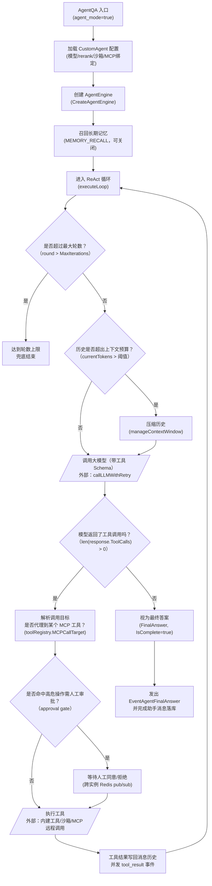

# 智能体执行 · 流程图（逆向推断稿）

> ⚠ **逆向推断·需人工校正**
> 本文档由 reverse-product-docs 从代码调用链反推生成，**未经业务确认**。
> 标 **（待确认：…）** 处（尤其分支条件）需业务方核对，文末有汇总清单。
> 全部核对完成后请删除本提示与清单。

## 流程：智能体执行（ReAct 循环 / 工具调用 / MCP / 沙箱 / 人工审批）

入口：`POST /api/v1/agent-chat/:session_id`（`agent_mode=true`）→ `session.Handler.AgentQA` → `sessionService.AgentQA` → `AgentEngine.Execute`

**（待确认：K 节点「高危需审批」的具体判定规则、F 节点轮数上限的业务口径，代码可见机制但业务规则不可见）**

### 1. 怎么读这张图

`M --> E` 是一条**回边**，代表「工具结果加入历史后，回到循环顶部再问一次模型」，这是 ReAct（Reason-Act）循环的核心结构，图上用箭头绕回体现，不是画错或遗漏。`[/.../]` 两次出现分别代表「大模型」和「工具执行后端（沙箱 / MCP）」两类外部依赖。

### 2. 这张图说明什么

Agent 执行是一个「想 → 做 → 看结果 → 再想」的多轮循环，每一轮都会重新把完整历史（含之前的工具结果）发给大模型，由模型自己决定「还要不要调用工具」，直到模型不再返回工具调用或达到轮数上限为止。

工具调用不是直接执行，而是先经过两层：一层「MCP 目标解析」（判断这次调用是不是在代理某个外部 MCP 服务的工具），一层「人工审批闸」（针对被判定为高危的操作，需要用户在前端点确认才会真正执行）。**（待确认：业务含义——具体哪些工具 / 参数组合会被判定为高危，代码里能看到审批机制存在（`internal/agent/approval` 包），但触发规则的业务口径本图未展开）**

### 3. 为什么这么设计

- 审批走 Redis pub/sub 而不是本地内存等待，说明设计上假设「发起审批请求的实例」和「用户点击确认落到的实例」可能不是同一个后端副本——这与会话对话一图里的 LiveRun 是同一类多实例协调考虑。**（待确认：设计意图需业务确认——Lite 单机模式下这条审批链路如何降级）**
- 上下文压缩（`manageContextWindow`）被放在「调用大模型之前」而不是「轮数到了才做一次」，说明系统按 token 预算动态压缩，让长对话 / 多轮工具调用不会无限膨胀直到超出模型上下文窗口而失败。

### 4. 容易看错的地方

- 「是否命中高危审批」这一分支目前只在工具执行前拦一次；如果模型在同一轮返回了多个工具调用，图上简化为单一分支。**（待确认：已省略并行工具调用的分支细节——实际是否逐个工具分别判断审批）**
- 沙箱执行和 MCP 远程调用被合并画成同一个外部调用节点，但代码里它们是两条不同的执行路径（沙箱用 `internal/sandbox` 会话管理器起一个远程 Cube/E2B 沙箱跑代码，MCP 则是标准协议远程调用第三方工具服务）。**（待确认：业务上是否要区分展示给用户「这是在你的沙箱里跑的」还是「调用了外部服务」）**

### 节点来源

| 节点 | 来源 file:类型.方法 |
|---|---|
| A | internal/handler/session/qa.go:Handler.AgentQA |
| B | internal/application/service/session_agent_qa.go:sessionService.AgentQA（buildAgentConfig） |
| C | internal/application/service/agent_service.go:agentService.CreateAgentEngine |
| D | internal/application/service/session_agent_qa.go（memoryService.Recall） |
| E | internal/agent/engine.go:AgentEngine.Execute / executeLoop |
| F,G | internal/agent/engine.go:AgentEngine.runReActIteration（manageContextWindow） |
| H | internal/agent/think.go:AgentEngine.callLLMWithRetry |
| I,I1 | internal/agent/engine.go:AgentEngine.runReActIteration |
| J | internal/agent/act.go:AgentEngine.runToolCall（toolRegistry.MCPCallTarget） |
| K,K1 | internal/agent/approval/gate.go |
| L | internal/agent/tools/registry.go:ToolRegistry.ExecuteTool（外部：internal/sandbox/session_manager.go 沙箱 / MCP 远程服务） |
| M | internal/agent/act.go:AgentEngine.emitToolOutcome |
| N | internal/application/service/session_agent_qa.go **（待确认：子代理标注 `internal/agent/finalize.go` 为推断、未逐行核对）** |

## 待确认清单

- [ ] Agent 工具调用中「高危操作需人工审批」的具体判定规则（哪些工具 / 参数会触发审批）
- [ ] 一轮 LLM 返回多个工具调用时，审批闸门是逐个校验还是批量一次性校验
- [ ] 沙箱执行与 MCP 远程调用是否需要在产品侧对用户做来源区分展示
- [ ] ReAct 循环的最大轮数、失败重试、超时等运营参数的业务口径
- [ ] Lite 单机模式（无 Redis）下 MCP 审批 pub/sub 的降级行为
- [ ] N 节点的最终答案落库位置（子代理未逐行核对 `finalize.go`，需确认）
