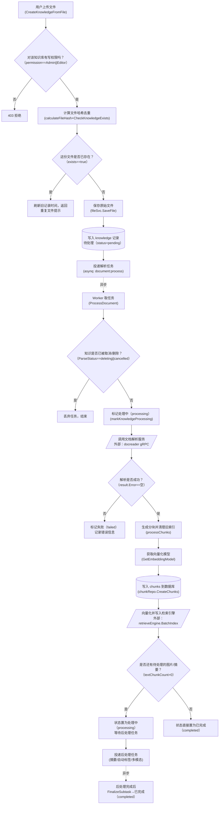

# 知识入库 · 流程图（逆向推断稿）

> ⚠ **逆向推断·需人工校正**
> 本文档由 reverse-product-docs 从代码调用链反推生成，**未经业务确认**。
> 标 **（待确认：…）** 处（尤其分支条件）需业务方核对，文末有汇总清单。
> 全部核对完成后请删除本提示与清单。

## 流程：知识入库（文件上传 → 解析 → 分块 → 向量化 → 落库）

入口：`POST /api/v1/knowledge-bases/:id/knowledge/file` → `KnowledgeHandler.CreateKnowledgeFromFile`

**（待确认：B 节点的写权限档位、I 节点的取消语义、Q 节点「还有待处理」的业务含义，均为代码条件可见、业务意图不可见）**

### 1. 怎么读这张图

| 图形 | 含义 |
|---|---|
| `[...]` 矩形 | 普通处理步骤（Go 函数调用） |
| `[(...)]` 柱形 | 数据库写入 |
| `[/.../]` 平行四边形 | 外部服务调用（docreader gRPC、向量检索引擎） |
| `{...}` 菱形 | 分支判断，业务问句在前、代码条件括注在后 |
| 实线箭头 `-->` | 同步调用 |
| 虚线箭头 `-.->` + 异步 | 跨 Asynq 队列的异步任务边界 |

### 2. 这张图说明什么

知识入库不是「上传即可用」的一次性同步流程，而是「**同步落地文件 + 异步解析索引**」的两段式设计：HTTP 请求只负责把文件存好、写一条待处理记录、丢进队列就立刻返回；真正耗时的解析（调用 Python docreader）、分块、向量化都在后台 worker 完成。文件去重（按哈希 + 知识库维度）在同步阶段就拦截，避免队列被重复文件灌满。

**（待确认：业务含义）** 入库完成后还有一个「后处理」阶段（摘要生成、自动打标签），意味着用户看到「处理完成」的时点，实际可能不是最终状态，而是「分块与向量已就绪，摘要还在补」。

### 3. 为什么这么设计

- 同步阶段只做能快速失败的检查（权限、文件类型、去重、配额），把不可控耗时全部推到队列，是典型的「快速返回 + 后台重活」模式。**（待确认：设计意图需业务确认——是否也是为了应对 docreader 单次解析可能耗时数十分钟这一已知约束，代码里 `callDocReaderWithTimeout` 默认给了 30 分钟超时）**
- 分块写库先于向量化写入检索引擎，两者失败时都有对方的补偿清理（写索引失败会删掉刚插入的 chunks），说明设计者把「分块表」和「向量索引」当成两个必须一致的存储，用先写后清做最简单的一致性保证，而非分布式事务。**（待确认：设计意图需业务确认——是否另有定时对账类的最终一致性补偿机制）**

### 4. 容易看错的地方

- Q 节点的「是否还有待处理」分支很容易被误读成「失败/成功」分支，实际它区分的是「这个知识还要不要等后处理才算真正完成」——多数场景下（有文本分块）会先进入处理中，而不是直接已完成。
- 「文件已存在」（D 分支）不是错误，代码把它包装成一种特殊的重复文件返回值（`NewDuplicateFileError`），前端可能把它当成成功或警告处理。

### 节点来源

| 节点 | 来源 file:类型.方法 |
|---|---|
| A | internal/handler/knowledge.go:KnowledgeHandler.CreateKnowledgeFromFile |
| B | internal/handler/knowledge.go:KnowledgeHandler.validateKnowledgeBaseAccess |
| C,D | internal/application/service/knowledge_create.go（calculateFileHash / repo.CheckKnowledgeExists） |
| E | internal/application/service/knowledge_create.go（fileSvc.SaveFile） |
| F | internal/application/service/knowledge_create.go（s.repo.CreateKnowledge） |
| G | internal/application/service/knowledge_create.go（asynq.NewTask types.TypeDocumentProcess） |
| H | internal/router/task.go:268（mux.HandleFunc→KnowledgeService.ProcessDocument） |
| I,J | internal/application/service/knowledge_process.go:knowledgeService.ProcessDocument |
| K | internal/application/service/knowledge_process.go:convert → internal/infrastructure/docparser/grpc_parser.go（外部：docreader Python 服务） |
| L | internal/application/service/knowledge_process.go:knowledgeService.convert |
| M | internal/application/service/knowledge_process.go:knowledgeService.processChunks |
| N | internal/application/service/knowledge_process.go（s.modelService.GetEmbeddingModel） |
| O | internal/application/service/knowledge_process.go（s.chunkRepo.CreateChunks） |
| P | internal/application/service/knowledge_process.go（retrieveEngine.BatchIndex） |
| Q,R,S | internal/application/service/knowledge_process.go:finalizeIndexedKnowledgeState |
| T,U | internal/application/service/knowledge_post_process.go（Handle / knowledgeRepo.FinalizeSubtask） |

## 待确认清单

- [ ] 入库完成后「处理中 →（后处理：摘要/自动标签/多模态）→ 已完成」的具体子任务组成，以及用户可见的进度语义
- [ ] 「重复文件」检测命中后，前端展示给用户的是「上传成功（复用旧文件）」还是「上传失败/冲突」
- [ ] B 节点写权限档位、I 节点取消语义、Q 节点分支的业务含义
- [ ] 分块表与向量索引之间是否另有定时对账类补偿机制
