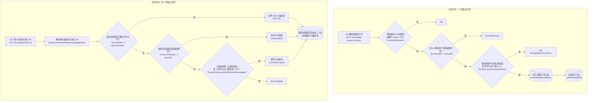

# 知识库共享与访问控制 · 流程图（逆向推断稿）

> ⚠ **逆向推断·需人工校正**
> 本文档由 reverse-product-docs 从代码调用链反推生成，**未经业务确认**。
> 标 **（待确认：…）** 处（尤其分支条件）需业务方核对，文末有汇总清单。
> 全部核对完成后请删除本提示与清单。

> 本图画的是**运行时链路**；权限位、角色档位与守卫的完整清单见 [权限矩阵](../权限矩阵.md)。

## 流程：知识库共享与访问控制

入口（分享）：`POST /api/v1/knowledge-bases/:id/shares` → `OrganizationHandler.ShareKnowledgeBase`
入口（访问）：`GET /api/v1/knowledge-bases/:id`（经 `KBAccessRead` 中间件）

**（待确认：K 分支「经共享 Agent 间接可见」是否为刻意设计的二级共享能力）**

### 1. 怎么读这张图

上下两个框是**两次分开触发的独立请求**，不是同一次调用的先后关系：上框是「把 KB 分享出去」，下框是「别人来访问时怎么判权」。`[(...)]` 仍表示数据库写入。

### 2. 这张图说明什么

KB 的访问控制是「三选一」的判定顺序：**自己租户拥有 → 组织共享授权 → 通过某个被分享的 Agent 间接可见**，命中第一个满足的即放行，且权限等级依次递减（拥有者 Admin 级 > 组织共享按分享时设定的等级 > 经共享 Agent 只能读）。

「分享」动作本身要求分享发起者在**源租户**里是该 KB 的拥有者或 Admin，同时在**目标组织**里至少是 Editor——这是两个独立维度的权限要求（对资源的所有权 + 对组织的成员角色），任一不满足都会被拒绝。

**（待确认：业务含义）** 通过共享 Agent 间接可见这条路径，场景上大致是「我没被直接分享这个知识库，但有人把一个绑定了它的 Agent 分享给了我」，这是否是产品刻意设计的「二级共享」能力需要业务确认。

### 3. 为什么这么设计

- 判权逻辑被抽成独立的 `application/access` 包（`ResolveKB`），与路由层的角色守卫（`OwnedKBOrAdmin`）分离，说明系统把「你在这个租户里是什么角色」（RBAC）和「这个资源本身允不允许跨租户访问」（资源级共享）当成两条正交的规则链，二者都要通过——与代码注释里 "Tenant roles ... and resource ownership guards remain separate checks" 的说法一致。
- 访问判权通过后会重写请求上下文里的「有效租户 ID」（`EffectiveTenantID`），让后续业务代码不用关心 KB 是自有的还是共享来的，都按同一套租户上下文取数——是一种「授权结果透明化」的设计，避免下游每个 handler 重复判断「这个 KB 到底是谁的」。

### 4. 容易看错的地方

- 「组织共享」和「共享 Agent 可见」是两条**完全不同**的路径：前者是 KB 直接分享给整个组织（`kb_shares` 表），后者是 Agent 分享带出的间接可见性，二者互不依赖——不要以为必须先有组织共享才能有 Agent 共享。
- 通过共享 Agent 拿到的访问权限被硬编码为**只读**（`OrgRoleViewer`），即使分享该 Agent 的人自己对 KB 有编辑权限，接收方也不会因此获得编辑权。这点容易被误解成「权限跟着 Agent 继承」。

### 节点来源

| 节点 | 来源 file:类型.方法 |
|---|---|
| A,B | internal/router/routes_agent.go（OwnedKBOrAdmin 路由守卫）→ internal/handler/organization.go:OrganizationHandler.ShareKnowledgeBase |
| C,D,E,F | internal/application/service/kbshare.go:kbShareService.ShareKnowledgeBase |
| G | internal/router/routes_knowledge.go（KBAccessRead("id")） |
| H | internal/middleware/kb_access.go:RequireKBAccess（AuthorizeTenantAPIKeyKnowledgeBases） |
| I,J,K,L | internal/application/access/knowledgebase.go:ResolveKB |
| M | internal/application/access/knowledgebase.go:KBAccess.Context / WithGrant |

## 待确认清单

- [ ] 「通过共享 Agent 间接访问 KB」这一能力的产品定位（是刻意设计的二级共享，还是访问控制的历史遗留兼容路径）
- [ ] 经共享 Agent 获得的权限被硬编码为只读，是否符合产品预期（不随分享者自身权限提升）
- [ ] 组织角色（admin/editor/viewer）与租户角色的业务职责边界，详见[权限矩阵](../权限矩阵.md)的待确认清单
