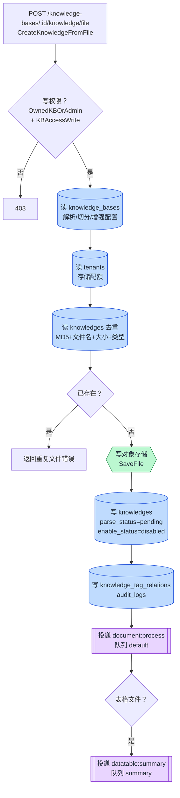
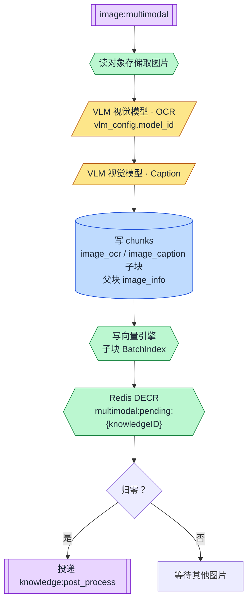
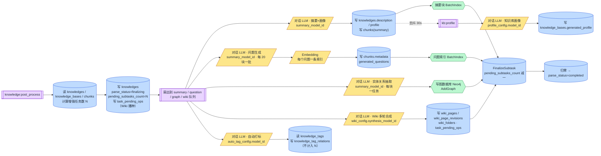
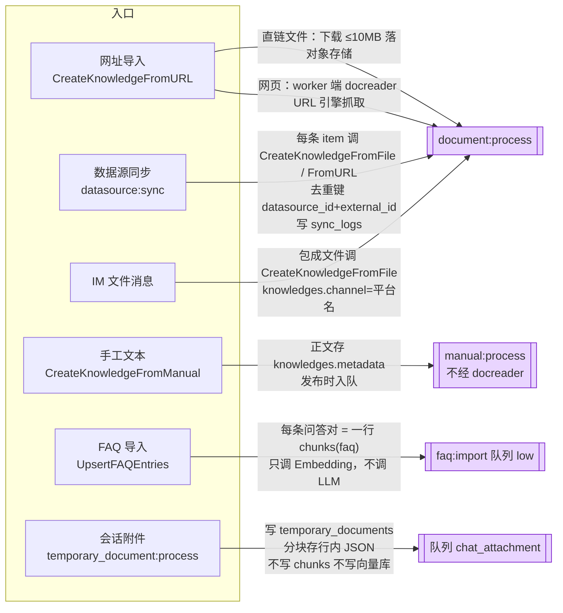
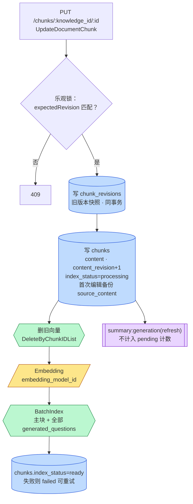
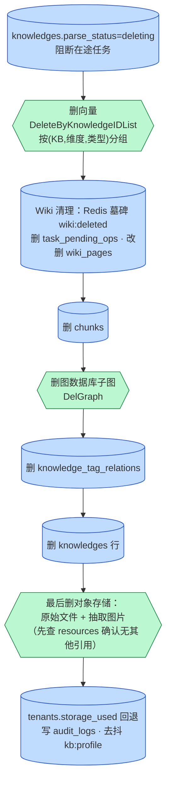
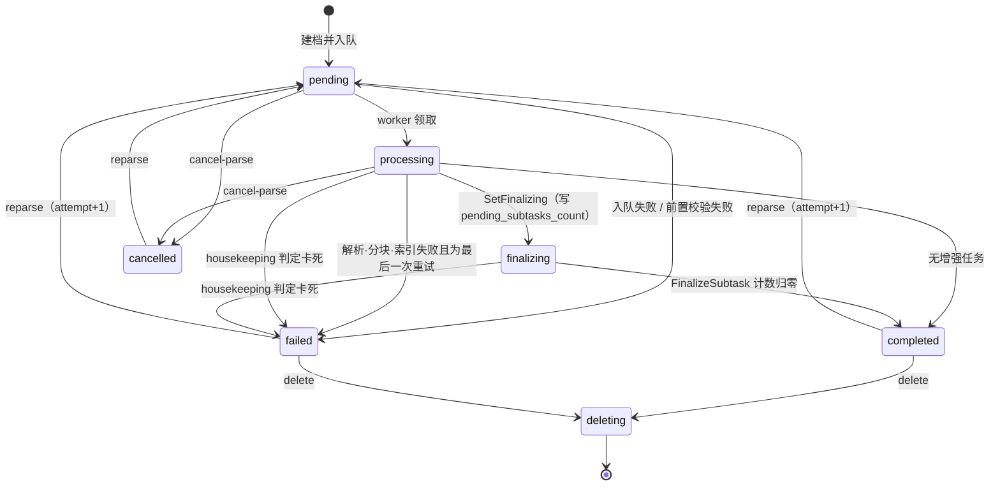

# 知识入库 · 模型与数据访问 · 工程视图

> **文档类型：** product（实施层 · 流程图）
> **受众：** 工程
> **更新于：** 2026-09-19
> **回答的问题：** 一份资料从上传到可检索、再到增强完成，**每一步调用了哪些外部模型、读写了哪些数据库表与外部存储**。
> **配套：** 业务视角的总流程见 `../知识入库.md`；检索侧见同目录《问答检索-模型与数据访问-工程视图》。

## 一、图例

| 形状 / 颜色 | 含义 | 示例 |
|---|---|---|
| 【模型:黄色平行四边形】 | 调用外部模型（对话 LLM / 向量 Embedding / 重排 Rerank / 视觉 VLM / 语音 ASR）或文档解析服务 | 【模型:Embedding】 |
| 【表:蓝色圆柱】 | 读写关系型主库（PostgreSQL，默认 ParadeDB 发行版；Lite 模式为 SQLite）中的表 | 【表:knowledges】 |
| 【存储:绿色六边形】 | 非关系型外部存储：向量检索引擎、对象存储、图数据库 | 【存储:向量引擎】 |
| 【队列:紫色双框】 | 异步任务队列（Redis + asynq；Lite 模式为进程内同步执行器） | 【队列:default】 |
| 菱形 | 分支判断 | — |

所有模型实例统一由「模型服务」按 model_id 从 【表:models】 读取参数（地址、密钥、维度、提供商）后实例化；**没有租户级默认模型兜底，所有绑定都来自 【表:knowledge_bases】 的字段**（见第七节）。

## 二、总览图：文件上传到增强完成（四段）

整条链路按执行者拆成四段，段与段之间用异步任务衔接（紫色双框即衔接点）。

### 2.1 同步段：HTTP 请求内完成，毫秒级返回

### 2.2 异步主流程：core 池 · ProcessDocument（解析 → 切分 → 向量化）

```mermaid
flowchart TD
    W[("读 tenants / knowledges / knowledge_bases<br/>写 parse_status=processing")] --> S1[("写 knowledge_processing_spans<br/>stage=docreader")]
    S1 --> P{"来源"}
    P -- 文件 --> P1{{"读对象存储<br/>GetFile"}}
    P -- 网址 --> P2["SSRF 复检"]
    P1 --> DR[/"文档解析服务 docreader<br/>gRPC Read / ReadStream<br/>引擎按 parser_engine_rules 路由"/]
    P2 --> DR
    DR --> AU{"音频？"}
    AU -- 是 --> ASR[/"ASR 语音模型<br/>asr_config.model_id"/]
    ASR --> IMG
    AU -- 否 --> IMG{{"图片落对象存储<br/>ImageResolver"}}
    IMG --> IMG2[("写 resources<br/>resource_bindings")]
    IMG2 --> CH["Go 侧分块<br/>auto / heading / heuristic<br/>可选父子块"]
    CH --> CL[("幂等清理旧产物<br/>删 chunks · 删向量 · 删图谱")]
    CL --> CW[("写 chunks<br/>text / parent_text<br/>span stage=chunking")]
    CW --> NE{"indexing_strategy<br/>开向量或关键词？"}
    NE -- 是 --> EMB[/"Embedding 向量模型<br/>embedding_model_id<br/>子批 5 · 保存批 40 · 并发 5"/]
    EMB --> VI{{"写向量引擎 BatchIndex<br/>向量 + BM25 关键词索引"}}
    VI --> FIN
    NE -- 否 --> FIN[("写 knowledges<br/>enable_status=enabled ← 此刻可检索<br/>tenants.storage_used 累计<br/>span stage=embedding")]
    FIN --> MM{"多模态且有图片？"}
    MM -- 是 --> MQ[["每张图投递 image:multimodal<br/>队列 multimodal"]]
    MQ --> MR{{"Redis 计数<br/>multimodal:pending:{knowledgeID}"}}
    MM -- 否 --> PQ[["投递 knowledge:post_process<br/>队列 postprocess"]]
    MR -. 全部完成后 .-> PQ
    classDef model fill:#fde68a,stroke:#b45309,color:#1f2937;
    classDef db fill:#bfdbfe,stroke:#1d4ed8,color:#1f2937;
    classDef store fill:#bbf7d0,stroke:#15803d,color:#1f2937;
    classDef queue fill:#e9d5ff,stroke:#7e22ce,color:#1f2937;
    class DR,ASR,EMB model;
    class W,S1,IMG2,CL,CW,FIN db;
    class P1,IMG,VI,MR store;
    class MQ,PQ queue;
```

### 2.3 多模态段：enrichment 池 · 每张图片一个任务

### 2.4 后处理编排与增强：postprocess 池扇出到 enrichment / wiki 池

**读图要点**

1. 同步段只做「能快速失败」的事：权限、配额、去重、落文件、写一条待处理记录、入队。所有模型调用都在异步段。
2. 主流程只调用两类模型：**文档解析服务**（把任意格式变成 Markdown + 图片）与 **Embedding**（把分块变成向量）；音频文件额外调用 **ASR**。
3. 「已可检索」的时点是向量索引写完、`enable_status=enabled` 的那一刻，而不是 `parse_status=completed`。
4. 增强段的模型调用全部是**对话 LLM**（摘要、问题生成、图谱抽取、Wiki 合成、自动打标、知识库画像）加上问题生成后的一次 **Embedding**；除 Wiki 的合成模型与自动打标、画像有各自字段外，默认都落到 `summary_model_id`。
5. 主流程之后只动两张「状态表」：`knowledges`（状态与计数）与 `knowledge_processing_spans`（逐阶段进度树，前端时间线由此渲染）。

## 三、步骤 × 外部模型 × 数据表/存储

| # | 步骤（函数） | 外部模型（类型 ｜ 模型 ID 来源） | 关系型表读写 | 非关系型存储 |
|---|---|---|---|---|
| 1 | HTTP 入口 `CreateKnowledgeFromFile` | 无 | 读 【表:knowledge_bases】（鉴权 + 配置） | — |
| 2 | 建档 `knowledgeService.CreateKnowledgeFromFile` | 无 | 读 【表:knowledge_bases】【表:tenants】（配额）；查重读 【表:knowledges】；写 【表:knowledges】【表:knowledge_tag_relations】【表:audit_logs】 | 写 【存储:对象存储】（`SaveFile`，后端由 `storage_backend_id` / `storage_provider_config` 决定；对象键 `{tenantID}/{knowledgeID}/{uuid}{ext}`） |
| 3 | 入队 `document:process` | 无 | 入队失败时写 【表:knowledges】 `parse_status=failed` | 【队列:default】（core 池，MaxRetry 3，Timeout 30 分钟） |
| 3b | 表格文件旁路 `datatable:summary` | 无（任务内才调） | — | 【队列:summary】 |
| 4 | Worker 领取 `ProcessDocument` | 无 | 读 【表:tenants】【表:knowledges】【表:knowledge_bases】；写 【表:knowledges】 `parse_status=processing` | — |
| 5 | 解析 `convert` | 【模型:文档解析服务 docreader】（gRPC，引擎按 `chunking_config.parser_engine_rules` 选 builtin / simple / anydoc / MinerU / PaddleOCR-VL / WeKnoraCloud；网页由 docreader 的 URL 引擎抓取） | 写 【表:knowledge_processing_spans】 stage=docreader；失败写 【表:knowledges】 状态与错误信息 | 读 【存储:对象存储】 `GetFile` |
| 6 | 音频转写 | 【模型:ASR】 ｜ `knowledge_bases.asr_config.model_id`（可被单次上传覆盖） | 读 【表:models】 | — |
| 7 | 图片落盘 `ImageResolver.ResolveAndStore` / `ResolveRemoteImages` | 无 | 写 【表:resources】【表:resource_bindings】（关系 `extracted_image`） | 写 【存储:对象存储】（图片；过滤小于 64px 或 512B 的图标） |
| 8 | 分块 `chunker.Split` / `SplitParentChild` | 无（纯 Go） | — | — |
| 9 | 落块与建索引 `processChunks` | 【模型:Embedding】 ｜ `knowledge_bases.embedding_model_id`；仅当 `indexing_strategy.vector_enabled` 或 `keyword_enabled`；索引文本 = 文档标题 + 换行 + 分块内容；父块不进索引 | 先幂等删旧 【表:chunks】；写 【表:chunks】（`text` / `parent_text`）；写 【表:tenants】 `storage_used`；写 【表:knowledges】 `enable_status=enabled`、`storage_size`、`processed_at`；写 【表:knowledge_processing_spans】 stage=chunking / embedding | 写 【存储:向量引擎】 `BatchIndex`（向量 + 关键词索引，见第五节矩阵）；清理旧 【存储:图数据库 Neo4j】 子图 |
| 9a | 索引写入细节 `KVHybridRetrieveEngine.Index` | Embedding 批量：子批默认 5 条，保存批 40，并发 5，失败指数退避 5 次 | — | 索引失败则补偿回滚：删 chunks + 删索引，置 failed |
| 10 | 多模态扇出 `enqueueImageMultimodalTasks` | 无 | 写 【表:knowledge_processing_spans】 stage=multimodal | 【队列:multimodal】；【存储:Redis】 `multimodal:pending:{knowledgeID}`（图片数，TTL 24h） |
| 11 | 图片 OCR + Caption `ImageMultimodalService.Handle` | 【模型:VLM 视觉模型】 ｜ `knowledge_bases.vlm_config.model_id`；OCR 与 Caption 各调用一次 `Predict` | 读 【表:models】【表:knowledge_bases】【表:knowledges】；写 【表:chunks】（`image_ocr` / `image_caption` 子块，父块 `image_info`） | 读 【存储:对象存储】 图片；写 【存储:向量引擎】 子块索引；【存储:Redis】 `DECR` 计数，归零后投递后处理 |
| 12 | 后处理编排 `KnowledgePostProcessService.Handle` | 无（只编排） | 读 【表:knowledges】【表:knowledge_bases】【表:chunks】；写 【表:knowledges】 `parse_status=finalizing` + `pending_subtasks_count`（或无子任务直接 completed）；写 【表:task_pending_ops】（Wiki 播种） | 扇出到 【队列:summary】【队列:question】【队列:graph】【队列:wiki】 |
| 13 | 摘要 + 文档画像 `ProcessSummaryGeneration` | 【模型:对话 LLM】 ｜ `knowledge_bases.summary_model_id`；提示词 `generate_summary.yaml`；temperature 0.3，max_tokens 1024，输入截断 8k 字符；输出 JSON（summary / gist / topics / doc_type / typical_question） | 读 【表:chunks】；写 【表:knowledges】 `description`、`profile`、`summary_status`；写 【表:chunks】（`summary` 块）；`FinalizeSubtask` 减计数 | 写 【存储:向量引擎】 摘要块索引 |
| 14 | 问题生成 `processQuestionGenerationForChunks` | 【模型:对话 LLM】 ｜ `summary_model_id`；【模型:Embedding】 ｜ `embedding_model_id`；每 20 个分块一批 | 读 【表:chunks】；写 【表:chunks】 `metadata.generated_questions`；`FinalizeSubtask` | 写 【存储:向量引擎】（每个问题独立一条索引，`source_id = chunkID-qID`） |
| 15 | 自动打标 `KnowledgeAutoTagService.Handle` | 【模型:对话 LLM】 ｜ `auto_tag_config.model_id`，空则 `summary_model_id` | 读 【表:knowledge_tags】【表:chunks】【表:knowledges】；写 【表:knowledge_tag_relations】 | 【队列:summary】；**不占 pending_subtasks 名额** |
| 16 | 图谱抽取 `ChunkExtractService.Handle` | 【模型:对话 LLM】 ｜ `summary_model_id`（随任务负载传入）；提示词 = 系统协议 + `extract_config` 的 few-shot（text / tags / nodes / relations / custom_instructions）；temperature 0.3、关闭 thinking；每分块一次调用 | 读 【表:chunks】【表:knowledge_bases】【表:knowledges】；`FinalizeSubtask` | 写 【存储:图数据库 Neo4j】 `AddGraph`（APOC 幂等合并，节点标签 `ENTITY<kb_id>` / `ENTITY<knowledge_id>`）；仅 `NEO4J_ENABLE=true`；【队列:graph】 |
| 17 | Wiki 摄取 `wikiIngestService.Handle` | 【模型:对话 LLM】 ｜ `wiki_config.synthesis_model_id`，空则 `summary_model_id`；多轮提示词（知识抽取 / 摘要 / 引用 / 候选别名 / 分类规划 / 去重 / 页面修改 / 索引简介） | 读 【表:chunks】【表:knowledges】；写 【表:wiki_pages】【表:wiki_page_revisions】【表:wiki_folders】；读写 【表:task_pending_ops】；失败落 【表:task_dead_letters】 | 【存储:Redis】 `wiki:inflight:{kbID}`（并发槽）、`wiki:slug:*`、`wiki:identity:*`、`wiki:deleted:{kb}:{knowledge}`（删除墓碑）、`wiki:finalize:active:{kbID}`；【队列:wiki】（独立池） |
| 18 | 知识库画像 `KnowledgeBaseProfileService.Handle` | 【模型:对话 LLM】 ｜ `profile_config.model_id`，空则 `summary_model_id`；内容哈希未变则不调模型 | 读 【表:knowledges】（画像行）【表:knowledge_tags】；写 【表:knowledge_bases】 `generated_profile` | 【队列:summary】，按知识库 30 秒去抖 |
| 19 | 表格摘要 `DataTableSummaryService.Handle` | 【模型:对话 LLM】 ｜ `summary_model_id`；【模型:Embedding】 | 写 【表:chunks】（`table_summary` / `table_column`） | 读 【存储:对象存储】 原始表格；写 【存储:向量引擎】 |

## 四、外部模型清单

| 模型类型（`models.type`） | 在入库链路中的用途 | 模型 ID 来源字段 | 调用时机 | 备注 |
|---|---|---|---|---|
| 文档解析服务（非 models 表，独立 Python gRPC 进程） | 任意格式 → Markdown + 图片字节 | `chunking_config.parser_engine_rules`（按文件类型选引擎） | 主流程 stage=docreader | 可选远程引擎 MinerU / PaddleOCR-VL / WeKnoraCloud 走 HTTP 转换器 |
| `ASR` | 音频 → 文本 | `asr_config.model_id` | 主流程，仅音频文件 | 未配置则音频文件直接失败；上传前置校验会拦 |
| `Embedding` | 分块 / 摘要块 / 生成问题 / 图片子块 / 表格块 → 向量 | `embedding_model_id` | 主流程 stage=embedding；增强段 13 / 14 / 11 / 19 | 更换向量模型必须重建索引；一次多库检索要求同一模型身份 |
| `VLLM`（视觉） | 图片 OCR 与描述 | `vlm_config.model_id` | 多模态段，每图两次调用 | 未配置则上传图片被前置拦截 |
| `KnowledgeQA`（对话 LLM） | 摘要 + 画像、问题生成、图谱抽取、Wiki 合成、自动打标、知识库画像、表格摘要 | `summary_model_id`（默认）；`wiki_config.synthesis_model_id`、`auto_tag_config.model_id`、`profile_config.model_id` 各自可覆盖 | 增强段 | 后台任务的调用受模型级并发闸门（Redis 信号量 `weknora:modelsem:{modelID}`）约束 |
| `Rerank` | **入库链路不使用** | — | — | 只在检索侧使用 |

## 五、数据库与存储清单

### 5.1 关系型主库表读写矩阵

| 表 | 读 | 写 | 在链路中的角色 |
|---|---|---|---|
| 【表:knowledge_bases】 | 步骤 1、2、4、11、12、16 | 步骤 18（`generated_profile`） | 所有解析 / 索引 / 增强配置与模型绑定的来源 |
| 【表:knowledges】 | 步骤 2（去重）、4、11、12、13、18 | 步骤 2、3、4、5、9、12、13（状态、计数、摘要、画像、错误、处理时间、存储大小） | 知识条目主记录与状态机载体 |
| 【表:chunks】 | 步骤 12、13、14、15、16、17 | 步骤 9、11、13、14、19 | 检索最小单元；`chunk_type` 区分 text / parent_text / image_ocr / image_caption / summary / table_summary / table_column / faq |
| 【表:knowledge_processing_spans】 | 前端时间线、巡检 | 步骤 5、9、10、12 | 每次尝试的逐阶段进度树（docreader → chunking → embedding → multimodal → postprocess），心跳来源 |
| 【表:tenants】 | 步骤 2、4 | 步骤 9（`storage_used`） | 配额与空间级默认配置 |
| 【表:models】 | 每次取模型 | — | 模型参数（密钥 AES 加密） |
| 【表:knowledge_tags】 / 【表:knowledge_tag_relations】 | 步骤 15、18 | 步骤 2、15 | 标签与自动打标 |
| 【表:resources】 / 【表:resource_bindings】 | 删除时确认引用 | 步骤 7 | 抽取图片的统一引用句柄 |
| 【表:wiki_pages】 / 【表:wiki_page_revisions】 / 【表:wiki_folders】 | 步骤 17 | 步骤 17 | Wiki 产物 |
| 【表:task_pending_ops】 | 步骤 17、启动恢复 | 步骤 12、17 | Wiki 摄取的持久化待办（重启后恢复） |
| 【表:task_dead_letters】 | 运维面板 | 重试耗尽时 | 死信快照；联动把父文档置 failed |
| 【表:audit_logs】 | 活动流 | 步骤 2、删除 | 知识库活动 |
| 【表:vector_stores】 | 解析引擎时 | — | 知识库绑定的向量库实例；为空则回落环境变量驱动的默认引擎 |
| 【表:storage_backends】 | 解析存储后端时 | — | 知识库绑定的对象存储实例 |

### 5.2 向量检索引擎矩阵（`BatchIndex` 落到哪里）

引擎由 `knowledge_bases.vector_store_id` → 【表:vector_stores】 解析；为空时回落租户的 `RETRIEVE_DRIVER` 环境引擎。所有引擎同时声明向量 + 关键词两种能力（ES v7 仅关键词）。

| 引擎 | 物理位置 | 向量列 / 索引 | 关键词实现 | 维度隔离 |
|---|---|---|---|---|
| PostgreSQL（默认，ParadeDB 镜像） | 表 【表:embeddings】（与业务同库） | `embedding halfvec`；HNSW 建在表达式 `(embedding::halfvec(N)) halfvec_cosine_ops` 上，**只为 798 / 1024 / 3584 三个维度建了索引** | ParadeDB `pg_search` BM25 索引（`USING bm25`，tokenizer `chinese_lindera`），**不是 tsvector** | 单表混维，`dimension` 列 |
| SQLite（Lite 模式） | 表 `lite_embeddings` + `vec0` 虚表 | sqlite-vec | FTS5 `lite_embeddings_fts`（bigram 分词） | 每维一张虚表 |
| Elasticsearch v7 / v8 | 索引 `ELASTICSEARCH_INDEX`，默认 `xwrag_default` | `dense_vector` | text 字段 BM25 | 单索引（**未按维度分**，待核实多维共存行为） |
| OpenSearch | 索引 `OPENSEARCH_INDEX`，默认 `weknora`，按维度别名 `{base}_{dim}` | `knn_vector`（HNSW） | text 字段 BM25 | 每维一别名 |
| Milvus | collection `weknora_embeddings_{dim}` | HNSW，metric 默认 IP | 内建 BM25 Function → 稀疏字段 `content_sparse` | 每维一 collection |
| Qdrant | collection `weknora_embeddings_{dim}` | Cosine | payload 全文索引（无 BM25 打分） | 每维一 collection |
| Weaviate | class `Weknora_embeddings`（+维度） | nearVector | 原生 BM25 | 动态 class |
| Doris | 表 `weknora_embeddings_{dim}` | ANN HNSW inner_product | 倒排索引 + chinese parser | 每维一表 |
| 腾讯云 VectorDB | database `weknora`，collection `weknora_embeddings_{dim}` | HNSW COSINE | 稀疏向量 SPARSE_INVERTED（服务端 BM25） | 每维一 collection |

统一写入载荷：`IndexInfo{Content, SourceID, SourceType=chunk, ChunkID, KnowledgeID, KnowledgeBaseID, TagID, IsEnabled}`。

### 5.3 对象存储、缓存与图数据库

| 存储 | 用途 | 关键路径 / 键 |
|---|---|---|
| 【存储:对象存储】（local / minio / s3 / cos / oss / tos / obs / ks3） | 原始文件、抽取图片、FAQ 大批量导入的条目 JSON、导出与克隆产物 | `{tenantID}/{knowledgeID}/{uuid}{ext}`；`{tenantID}/exports/...`；应用层持有 `resource://{handle}` 稳定引用 |
| 【存储:Redis】 | asynq 队列 broker；多模态计数 `multimodal:pending:{knowledgeID}`；FAQ 导入互斥 `faq_import_running:{kbID}` 与进度 `faq_import_progress:{taskID}`；Wiki 槽位与墓碑 `wiki:*`；模型并发信号量 `weknora:modelsem:{modelID}`；系统设置发布订阅 | Lite 模式下全部退化为进程内 |
| 【存储:图数据库 Neo4j】 | 实体 / 关系图谱（`AddGraph` / `DelGraph`），依赖 APOC | 节点标签 `ENTITY<kb_id>` + `ENTITY<knowledge_id>`，属性 name / kg / attributes / chunks |

## 六、其他入库分支

**FAQ 索引内容由两个开关决定**（`faq_config`）：`index_mode` = `question_only`（仅标准问 + 相似问）或 `question_answer`（再拼答案，默认）；`question_index_mode` = `combined`（合并成一条索引，默认）或 `separate`（标准问与每个相似问各一条，`source_id = {chunkID}-{index}`）。反例问不进索引。FAQ 型知识库只有一个知识条目，所有问答对挂在它下面。

### 6.1 分块人工编辑与重索引

编辑限制：父子块模式下重建父块内容；删除的图片对应 OCR / Caption 子块置 `is_enabled=false` 而非硬删；禁止新增图片。回滚（`RevertDocumentChunk`）从 `chunk_revisions` 取内容后走同一条重索引路径。

### 6.2 删除的清理顺序

先删记录、后删文件：任何一步失败都可以重试，不会出现「记录没了、文件找不回」的半成品。重解析（`ReparseKnowledge`）不走删除，而是开新尝试号、重置为 pending、重新入队，旧产物由 `processChunks` 开头的幂等清理段处理；取消（`CancelKnowledgeParse`）置 `cancelled`、清零计数、从各队列撤任务，**已写的分块与索引保留**。

## 七、状态机与配置来源

### 7.1 `knowledges.parse_status`

辅助状态：`enable_status ∈ {enabled, disabled}`（索引成功即 enabled）；`summary_status ∈ {none, pending, processing, completed, failed}`；span 状态 `pending / running / done / failed / skipped / cancelled`。巡检（每 5 分钟）：`parse_status IN (pending, processing, finalizing) AND updated_at < cutoff`，再看 `knowledge_processing_spans` 的心跳与 asynq 队列是否仍有该任务，三条都满足才置 failed；阈值 = max(1h, DocumentProcessTimeout) + 10min。

### 7.2 `knowledge_bases` 中决定链路行为的列

| 列 | 内容 | 消费步骤 |
|---|---|---|
| `embedding_model_id` | 向量 / 关键词索引唯一 Embedding 模型 | 9、11、13、14、19、FAQ、分块重索引 |
| `summary_model_id` | 摘要、问题生成、图谱抽取、表格摘要的对话 LLM；也是自动打标 / 画像 / Wiki 的回落 | 13、14、16、18、19 |
| `chunking_config` | `chunk_size / chunk_overlap / separators / strategy(auto·heading·heuristic) / enable_parent_child / parent_chunk_size / child_chunk_size / parser_engine_rules / table_metadata_instructions` | 5、8 |
| `vlm_config` | `enabled / model_id / description_language / custom_instructions` | 11 |
| `asr_config` | `enabled / model_id / language` | 6 |
| `extract_config` | `enabled / text / tags / nodes / relations / custom_instructions` | 16 |
| `question_generation_config` | `enabled / question_count / custom_instructions` | 14 |
| `auto_tag_config` | `enabled / model_id / max_tags / skip_if_tagged` | 15 |
| `profile_config` / `generated_profile` | 画像配置 / 结果 | 18 |
| `wiki_config` | `synthesis_model_id / extraction_granularity / ingest_batch_size / ingest_*_parallel / content_instructions / extraction_instructions` | 17 |
| `faq_config` | `index_mode / question_index_mode` | FAQ |
| `indexing_strategy` | `vector_enabled / keyword_enabled / wiki_enabled / graph_enabled`（默认 vector + keyword） | 是否跳过 Embedding、是否扇出 Wiki / 图谱 |
| `vector_store_id` | 绑定 `vector_stores` 行，建库后不可改 | 5.2 |
| `storage_backend_id` / `storage_provider_config` / `cos_config`（结构体名 StorageConfig） | 对象存储后端 | 2、7 |

单次上传的 `process_config` 反序列化为覆盖项存进 `knowledges.metadata`，worker 用 `ResolveProcessConfig(kb, overrides)` 合并；约束 `GraphEnabled = GraphEnabled && ExtractConfig.Enabled`。

## 八、风险与待核实

| # | 事项 | 影响 |
|---|---|---|
| 1 | PostgreSQL 引擎只为 798 / 1024 / 3584 维度建了 HNSW 索引 | 其他维度的向量模型在默认引擎上退化为顺序扫描 |
| 2 | `knowledge_bases.image_processing_config` 结构体仍在，但多模态实际只读 `vlm_config` | 待核实是否仍有其他路径使用 |
| 3 | `chunk_type=wiki_page` 常量存在且检索侧有 Wiki 加权，但未找到创建该类型分块的写入点 | Wiki 页面是否进向量检索，待核实 |
| 4 | Elasticsearch 单索引未按维度分 | 多维度共存时行为待核实 |
| 5 | MySQL / SQLite 迁移与 ParadeDB 主线在 BM25 上必然不同 | 关键词检索在这两种库上的退化方式待核实 |
| 6 | `pg_trgm` 扩展已创建但代码未使用 | 无功能影响，可能是历史遗留 |

## 九、节点来源

| 步骤 | 来源 file:函数 |
|---|---|
| 1 | `internal/handler/knowledge.go:CreateKnowledgeFromFile`；路由 `internal/router/routes_knowledge.go` |
| 2、3、3b | `internal/application/service/knowledge_create.go:CreateKnowledgeFromFile`（calculateFileHash / CheckKnowledgeExists / SaveFile / CreateKnowledge / Enqueue）；`knowledge_task_options.go` |
| 4、5、6、7、8、9 | `internal/application/service/knowledge_process.go:ProcessDocument / convert / processChunks / finalizeIndexedKnowledgeState`；`internal/infrastructure/docparser/{grpc_parser,engines,image_resolver}.go`；`internal/infrastructure/chunker/` |
| 9a | `internal/application/service/retriever/keywords_vector_hybrid_indexer.go`；`internal/models/embedding/batch.go` |
| 10、11 | `knowledge_process.go:enqueueImageMultimodalTasks`；`image_multimodal.go:Handle` |
| 12 | `knowledge_post_process.go:Handle`；`internal/application/repository/knowledge.go:SetFinalizing / FinalizeSubtask / CompleteProcessingWithoutSubtasks` |
| 13、14 | `knowledge_process.go:ProcessSummaryGeneration / getSummary / processQuestionGenerationForChunks` |
| 15 | `knowledge_auto_tag.go:Handle` |
| 16 | `extract.go:ChunkExtractService.Handle`；`internal/application/repository/retriever/neo4j/repository.go` |
| 17 | `wiki_ingest.go:Handle`；`wiki_ingest_batch.go` |
| 18 | `knowledgebase_profile.go:Handle` |
| 19 | `extract.go:DataTableSummaryService.Handle` |
| 六 | `knowledge_create.go:CreateKnowledgeFromURL / CreateKnowledgeFromManual`；`datasource_service.go:ProcessSync`；`internal/im/service.go`；`knowledge_faq_import.go:UpsertFAQEntries`；`knowledge_faq.go:buildFAQIndexContent / buildFAQIndexInfoList` |
| 6.1 | `chunk.go:UpdateDocumentChunk / RevertDocumentChunk / syncChunkIndex` |
| 6.2 | `knowledge_delete.go:executeKnowledgeDelete`；`knowledge_process.go:ReparseKnowledge / CancelKnowledgeParse` |
| 7 | `internal/types/knowledge.go`；`internal/types/knowledge_span.go`；`knowledge_housekeeping.go`；`internal/types/knowledgebase.go`；`knowledge_process_config.go` |
| 5.2 | `internal/application/repository/retriever/*`；`migrations/versioned/000002_embeddings.up.sql`、`000059_embeddings_hnsw_1024.up.sql` |
