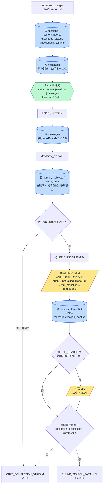
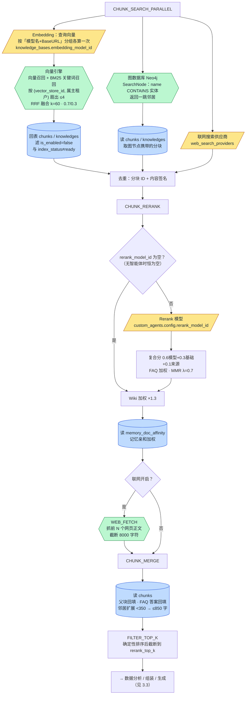
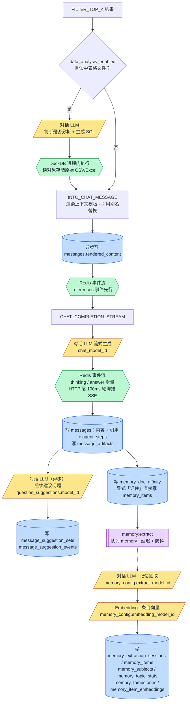
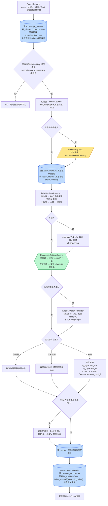
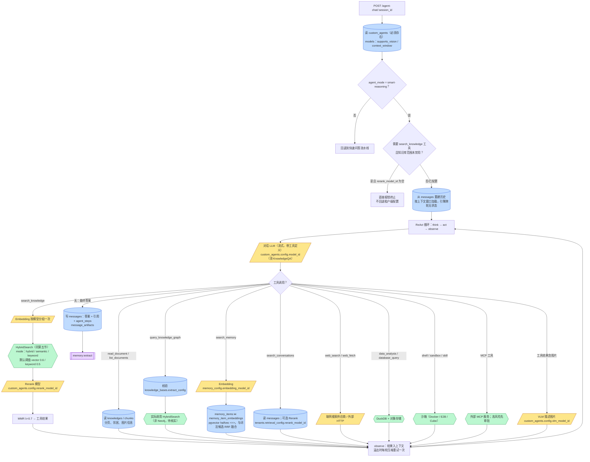

# 问答检索 · 模型与数据访问 · 工程视图

> **文档类型：** product（实施层 · 流程图）
> **受众：** 工程
> **更新于：** 2026-09-19
> **回答的问题：** 一次提问从进来到答案流出，**每个阶段调用了哪些外部模型、读写了哪些数据库表与外部存储**；混合检索在各引擎上具体查什么；智能体路径与快速问答路径的差异。
> **配套：** 业务视角的总流程见 `../问答检索.md`；入库侧见同目录《知识入库-模型与数据访问-工程视图》。

## 一、图例

| 形状 / 颜色 | 含义 |
|---|---|
| 【模型:黄色平行四边形】 | 调用外部模型：对话 LLM / Embedding / Rerank / VLM，或联网搜索供应商 |
| 【表:蓝色圆柱】 | 读写关系型主库中的表 |
| 【存储:绿色六边形】 | 向量检索引擎、Redis 事件流、图数据库、对象存储、进程内 DuckDB |
| 【队列:紫色双框】 | 异步任务队列 |

## 二、入口总览

| 入口 | 路由 | 处理器 → 服务 | 说明 |
|---|---|---|---|
| 快速问答（RAG / 纯聊天） | `POST /api/v1/knowledge-chat/:session_id` | `session.Handler.KnowledgeQA` → `sessionService.KnowledgeQA` | 事件驱动插件流水线 |
| 智能推理（ReAct 智能体） | `POST /api/v1/agent-chat/:session_id` | `session.Handler.AgentQA` → `session_agent_qa.go` → `internal/agent/engine.go` | 按 `custom_agents.config.agent_mode` 判定；`quick-answer` 模式回退到快速问答流水线 |
| 独立混合检索 | `GET/POST /api/v1/knowledge-bases/:id/hybrid-search` | `KnowledgeBaseHandler.HybridSearch` → `HybridSearch` | **不经过重排 / 合并 / 截断**，直接返回融合结果 |
| 只检索不生成 | 服务内 `SearchKnowledge` | 流水线 `CHUNK_SEARCH → CHUNK_RERANK → CHUNK_MERGE → FILTER_TOP_K` | 供接口与工具复用 |
| 对外工具（MCP 端点） | 独立 MCP 协议端点 | `internal/mcpserver/tools_retrieve.go` → 复用智能体的 `search_knowledge` 工具 | 未注入 Rerank 模型：只检索 + MMR |
| 嵌入渠道 / IM 渠道 | `POST /api/v1/embed/:channel_id/...`、各平台回调 | 同快速问答 / 智能体 | 身份翻译成调用主体后同链路 |

## 三、总览图：快速问答流水线（三段）

流水线按阶段拆成三段图，图与图之间按阶段名衔接。

### 3.1 请求受理 → 历史与记忆 → 查询理解

### 3.2 并行检索 → 重排 → 网页抓取 → 合并 → 截断

### 3.3 数据分析 → 组装上下文 → 流式生成 → 收尾与记忆抽取

**读图要点**

1. 一次典型 RAG 提问最多调用 **四类模型**：改写用对话 LLM（或 VLM）、查询向量用 Embedding、精排用 Rerank、生成用对话 LLM；图谱与数据分析各多一次 LLM 调用。
2. **记忆召回不调模型**：主键读记忆主体的预渲染块 + 词法匹配；只有智能体的「搜索记忆」工具才走向量。
3. **快速问答在没有绑定智能体时不做 Rerank**：`rerank_model_id` 只从智能体配置取，取不到就跳过精排（仍会做 Wiki 加权与记忆亲和加权）。
4. 检索阶段访问的存储最杂：向量引擎（向量 + BM25）、图数据库（实体）、外部搜索供应商，再回表 `chunks` / `knowledges` 做启用状态与索引状态过滤。
5. 生成结束后仍有三条尾巴：建议问题（LLM）、记忆抽取（LLM + Embedding，异步）、文档亲和记录。

## 四、阶段 × 外部模型 × 数据表/存储

| # | 阶段（事件常量 / 函数） | 外部模型 ｜ 模型 ID 来源 | 关系型表读写 | 非关系型存储 |
|---|---|---|---|---|
| 0 | 请求解析 / 落库（`qa.go:parseQARequest / persistTurnMessages`） | 无 | 读 【表:sessions】【表:custom_agents】【表:knowledge_bases】【表:knowledges】【表:tenants】；写 【表:messages】 两行 | 附件 / 图片 URL 经 `storageurl.StreamRewriter` 改写为对象存储可访问链接 |
| 0.5 | SSE 准备（`setupSSEStream / SetLiveRun`） | 无 | — | 【存储:Redis】 事件列表 `stream:events:{sessionID}:{messageID}`、插话子列表 `...:steer`、单跑锁 `stream:events:{sessionID}:live-run`（SetNX + TTL）；内存模式为进程内 map |
| 1 | `LOAD_HISTORY`（`load_history.go`） | 无 | 读 【表:messages】（最近 `maxRounds*2+10` 条，按 `request_id` 配对） | — |
| 2 | `MEMORY_RECALL`（`memory_recall.go`） | **无** | 读 【表:memory_subjects】【表:memory_items】 | 不触发向量引擎 |
| 3 | `QUERY_UNDERSTAND` · 改写 + 意图 + 图片描述（`query_understand.go`） | 【模型:对话 LLM 或 VLM】 ｜ 有图且 chat 支持视觉 → `chat_model_id`；否则 `custom_agents.config.vlm_model_id`；纯文本 → `query_understand_model_id`，空则 `chat_model_id` | 读 【表:messages】；异步写 【表:messages】 `images[].caption`；读 【表:memory_items】（背景、兴趣、常查资料注入改写提示词） | — |
| 3b | `QUERY_UNDERSTAND` · 实体抽取（`extract_entity.go`） | 【模型:对话 LLM】 ｜ `chat_model_id` | 读 【表:knowledge_bases】（`extract_config.enabled`）【表:knowledges】 | 仅 `NEO4J_ENABLE=true` |
| 4 | `CHUNK_SEARCH_PARALLEL`（`search_parallel.go`） | 无（编排，克隆状态并发跑 4a + 4b） | — | — |
| 4a | 内部 `CHUNK_SEARCH`（`search.go:searchByTargets`）→ `HybridSearch` | 【模型:Embedding】 ｜ `knowledge_bases.embedding_model_id`（跨租户共享库用**源租户**的模型）；【模型:联网搜索供应商】 ｜ 请求 → 智能体 → 租户默认 | 读 【表:knowledge_bases】【表:models】【表:kb_shares】（授权）；回表 【表:chunks】【表:knowledges】 | 【存储:向量引擎】 向量 + 关键词两路（第五节）；外部搜索 HTTP |
| 4b | 内部 `ENTITY_SEARCH`（`search_entity.go`） | 无 | 读 【表:chunks】【表:knowledges】（取图节点携带的分块） | 【存储:图数据库 Neo4j】 Cypher `MATCH (n:L)-[r]-(m:L) WHERE ANY(t IN $nodes WHERE n.name CONTAINS t)` |
| 5 | `CHUNK_RERANK`（`rerank.go`） | 【模型:Rerank】 ｜ **仅** `custom_agents.config.rerank_model_id`；为空直接跳过 | 内存打分 | — |
| 5b | 同事件内层 `PluginWikiBoost` | 无 | 读 【表:knowledge_bases】（是否开 Wiki） | — |
| 5c | 同事件内层 `PluginMemoryAffinity` | 无 | 读 【表:memory_doc_affinity】 | — |
| 6 | `WEB_FETCH`（`web_fetch.go`，仅联网开启） | 无 | — | 外部 HTTP 抓正文，截断 8000 字符 |
| 7 | `CHUNK_MERGE`（`merge.go` + `merge_faq.go` + `merge_expand.go` + `merge_history.go`） | 无 | 读 【表:chunks】：父块回填、FAQ 答案回填、前后邻居扩展（全部走 `ListChunksByID`） | — |
| 8 | `FILTER_TOP_K` | 无 | — | 确定性排序（分数 → knowledge_id → chunk_type → chunk_index → id）后截断 |
| 9 | `DATA_ANALYSIS`（可选） | 【模型:对话 LLM】 ｜ `chat_model_id` | 读 【表:knowledges】【表:chunks】 | 【存储:DuckDB】 进程内；读 【存储:对象存储】 原始表格 |
| 10 | `INTO_CHAT_MESSAGE` | 无 | 异步写 【表:messages】 `rendered_content` | 引用别名注册（`cN` / `wN` / `dN` / `bN`），内部 ID 不进模型上下文 |
| 11 | `CHAT_COMPLETION_STREAM` | 【模型:对话 LLM（流式）】 ｜ `chat_model_id` | — | 【存储:Redis】 事件流 append |
| 12 | 回合收尾（`qa.go:completeAssistantMessage / recordTurnMemory`） | 【模型:对话 LLM（异步）】 建议问题 ｜ `question_suggestions.model_id`，空则 `messages.model_id` | 写 【表:messages】【表:message_suggestion_sets】【表:message_suggestion_events】【表:message_artifacts】【表:memory_doc_affinity】；显式「记住」直接写 【表:memory_items】 | 【队列:memory】 投递 `memory:extract`（延迟 + 防抖）；清 live-run 锁 |
| 13 | 后台记忆抽取（`memory/extract.go:Handle`） | 【模型:对话 LLM】 ｜ `memory_config.extract_model_id` → 回合 `chat_model_id` → 工作区第一个 KnowledgeQA 模型；【模型:Embedding】 ｜ `memory_config.embedding_model_id`（工作区级，与知识库无关） | 读写 【表:memory_extraction_sessions】【表:memory_items】【表:memory_subjects】【表:memory_topic_stats】【表:memory_tombstones】；写 【表:memory_item_embeddings】 | — |

**流水线实际顺序**（`PipelineBuilder` 动态拼装，`types.Pipeline` 静态预设未被 RAG 路径使用）：

| 路径 | 阶段顺序 |
|---|---|
| RAG（选了知识库或开联网） | LOAD_HISTORY（有历史）→ MEMORY_RECALL → QUERY_UNDERSTAND → CHUNK_SEARCH_PARALLEL → CHUNK_RERANK → WEB_FETCH（联网）→ CHUNK_MERGE → FILTER_TOP_K → DATA_ANALYSIS（开启）→ INTO_CHAT_MESSAGE → CHAT_COMPLETION_STREAM |
| 纯聊天 | LOAD_HISTORY（有历史）→ MEMORY_RECALL → CHAT_COMPLETION_STREAM |
| 只检索 `SearchKnowledge` | CHUNK_SEARCH → CHUNK_RERANK → CHUNK_MERGE → FILTER_TOP_K |

同一事件内的插件链（外 → 内，按容器注册顺序）：`QUERY_UNDERSTAND` = 改写 → 实体抽取；`CHUNK_RERANK` = 模型重排 → Wiki 加权 → 记忆亲和（后两者先调下一层再后置加权）。

## 五、混合检索内部（`HybridSearch`）

### 5.1 各引擎具体查什么

| 引擎 | 物理位置 | 向量检索 | 关键词检索 | 过滤条件 | 分数值域 |
|---|---|---|---|---|---|
| PostgreSQL（ParadeDB） | 表 【表:embeddings】 | 子查询取 `expandedTopK = clamp(TopK*2, 100, 200)` 个候选：`embedding::halfvec(dim) <=> $q::halfvec(dim)`，`score = 1 - distance`，`WHERE dimension = ?`；事务内 `SET LOCAL hnsw.ef_search`、`hnsw.iterative_scan = strict_order`（老版本自动降级） | ParadeDB BM25：`content ||| ?` + `paradedb.score(id)`（**不是 tsvector / pg_trgm**） | `knowledge_base_id / knowledge_id / tag_id IN (...)`；`is_enabled IS NULL OR true` | 向量 [0,1]；BM25 无上界 |
| SQLite（Lite） | `lite_embeddings` + `vec0` 虚表 + FTS5 | `WHERE v.embedding MATCH ?` ORDER BY distance | FTS5 `MATCH`，`score = bm25()*-1000000`，bigram 分词 | 先在主表过滤再取 top-k | — |
| Elasticsearch v8 | 索引 `xwrag_default`（默认） | `script_score` + `max(cosineSimilarity, 0)`，`min_score=阈值` | `match: {content: query}` | bool filter | 向量 [0,1] |
| Elasticsearch v7 | 同上 | **不支持**（仅关键词引擎） | `match` | bool filter | — |
| OpenSearch | `weknora_{dim}` 别名 | 原生 `knn`（COSINESIMIL 已折算 (1+cos)/2）+ `min_score` | `match` | bool must | [0,1] |
| Milvus | `weknora_embeddings_{dim}` | HNSW，metric 默认 IP | 稀疏字段 BM25，按语言选 analyzer | 布尔表达式 | COSINE 时 [-1,1] → 归一 |
| Qdrant | `weknora_embeddings_{dim}` | Cosine，`score_threshold` 下推 | payload `MatchText` OR，**命中分恒 1.0** | `MatchKeywords` | 关键词恒 1.0 |
| Weaviate | class `Weknora_embeddings` | `nearVector` + certainty | 原生 BM25 | where | certainty [0,1] |
| Doris | `weknora_embeddings_{dim}` | `inner_product_approximate`（向量先单位化） | `MATCH_ANY`，**分恒 1.0** | SQL | 关键词恒 1.0 |
| 腾讯云 VectorDB | `weknora` / `weknora_embeddings_{dim}` | HNSW COSINE | 本地 SparseEncoder → 稀疏检索 | 标量 FILTER | 归一 |
| Neo4j（不在引擎注册表内） | 标签 `ENTITY<kb>` / `ENTITY<knowledge>` | — | Cypher 模糊匹配实体名，返回一跳邻居 | 命名空间 | 无分数 |

### 5.2 分数公式与阈值

| 环节 | 公式 / 规则 | 参数来源 |
|---|---|---|
| RRF 融合 | `score = w_v/(k + rank_v) + w_k/(k + rank_k)`，rank 从 1 起，缺席侧不计；**融合后覆盖原始分数** | `tenants.retrieval_config`：k 默认 60，权重默认 0.7 / 0.3 |
| 召回默认 | `EmbeddingTopK=50`、`VectorThreshold=0.15`、`KeywordThreshold=0.3`、`RerankTopK=10`、`RerankThreshold=0.2` | `retrieval_config.go` |
| 复合分 | `0.6*模型分 + 0.3*基础分 + 0.1*来源权重`（联网来源 0.95，其余 1.0），clamp [0,1] | `rerank.go` |
| FAQ 加权 | `min(score * faq_score_boost, 1.0)`，条件 `faq_priority_enabled && boost>1 && chunk_type=faq` | 智能体配置 |
| MMR | `0.7*relevance - 0.3*max Jaccard`，k = `rerank_top_k` | λ 写死 0.7 |
| 阈值降级 | 首轮 0 结果且阈值 > 0.3 → 用 `max(阈值*0.7, 0.3)` 重试一次 | — |
| Top-1 兜底 | 全被滤掉时，top1 ≥ 0.15 则保留（显式圈定标签 / 文档时为 0） | — |
| Wiki 加权 | `score *= 1.3`，仅当命中 `wiki_page` 类型且范围内有开 Wiki 的库 | — |
| 记忆亲和 | `score *= 1 + (maxBoost-1) * log1p(hits)/log1p(fullHits)` | `memory_doc_affinity` |

### 5.3 启用状态过滤（两层）

1. 索引层：各引擎的 `is_enabled` 过滤（PostgreSQL 为 `is_enabled IS NULL OR is_enabled = true`，历史无字段的数据视为启用）。
2. 回表层：`isSearchableChunk` 丢弃 `chunks.is_enabled=false`、`index_status ∈ {processing, failed}`（防编辑后未同步的脏命中），且 `chunk_type` 必须在白名单 `text / summary / table_column / table_summary / faq / image_ocr / image_caption`。

## 六、智能推理（智能体）路径

与快速问答的差异：

| 维度 | 快速问答 | 智能推理 |
|---|---|---|
| 对话模型来源 | 知识库 `summary_model_id`（第一个远程的）→ 第一个 KnowledgeQA 模型 | 请求 `summary_model_id`（共享智能体时忽略）→ **`custom_agents.config.model_id`（必填）** |
| Rerank | 仅智能体配置，为空则跳过 | 使用知识检索工具时**必填**，缺失报错 |
| 检索阈值默认 | `retrieval_config`：vector 0.15 / keyword 0.3 | 工具内：vector 0.6 / keyword 0.5（**与前者不一致**，同一库召回量会明显不同） |
| 历史 | 按 `history_turns` 取最近 N 轮 | 按上下文窗口加载，溢出时压缩 |
| 记忆 | 召回预渲染块 | 可主动调用搜索记忆 / 搜索历史对话工具 |
| 图谱 | `ENTITY_SEARCH` 真正查 Neo4j | `query_knowledge_graph` 工具实际调 HybridSearch（待核实） |

## 七、模型选择规则总表

| 用途 | 决定字段（按优先级） | 备注 |
|---|---|---|
| 对话 LLM（快速问答） | ① 范围内知识库 `summary_model_id` 中第一个 `source=remote` 的 ② 第一个库的 `summary_model_id` ③ 【表:models】 中第一个 `type=KnowledgeQA` | — |
| 对话 LLM（智能体） | ① 请求 `summary_model_id`（共享智能体时清空）② `custom_agents.config.model_id`（须 KnowledgeQA）③ 知识库兜底 | — |
| Embedding（查询向量） | `knowledge_bases.embedding_model_id`；跨租户共享库用源租户的同名模型；分组键 `model.Name + "|" + BaseURL` | 维度必须与模型声明一致，否则错误码 2201 |
| Rerank（快速问答） | 仅 `custom_agents.config.rerank_model_id` | 无智能体 → 跳过 |
| Rerank（只检索接口） | ① `tenants.retrieval_config.rerank_model_id` ② 第一个 `type=Rerank` | — |
| Rerank（智能体） | `custom_agents.config.rerank_model_id`，缺失即报错 | — |
| VLM | `custom_agents.config.vlm_model_id` | 改写阶段有图时；工具结果图片描述 |
| 改写模型 | `custom_agents.config.query_understand_model_id`，空则对话模型 | 可指定小模型 |
| 建议问题模型 | `question_suggestions.model_id`，空则 `messages.model_id` | 异步 |
| 记忆抽取模型 | `memory_config.extract_model_id` → 回合对话模型 → 工作区第一个 KnowledgeQA | 空间级配置 |
| 记忆 Embedding | `memory_config.embedding_model_id` | 与知识库模型无关 |
| 联网搜索供应商 | 请求 → 智能体 → 租户默认（【表:web_search_providers】） | — |

【表:models】 字段：`type ∈ {Embedding, Rerank, KnowledgeQA, VLLM, ASR}`；`source ∈ {local, remote}`（历史值 aliyun / zhipu / openai 等等价 remote + provider）；`parameters` JSON 含 `base_url / api_key(加密) / provider / embedding_parameters.dimension / supports_vision / context_window / max_concurrency`。本地与远程分叉点：`source=local` 走 Ollama 客户端，否则按 `provider`（空则按地址自动识别）路由到 OpenAI 兼容 / Anthropic / WeKnoraCloud 等适配器。

## 八、会话持久化与 Redis 键

| 时机 | 动作 | 表 / 键 |
|---|---|---|
| 请求解析后 | 写用户消息 + 助手消息占位；失败则回滚删除 | 【表:messages】 |
| 并发保护 | `GetLiveRun` 拒绝同会话并发生成 | Redis `stream:events:{sessionID}:live-run`（SetNX + TTL） |
| 流事件 | `RPUSH` + 刷新 TTL（1 小时）；`LRANGE offset..-1` 拉取 | `stream:events:{sessionID}:{messageID}` |
| 用户插话 | Lua 幂等追加到子列表 | `stream:events:{sessionID}:{messageID}:steer` |
| 停止 | 追加 stop 事件；独立监视器 300ms 轮询、2 小时兜底 | 同事件列表 |
| 完成 | 更新内容 + 引用 + `agent_steps`；产物先删后插 | 【表:messages】【表:message_artifacts】 |
| 完成后 | 异步建议问题 | 【表:message_suggestion_sets】【表:message_suggestion_events】 |
| 模型并发 | 后台任务按模型限流（交互式请求不排队） | Redis ZSET `weknora:modelsem:{modelID}` |
| 限流（嵌入 / IM / MCP） | 滑动窗口 | Redis ZSET `{prefix}{key}` |
| 断线续传 | `GET /sessions/continue-stream/:id?message_id=` 从 offset 0 重放 | 事件列表 |

## 九、风险与待核实

| # | 事项 | 影响 |
|---|---|---|
| 1 | 快速问答无智能体时不做 Rerank | 若产品预期「必过精排」，需确认意图 |
| 2 | RRF 融合覆盖原始分数，随后复合分的 `0.3*base` 用的是 RRF 分（量级约 0.01） | 混检路径下基础分项几乎不起作用，疑似缺陷 |
| 3 | `KnowledgeType`（FAQ 索引分流）在多数引擎仓储未被消费 | FAQ 与文档实际落同一索引 / collection，待核实 |
| 4 | PostgreSQL 仅 798 / 1024 / 3584 维度有 HNSW 索引 | 其他维度顺序扫描 |
| 5 | `query_knowledge_graph` 工具实际调 HybridSearch 而非 Neo4j | 与工具描述不符，待核实 |
| 6 | Qdrant / Doris 关键词分恒 1.0 | 依赖关键词绝对分的逻辑（如 `KeywordThreshold`）在这两个引擎上失效；RRF 靠排名仍可用 |
| 7 | 智能体工具默认阈值（0.6 / 0.5）与租户默认（0.15 / 0.3）不一致 | 同一库在两种模式下召回量差异明显 |
| 8 | 记忆向量召回直接查 `memory_item_embeddings`（pgvector），不走向量引擎注册表 | 非 PostgreSQL 主库时退化为进程内打分 |

## 十、节点来源

| 阶段 | 来源 file:函数 |
|---|---|
| 入口 / 落库 / SSE | `internal/handler/session/qa.go:KnowledgeQA / AgentQA / parseQARequest / persistTurnMessages / setupSSEStream / completeAssistantMessage / recordTurnMemory`；`internal/handler/session/stream.go`；`internal/stream/redis_manager.go` |
| 流水线编排 | `internal/application/service/session_knowledge_qa.go:KnowledgeQA / KnowledgeQAByEvent / SearchKnowledge`；插件注册 `internal/container/container.go` |
| 1 / 2 / 3 / 3b | `chat_pipeline/load_history.go`、`memory_recall.go`、`query_understand.go`、`extract_entity.go` |
| 4 / 4a / 4b | `chat_pipeline/search_parallel.go`、`search.go`、`search_entity.go`；`knowledgebase_search.go:HybridSearch / GetQueryEmbedding`、`knowledgebase_search_storegroup.go`、`knowledgebase_search_fanout.go`、`knowledgebase_search_fusion.go`、`knowledgebase_search_faq.go`、`knowledgebase_search_results.go` |
| 5 / 5b / 5c | `chat_pipeline/rerank.go`、`wiki_boost.go`、`memory_affinity.go` |
| 6 / 7 / 8 / 9 / 10 / 11 | `chat_pipeline/web_fetch.go`、`merge.go`（+ `merge_faq.go` / `merge_expand.go` / `merge_history.go`）、`filter_top_k.go`、`data_analysis.go`、`into_chat_message.go`、`chat_completion_stream.go` |
| 12 / 13 | `message_suggestion.go`；`service/memory/extract.go`、`vector.go`、`search.go`；`repository/memory_vector.go` |
| 引擎 | `internal/application/repository/retriever/{postgres,sqlite,elasticsearch,opensearch,milvus,qdrant,weaviate,doris,tencentvectordb,neo4j}`；`service/retriever/{composite,factory,normalizer,registry}.go` |
| 智能体 | `session_agent_qa.go`、`session_qa_helpers.go`、`agent_share.go:agentRequiresRerankModel`；`internal/agent/engine.go`；`internal/agent/tools/{search_knowledge,read_document,query_knowledge_graph,search_memory,search_conversations}.go` |
| 独立接口 / MCP | `internal/handler/knowledgebase.go:HybridSearch`；`internal/mcpserver/{server,tools_retrieve}.go` |
| 模型路由 | `internal/models/chat/chat.go`、`embedding/embedder.go`、`vlm/vlm.go`、`provider/provider.go`、`limiter/` |
