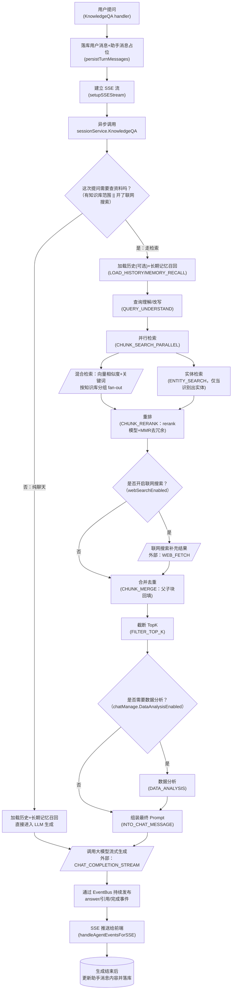

# 问答检索 · 流程图（逆向推断稿）

> ⚠ **逆向推断·需人工校正**
> 本文档由 reverse-product-docs 从代码调用链反推生成，**未经业务确认**。
> 标 **（待确认：…）** 处（尤其分支条件）需业务方核对，文末有汇总清单。
> 全部核对完成后请删除本提示与清单。

## 流程：问答检索（提问 → 混合检索 → 重排 → LLM 生成 → 流式返回）

入口：`POST /api/v1/knowledge-chat/:session_id` → `session.Handler.KnowledgeQA`

**（待确认：E 节点「需不需要查资料」的产品判定口径、Q 节点数据分析的触发条件，均为代码条件可见、业务意图不可见）**

### 1. 怎么读这张图

形状与箭头约定同「知识入库」一图。这里额外注意：`CHUNK_SEARCH_PARALLEL` 之后画出两条并行分支（分块检索 / 实体检索），两者并发跑完再汇入重排，是「并行 fan-out、结果汇总」，**不是先后顺序**。

### 2. 这张图说明什么

系统把「要不要检索资料」当成第一道分岔：只要命中了知识库范围或开了联网搜索，就走一条 9 段式 RAG 流水线（历史 → 记忆 → 改写 → 并行检索 → 重排 →[联网]→ 合并 → 截断 →[数据分析]→ 拼 prompt → 生成）；否则退化成「历史 + 记忆 + 直接生成」的纯聊天路径。

检索本身是向量 + 关键词混合，按知识库分组、多知识库并行 fan-out 后再统一按分数归一化排序，说明**混合检索是内建能力而非可选插件**。**（待确认：业务含义——关键词检索具体是 BM25 还是别的算法，代码里只见「关键词/keyword」字样，未深入索引引擎实现确认算法名）**

重排阶段还叠加了 MMR（最大边际相关性）做多样性去重，说明产品对「检索结果不能全是同一段落的重复表述」有明确要求。

### 3. 为什么这么设计

- 所有阶段都注册成「插件 + 事件」的责任链（`EventManager` / `Plugin.OnEvent`），而不是一个大函数，说明这条流水线被设计成可插拔——按知识库配置的不同（是否开联网搜索、是否开数据分析）在运行时动态拼装事件序列（`NewPipelineBuilder`），便于后续加新阶段（如 `WIKI_BOOST`、`DATA_ANALYSIS`）而不用改老代码。
- 检索前先算一次 query embedding 并在多知识库间复用，避免同一句话被重复调用 embedding API。**（待确认：设计意图需业务确认——是否也出于成本控制的显式取舍）**

### 4. 容易看错的地方

- 「纯聊天」分支（F）并不代表完全没有上下文：它仍然会走 `MEMORY_RECALL`（长期记忆召回），容易被误认为是「零上下文的裸模型问答」。
- `CHUNK_RERANK` 图上看是单一步骤，实际内部还包含「复合分数计算 + MMR 多样性重排」两层逻辑。**（待确认：是否所有知识库都强制启用 rerank 模型——智能体路径里能看到「未配置 rerank 模型直接报错」的强约束，但纯 RAG 路径是否同样强制，本图未验证）**

### 节点来源

| 节点 | 来源 file:类型.方法 |
|---|---|
| A | internal/handler/session/qa.go:Handler.KnowledgeQA |
| B | internal/handler/session/qa.go:Handler.persistTurnMessages |
| C | internal/handler/session/qa.go:Handler.setupSSEStream |
| D,E | internal/application/service/session_knowledge_qa.go:sessionService.KnowledgeQA |
| G,H,I | internal/application/service/session_knowledge_qa.go（pipeline builder：LOAD_HISTORY/MEMORY_RECALL/QUERY_UNDERSTAND） |
| I,J | internal/application/service/chat_pipeline/search_parallel.go → chat_pipeline/search.go → internal/application/service/knowledgebase_search.go:HybridSearch |
| K | internal/application/service/chat_pipeline/search_entity.go |
| L | internal/application/service/chat_pipeline/rerank.go:PluginRerank.OnEvent / applyMMR |
| N | internal/application/service/chat_pipeline/web_fetch.go |
| O | internal/application/service/chat_pipeline/merge.go:PluginMerge.OnEvent |
| P | internal/application/service/chat_pipeline/filter_top_k.go |
| R | internal/application/service/chat_pipeline/data_analysis.go |
| S | internal/application/service/chat_pipeline/into_chat_message.go |
| T | internal/application/service/chat_pipeline/chat_completion_stream.go |
| V | internal/handler/session/stream.go:Handler.handleAgentEventsForSSE |
| W | internal/handler/session/qa.go:Handler.completeQuickAnswerTurn |

## 待确认清单

- [ ] 混合检索中「关键词检索」的具体算法（是否为 BM25）及其与向量分数的权重融合公式
- [ ] `DATA_ANALYSIS` 阶段的触发条件（`chatManage.DataAnalysisEnabled`）对应的产品开关位置与使用场景
- [ ] 纯 RAG 路径是否与智能体路径一样强制要求配置 rerank 模型
- [ ] E 节点「需不需要查资料」的产品判定口径
