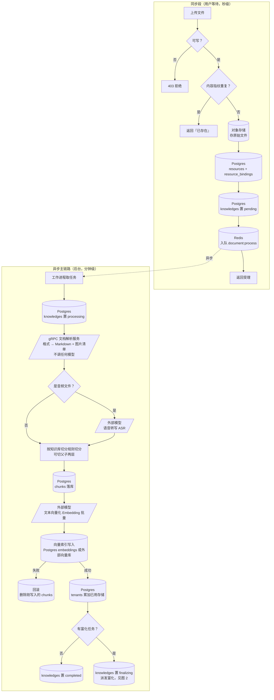
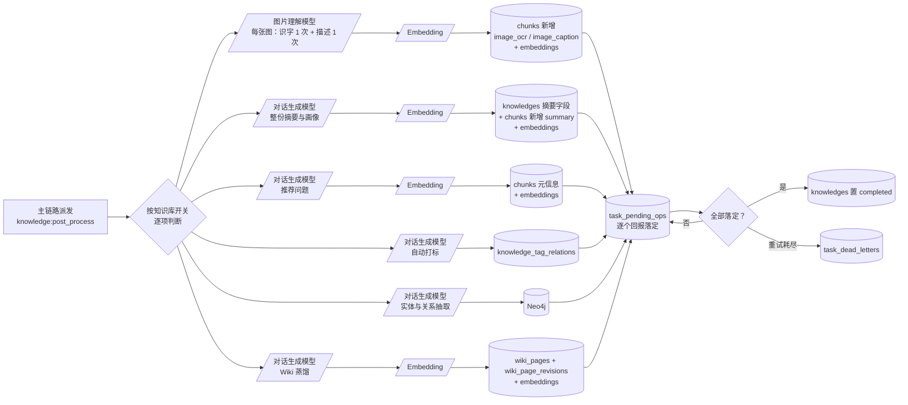
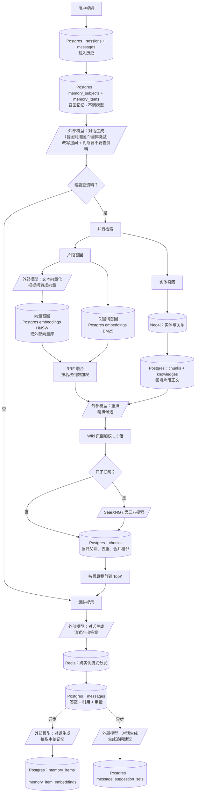
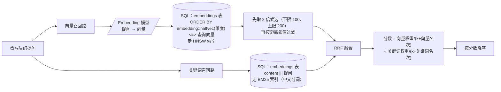

# 知识库入库与检索流程

> 事实源：`internal/application/service/knowledge_*.go`、`internal/application/service/chat_pipeline/*.go`、`internal/application/repository/retriever/**`、`docreader/**`、`docker-compose.yml`。
> 本文重点回答两个问题：**每一步调用了哪些外部模型**、**每一步读写了哪些数据库和表**。模型调用点与表访问点逐条来自代码实读，未作推断；少数无法从代码判定业务意图的地方已就地标注。

---

## 0. 读这份文档前：组件与存储速查

### 0.1 参与的进程

| 组件 | 语言 | 在两条流程里干什么 |
|---|---|---|
| 主应用 | Go | 接收请求、编排全流程、调用所有外部模型、读写所有数据库 |
| 后台工作进程 | Go（与主应用同一镜像，独立协程池） | 消费异步任务：解析、索引、富化、同步 |
| 文档解析服务 | Python（gRPC） | **只做一件事**：把任意格式文件转成统一 Markdown + 图片清单。**不分块、不识字、不调模型** |
| 沙箱 | 独立容器 | 智能体执行脚本，与本文两条流程无关 |

> 一个常见误解：以为解析服务负责识字（OCR）和图片理解。实际不是——解析服务只做格式转换，**识字与图片描述全部在主应用侧调用图片理解模型完成**（见 `docreader/parser/base_parser.py:48` 的注释：chunking / OCR / VLM caption 均在 Go 侧）。

### 0.2 参与的存储

| 存储 | 类型 | 在两条流程里的角色 | 是否必需 |
|---|---|---|---|
| PostgreSQL（ParadeDB 镜像，带 pgvector + pg_search） | 关系型 + 向量 + 全文 | 业务主库；默认也是向量与关键词索引的存放处 | **必需** |
| Redis | 内存 KV | 异步任务队列、流式输出跨实例分发、限流与并发闸门 | **必需** |
| 对象存储（MinIO / COS / S3 / OSS / OBS / KS3 / TOS / 本地磁盘） | 对象 | 存原始文件与文档内图片 | **必需**（本地磁盘为默认兜底） |
| 外部向量库（Elasticsearch / OpenSearch / Qdrant / Milvus / Weaviate / Doris / 腾讯向量数据库） | 向量 | 替代 PostgreSQL 存放向量索引 | 可选 |
| Neo4j | 图 | 存实体与关系，供实体检索使用 | 可选（开启图谱抽取时） |
| SearXNG | 搜索聚合 | 联网检索 | 可选 |

---

## 1. 入库流程

### 1.1 同步段（HTTP 请求内完成，用户等待）

入口：`POST /api/v1/knowledge-bases/:id/knowledge/file`（文件）、`.../knowledge/url`（网址）、`.../knowledge/manual`（手写 Markdown）

| 步 | 动作 | 外部模型 | 读表 | 写表 | 其他存储 |
|---|---|---|---|---|---|
| 1 | 校验调用者对该知识库可写 | — | `knowledge_bases`、`tenant_members`、`kb_shares`、`organization_tenant_members`、`tenant_api_keys` | — | — |
| 2 | 读取知识库的加工配置（切分规则、模型绑定、富化开关） | — | `knowledge_bases` | — | — |
| 3 | 计算文件内容指纹，判重 | — | `knowledges` | — | — |
| 4 | 保存原始文件，登记为可复用资源 | — | `storage_backends` | `resources`、`resource_bindings` | **对象存储写入** |
| 5 | 创建知识条目，状态 `pending` | — | — | `knowledges` | — |
| 6 | 投递解析任务 | — | — | — | **Redis 入队 `document:process`** |
| 7 | 返回 | — | — | — | — |

**第 3 步命中重复时**不报错：刷新旧记录时间戳并返回「重复文件」语义的响应，前端据此提示。

### 1.2 异步段主链路（后台工作进程，`document:process` 任务）

| 步 | 动作 | 外部模型 | 读表 | 写表 | 其他存储 |
|---|---|---|---|---|---|
| 1 | 取消/删除检查 | — | `knowledges` | — | — |
| 2 | 置 `processing`，开处理追踪 | — | — | `knowledges`、`knowledge_processing_spans` | — |
| 3 | 取原始文件 | — | `resources`、`storage_backends` | — | **对象存储读取** |
| 4 | **调用文档解析服务**，得到 Markdown + 图片清单 | 无（纯格式转换） | — | — | gRPC 调用解析服务 |
| 4b | 音频类文件：**调用语音转写模型** | **ASR**（知识库 `asr_config.model_id`） | `models` | — | — |
| 5 | 图片落对象存储 | — | `storage_backends` | `resources`、`resource_bindings` | **对象存储写入** |
| 6 | 按知识库切分规则切分；开启父子模式时切两层 | — | — | — | — |
| 7 | 清理该条目的旧分块与旧索引（重新解析场景） | — | — | `chunks`（删）、`embeddings`（删） | 外部向量库（删） |
| 8 | 分块落库 | — | — | `chunks` | — |
| 9 | 估算索引体积、校验空间配额 | — | `tenants` | — | — |
| 10 | **批量向量化并写索引** | **Embedding**（知识库 `embedding_model_id`） | `models`、`vector_stores` | `embeddings` | 或外部向量库 |
| 11 | 索引写失败 → 回滚第 8 步的分块 | — | — | `chunks`（删） | — |
| 12 | 累加空间已用存储量 | — | — | `tenants` | — |
| 13 | 判定是否还有富化任务 | — | `knowledge_bases` | `knowledges`（`finalizing` 或 `completed`） | — |
| 14 | 投递后处理任务 | — | — | `task_pending_ops` | **Redis 入队 `knowledge:post_process`** |

**第 10 步是整条链路唯一的强一致要求点**：分块表与向量索引必须同时存在或同时不存在，系统用「索引写失败就删分块」来保证，而不是分布式事务。

### 1.3 异步段富化子链路（并行派发）

后处理任务按知识库配置并行派发以下子任务，各自独立成败：

| 子任务 | 队列 | 外部模型 | 读表 | 写表 | 其他存储 |
|---|---|---|---|---|---|
| **图片识字 + 图片描述** | `multimodal` | **图片理解模型**（知识库 `vlm_config.model_id`）<br/>每张图调 2 次：一次识字、一次描述 | `models`、`knowledge_bases`、`chunks` | `chunks`（新增 `image_ocr` / `image_caption` 两类子块） | 对象存储读图 |
| ↳ 新增子块的向量化 | `multimodal` | **Embedding** | `models` | `embeddings` | 或外部向量库 |
| **整份摘要与画像** | `summary` | **对话生成模型**（知识库 `summary_model_id`） | `models`、`chunks` | `knowledges`（摘要、画像、摘要状态）、`chunks`（新增 `summary` 块） | — |
| ↳ 摘要块向量化 | `summary` | **Embedding** | `models` | `embeddings` | 或外部向量库 |
| **推荐问题生成** | `question` | **对话生成模型**（`summary_model_id`） | `models`、`chunks` | `chunks`（问题写回分块元信息） | — |
| ↳ 问题向量化 | `question` | **Embedding** | `models` | `embeddings` | 或外部向量库 |
| **自动打标** | `postprocess` | **对话生成模型**（`auto_tag_config.model_id`，缺省回落 `summary_model_id`） | `models`、`knowledge_tags`、`chunks` | `knowledge_tag_relations` | — |
| **表格摘要** | `postprocess` | **对话生成模型** | `models`、`chunks` | `chunks`（新增 `table_summary` / `table_column` 块） | — |
| **实体与关系抽取** | `graph` | **对话生成模型**（`summary_model_id`） | `models`、`chunks` | — | **Neo4j 写入** |
| **Wiki 蒸馏** | `wiki` | **对话生成模型**（知识库 `wiki_config.synthesis_model_id`） | `models`、`chunks`、`knowledges` | `wiki_pages`、`wiki_page_revisions`、`wiki_folders` | — |
| ↳ Wiki 页面向量化 | `wiki` | **Embedding** | `models` | `embeddings` | 或外部向量库 |

每个子任务落定时回写 `task_pending_ops`；全部落定后条目状态由 `finalizing` 转 `completed`。重试耗尽的任务写入 `task_dead_letters`。

### 1.4 入库全景图 1：同步段与异步主链路



### 1.5 入库全景图 2：富化子链路

派发后六路并行，各自独立成败；任何一路失败都不改写正文已可检索这个事实。



图例：`[( )]` 为存储读写，`[/ /]` 为外部服务或外部模型调用，`{ }` 为分支。

---

## 2. 检索流程

### 2.1 一轮问答的阶段清单

入口：`POST /api/v1/sessions/:session_id/chat`（流式）

事件链由代码按开关动态拼装（`internal/application/service/session_knowledge_qa.go:172-207`）：

```
纯聊天：  载入历史(可选) → 召回记忆 → 流式生成
带检索：  载入历史(可选) → 召回记忆 → 理解提问 → 并行检索 → 重排
          → 联网抓取(可选) → 合并 → 裁剪 → 数据分析(可选) → 组装提示 → 流式生成
```

| 阶段 | 外部模型 | 读表 | 写表 | 其他存储 |
|---|---|---|---|---|
| 载入历史 | — | `sessions`、`messages` | — | — |
| 召回记忆 | **无**（刻意设计：每轮最前面，不能被模型延迟拖住） | `memory_subjects`、`memory_items`、`memory_topic_stats` | — | — |
| 理解提问（改写 + 判断要不要查资料） | **对话生成模型**；提问含图片时改用**图片理解模型** | `models`、`custom_agents`、`sessions` | `messages`（异步回写图片描述） | — |
| 并行检索 · 片段召回 | **Embedding**（查询向量化，按知识库的 `embedding_model_id`） | `knowledge_bases`、`models`、`vector_stores`、`embeddings`、`chunks` | — | 或外部向量库 |
| 并行检索 · 实体召回 | — | `chunks`、`knowledges` | — | **Neo4j 读取** |
| 重排 | **重排模型**（会话/智能体的 `rerank_model_id`） | `models` | — | — |
| Wiki 加权 | — | `knowledge_bases` | — | — |
| 联网抓取（可选） | — | `web_search_providers` | — | SearXNG 或第三方搜索 API |
| 合并（展开父块、去重、合并相邻） | — | `chunks` | — | — |
| 裁剪到 TopK | — | — | — | — |
| 数据分析（可选） | **对话生成模型** | `models` | — | 沙箱执行 |
| 组装提示 | — | `temporary_documents`、`knowledges` | — | 对象存储读附件 |
| 流式生成 | **对话生成模型**（会话/智能体的 `model_id`） | `models` | `messages`（答案、引用、用量） | **Redis：跨实例流式分发** |
| 事后·记忆抽取 | **对话生成模型** | `models`、`messages` | `memory_items`、`memory_item_embeddings`、`memory_subjects`、`memory_topic_stats`、`memory_extraction_sessions` | **Redis 入队 `memory:extract`** |
| 事后·追问建议 | **对话生成模型** | `models`、`messages` | `message_suggestion_sets` | — |

### 2.2 检索全景图



### 2.3 混合检索内部：两路召回怎么合成一张榜



**为什么不用两路分数直接相加**：向量相似度在 0~1 之间，关键词打分是无上界的 BM25 得分，量纲完全不同。直接相加会让关键词路系统性淹没向量路。RRF 只看名次不看分数，规避了这个问题。

**为什么向量查询里要写两次类型转换**：向量列没有固定维度（同一张表要能放 798 维、3584 维等多种向量），索引因此建在「转换成固定维度后的表达式」上。查询侧的排序表达式必须与索引表达式**逐字一致**，否则查询计划会退化成全表扫描——这不是冗余写法，是唯一能用上索引的写法（`internal/application/repository/retriever/postgres/repository.go:362-393`）。

### 2.4 索引表结构要点

向量与关键词共用同一张 `embeddings` 表（PostgreSQL 方案）：

| 字段 | 作用 |
|---|---|
| `embedding` | 向量本体，半精度、无固定维度 |
| `dimension` | 该行向量的维度，HNSW 索引按维度分建并带条件 |
| `content` | 片段正文，BM25 索引就建在它上面 |
| `knowledge_base_id` / `knowledge_id` / `chunk_id` / `tag_id` | 过滤与回链 |
| `is_enabled` | 片段是否参与检索；为空视为启用（历史数据兼容） |

两类索引：
- `embeddings_search_idx` — BM25 全文索引，中文分词
- `embeddings_embedding_idx_3584` / `embeddings_embedding_idx_798` — 按维度分建的 HNSW 向量索引，带 `WHERE dimension = ...` 条件

---

## 3. 外部模型调用总表

| 模型能力 | 在入库流程被调用的位置 | 在检索流程被调用的位置 | 配置来源 |
|---|---|---|---|
| **文本向量化** | 正文分块批量向量化；图片子块、摘要块、问题、Wiki 页面各自向量化 | 提问向量化（每轮 1 次，多知识库共用） | 知识库 `embedding_model_id` |
| **重排** | 不调用 | 重排阶段（每轮 1 次） | 会话/智能体 `rerank_model_id` |
| **对话生成** | 摘要与画像、推荐问题、自动打标、表格摘要、实体关系抽取、Wiki 蒸馏 | 理解提问、数据分析、流式生成答案、记忆抽取、追问建议 | 入库侧取知识库 `summary_model_id`（自动打标可单独指定）；检索侧取会话/智能体 `model_id` |
| **图片理解** | 图片识字 + 图片描述（每张图 2 次） | 提问含图片时的理解阶段 | 知识库 `vlm_config.model_id` |
| **语音转写** | 音频类文件转文字 | 不调用 | 知识库 `asr_config.model_id` |

**模型供应商**共支持 19 类（本地部署、通用 OpenAI 兼容、阿里云百炼、智谱、火山引擎、DeepSeek、混元、MiniMax、OpenAI、Gemini、Mimo、SiliconFlow、Jina、OpenRouter、LiteLLM、Requesty、NVIDIA、Novita、Azure OpenAI）。所有供应商差异在模型接入层消化，上层只认五类能力。

### 3.1 一次典型入库的模型调用次数

以「一份 80 页 PDF，切出 210 个文本块、含 12 张图片、开启全部富化」为例：

| 模型 | 调用次数 | 说明 |
|---|---|---|
| 文本向量化 | 约 5~8 次批量调用 | 210 个正文块 + 19 个图片子块 + 1 个摘要块 + 若干问题，按批次合并 |
| 图片理解 | 24 次 | 12 张图 × (识字 1 + 描述 1) |
| 对话生成 | 约 15~40 次 | 摘要 1~3 次（内容长则分片）+ 推荐问题按块分批 + 自动打标 1 次 + 图谱抽取按块 1 次/块（仅开启时） |
| 重排 | 0 次 | 入库不重排 |

### 3.2 一次典型问答的模型调用次数

| 模型 | 调用次数 |
|---|---|
| 对话生成 | 1（理解提问）+ 1（生成答案）+ 1（记忆抽取，异步）+ 1（追问建议，异步）= 约 4 次 |
| 文本向量化 | 1 次（提问向量化，跨知识库复用） |
| 重排 | 1 次 |
| 图片理解 | 0 或 1（提问带图时） |

---

## 4. 数据表访问矩阵

`R` = 读，`W` = 写，`RW` = 读写。

| 表 | 入库同步段 | 入库异步段 | 富化 | 检索 | 说明 |
|---|---|---|---|---|---|
| `knowledge_bases` | R | R | R | R | 加工配置与模型绑定的唯一来源 |
| `knowledges` | W | RW | RW | R | 条目主表与解析状态 |
| `chunks` | — | RW | RW | R | 检索命中的最小单元 |
| `embeddings` | — | RW | W | R | 向量 + 关键词索引（PostgreSQL 方案） |
| `knowledge_processing_spans` | — | W | W | — | 加工链路时间线 |
| `knowledge_tags` | — | — | R | R | 标签定义 |
| `knowledge_tag_relations` | — | — | W | R | 自动打标结果 |
| `chunk_revisions` | — | — | — | — | 仅人工编辑分块时写 |
| `resources` / `resource_bindings` | W | RW | W | R | 文件与图片的引用登记 |
| `storage_backends` | R | R | R | R | 存储后端连接信息 |
| `vector_stores` | — | R | R | R | 外部向量库连接信息 |
| `models` | — | R | R | R | 模型连接参数 |
| `tenants` | R | RW | — | R | 配额与空间级默认值 |
| `tenant_members` / `kb_shares` / `organization_tenant_members` | R | — | — | R | 可见范围判定 |
| `tenant_api_keys` | R | — | — | R | 机器身份的能力范围 |
| `task_pending_ops` | — | W | RW | — | 富化子任务台账 |
| `task_dead_letters` | — | W | W | — | 重试耗尽归档 |
| `sessions` | — | — | — | RW | 会话与本会话策略覆盖 |
| `messages` | — | — | — | RW | 消息、引用、用量 |
| `message_suggestion_sets` | — | — | — | W | 追问建议缓存 |
| `custom_agents` | — | — | — | R | 智能体的模型与检索策略 |
| `temporary_documents` | — | — | — | R | 会话临时附件 |
| `memory_subjects` / `memory_items` / `memory_item_embeddings` | — | — | — | RW | 长期记忆 |
| `memory_topic_stats` / `memory_tombstones` / `memory_doc_affinity` | — | — | — | RW | 记忆的升级、遗忘与偏好信号 |
| `memory_extraction_sessions` | — | — | — | W | 抽取进度游标 |
| `web_search_providers` | — | — | — | R | 联网搜索服务商 |
| `wiki_pages` / `wiki_page_revisions` / `wiki_folders` | — | — | W | R | Wiki 蒸馏产物 |
| `data_sources` / `sync_logs` | — | — | — | — | 仅数据源同步链路使用 |
| `audit_logs` | W | — | — | — | 关键操作留痕 |

---

## 5. 容易踩的坑

1. **知识库建了索引之后不能换向量化模型。** 换了以后旧向量与新查询向量不在同一空间，检索会**静默失准**——不报错、只是结果变差，是最难发现的一类故障。

2. **「收尾中」不等于「不可用」。** 正文索引写完那一刻起内容就已经能被搜到，`finalizing` 只表示摘要、图片识别这类增强内容还在生成。把它当成不可用会让用户白等。

3. **图片识字与图片描述是两次独立的模型调用**，各自产出一个独立的可检索片段。一张图可能既贡献「图里的文字」又贡献「图里画了什么」，两者都能被单独命中。

4. **关键词召回走的是 BM25 索引，不是 `LIKE`。** 它对中文做了分词，所以「违约金计算」能命中「违约金的计算方式」，但也意味着**极少见的专有名词可能被切碎**，这时要靠向量召回兜底——这正是必须保留混合检索的原因。

5. **向量召回先取 2 倍候选再按阈值过滤**（下限 100、上限 200）。候选上限刻意压在 200：HNSW 索引要求搜索宽度不小于返回条数，宽度过大反而比全表扫描更慢，且会让查询计划放弃索引。

6. **检索侧不判断可见范围。** 范围由权限链路算好后传入。任何在检索侧「顺手查一下共享关系」的改动都会制造跨空间越权缺口。

7. **记忆召回刻意不调模型。** 它位于每轮最前面，一旦引入模型调用，首字延迟会被直接拖垮。

---

## 附：关键代码位置

| 环节 | 位置 |
|---|---|
| 入库同步段 | `internal/application/service/knowledge_create.go` |
| 入库异步主链路 | `internal/application/service/knowledge_process.go` |
| 富化派发 | `internal/application/service/knowledge_post_process.go` |
| 图片识字与描述 | `internal/application/service/image_multimodal.go` |
| 文档解析服务 | `docreader/parser/`，接口定义 `docreader/proto/docreader.proto` |
| 问答事件链拼装 | `internal/application/service/session_knowledge_qa.go:172` |
| 各阶段插件 | `internal/application/service/chat_pipeline/` |
| 混合检索编排 | `internal/application/service/knowledgebase_search.go` |
| RRF 融合 | `internal/application/service/knowledgebase_search_fusion.go` |
| PostgreSQL 向量与关键词检索 SQL | `internal/application/repository/retriever/postgres/repository.go` |
| 索引表 DDL | `migrations/versioned/000002_embeddings.up.sql` |
| 异步任务类型清单 | `internal/types/task.go:235` |
